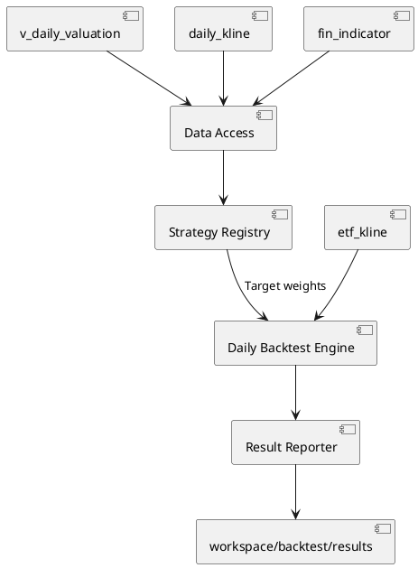

# 日频股票回测

## 1. 定位与范围

`backtest/` 是基于统一视图的 A 股日频、长仓、横截面选股回测模块。当前内置 `quality-value-recovery` 与 `price-momentum` 两个策略，统一使用月度等权调仓和 ETF 基准比较；它用于验证研究假设，不能直接替代实盘交易系统。

不支持分钟级交易、融资融券、整手委托、停复牌原因、涨跌停成交限制、税费、行业中性或参数寻优。

## 2. 架构与数据流



回测启动时通过 `db_manager.ensure_views(...)` 按策略数据需求显式加载 `v_daily_valuation`、`daily_kline`、`fin_indicator` 和 `etf_kline`。所有市场与财务查询均经统一视图完成，不直接读取 Parquet 文件。

| 模块 | 职责 |
|:---|:---|
| `backtest/config.py` | 读取 TOML、校验日期、资金、费用与基准参数 |
| `backtest/data_access.py` | 通过统一视图加载行情、估值与公告日对齐财务指标 |
| `backtest/strategy_base.py` | 定义策略契约和标准目标权重表校验 |
| `backtest/strategy_registry.py` | 显式注册可执行策略 |
| `backtest/strategies/` | 每个策略独立加载信号数据并生成目标权重 |
| `backtest/engine.py` | 按 T+1 开盘调仓，逐日计算净值、现金和交易成本 |
| `backtest/metrics.py` | 计算收益、波动率、夏普和最大回撤 |
| `backtest/reporter.py` | 将输入参数、目标、交易、净值和摘要写入独立结果目录 |

## 3. 无未来函数规则

1. 信号在调仓日 T 收盘后生成。
2. T 日估值来自 `v_daily_valuation`，该视图以财务公告日 ASOF 对齐，不能使用尚未披露的 TTM 数据。
3. `fin_indicator` 的质量因子在回测查询中以 `公告日期` ASOF 对齐，不能以 `report_date` 直接对齐。
4. 调仓最早在下一个实际有行情的交易日 T+1 开盘执行，禁止 T 日收盘信号以 T 日价格成交。
5. 不复权价用于估值与原始成交价记录；后复权价用于持仓收益、净值和基准收益。

持仓以连续价值而非整手股数表示。这样可以隔离策略本身与不同证券价格、最小交易单位导致的资金闲置；整手及涨跌停等实盘撮合约束留待独立模块实现。

## 4. 内置策略

所有内置策略在每月最后一个交易日筛选标的，并于下一交易日开盘等权调仓。可用策略通过以下命令查看：

```bash
uv run main.py list-backtest-strategies
```

### 4.1 quality-value-recovery

| 条件 | 默认阈值 |
|:---|:---|
| 上市交易日 | 至少 250 日 |
| 估值 | `pe_ttm` 与 `pb` 均处于合格股票横截面最低 40% |
| 质量 | 加权 ROE 大于 8%，经营现金流/营业收入大于 0 |
| 趋势 | 后复权收盘价高于 120 日均线 |
| 排名 | PE 与 PB 横截面百分位之和，分数由低到高 |
| 持仓 | 前 20 只等权，可通过 TOML 的 `holding_count` 修改 |

若目标证券 T+1 没有有效开盘价，则不建仓，其目标权重保留为现金。若既有持仓没有有效开盘价，则该次调仓整体跳过，避免将无法交易的证券以虚构价格卖出。

### 4.2 price-momentum

| 条件 | 默认阈值 |
|:---|:---|
| 上市交易日 | 至少 250 日 |
| 动量 | 后复权 120 日收益率，由高到低排名 |
| 趋势 | 后复权收盘价高于 120 日均线 |
| 持仓 | 前 20 只等权 |

动量策略仅使用市场数据，不读取财务指标；因此它是验证策略注册表与策略特有数据需求的基准实现。

## 5. 成交、成本和净值

单边交易成本为 `commission_bps + slippage_bps`。每次调仓先按开盘时持仓与目标持仓的绝对差额计算名义换手，再从组合净值中扣除成本，最后按扣成本后的净值配置目标权重。因此现金不会因成本而变为负数。

后复权收盘价涵盖分红与除权影响。引擎先将前一收盘持仓价值按当日后复权开盘价变动至开盘，再在收盘时按后复权收盘价变动，避免将公司行为误记为投资收益或损失。

## 6. 配置、命令与输出

回测输入为 TOML。配置由 `[run]`、`[strategy]` 与 `[strategy.parameters]` 组成；前两部分定义通用运行环境，最后一部分由已注册策略严格校验。示例配置位于 `config/backtest/`。

```toml
[run]
start_date = "2018-01-01"
end_date = "2026-08-07"
initial_capital = 1000000
commission_bps = 5
slippage_bps = 5
benchmark_symbol = "510300"

[strategy]
name = "price-momentum"

[strategy.parameters]
holding_count = 20
lookback_days = 120
trend_window = 120
min_listing_days = 250
```

```bash
uv run main.py run-backtest \
  --backtest-config config/backtest/price_momentum.toml
```

将 `benchmark_symbol` 设为空字符串可跳过 ETF 基准。每次运行写入 `workspace/backtest/results/<strategy>_<timestamp>/`：

| 文件 | 内容 |
|:---|:---|
| `parameters.json` | 解析并校验后的通用参数、策略参数和策略版本 |
| `daily_nav.csv` | 每日策略净值、现金、持仓市值和基准净值 |
| `rebalance_targets.csv` | 信号日、候选评分、排名和目标权重 |
| `trades.csv` | T+1 成交记录、原始及后复权开盘价、名义金额与成本 |
| `summary.md` | 收益、风险、换手和交易记录摘要 |

结果目录已被 Git 忽略。可复用的研究结论应在复核后写入 `investigation/`，不应把单次运行结果直接提交。

## 7. 新增策略

新增策略必须在 `backtest/strategies/` 中实现 `BacktestStrategy` 契约，并在 `backtest/strategy_registry.py` 显式注册。策略只能负责点时数据需求和标准目标权重表，不能修改引擎的 T+1 成交、复权收益与成本口径。

每个策略必须：

1. 声明名称、版本、说明和参数摘要。
2. 为 TOML 参数设置默认值、类型与范围校验，并拒绝未知参数。
3. 通过 `BacktestDataAccess` 读取统一视图，财务字段必须按公告日对齐。
4. 返回 `date`、`symbol`、`score`、`rank`、`target_weight` 五列目标权重表。
5. 提供策略筛选、未来函数边界和可手算样本测试。

## 8. 验证与扩展

单元测试覆盖 TOML 配置、策略注册、质量价值与动量策略排序、T+1 成交、交易成本和缺失目标开盘价处理。修改时间线、费用、复权口径或目标权重逻辑时，必须先补充对应的可手算测试样例。

后续可独立扩展行业权重约束、卖出印花税、停牌与涨跌停规则、整手仿真、因子 IC、归因和参数敏感性分析；这些功能不得改变本模块现有的点时数据和 T+1 成交约束。
