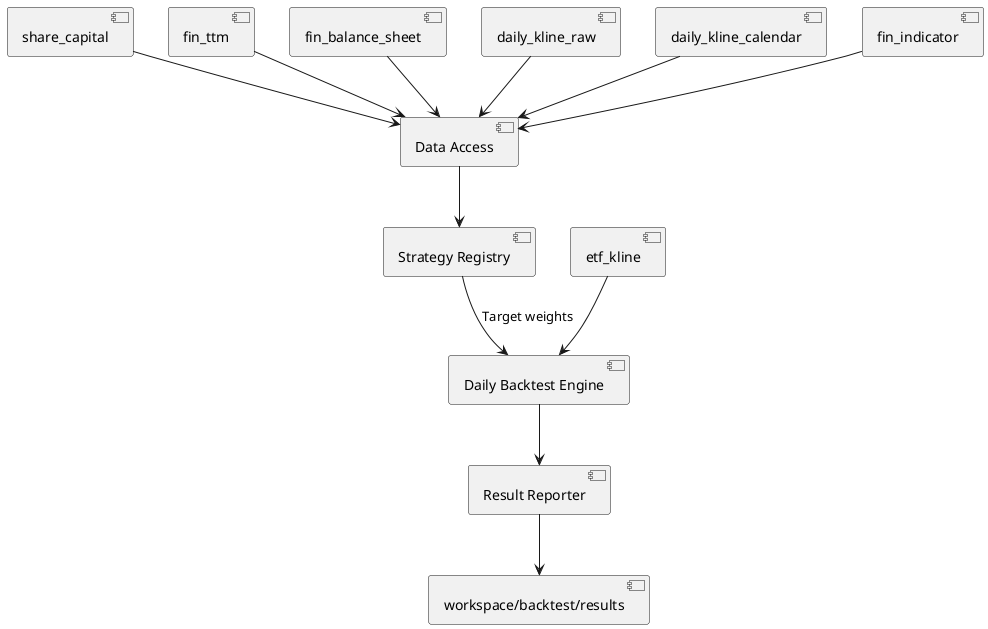

# 日频股票回测

## 1. 定位与范围

`backtest/` 是基于统一视图的 A 股日频、长仓、横截面选股回测模块。当前内置 `quality-value-recovery`、`price-momentum`、`multi-factor-quality-value-momentum` 与 `factor-composite-experiment` 四个策略，统一使用月度调仓和 ETF 基准比较；另提供候选实验的训练/验证/测试与 Walk-forward 评估器。它用于验证研究假设，不能直接替代实盘交易系统。

不支持分钟级交易、融资融券、整手委托、停复牌原因、涨跌停成交限制或税费；研究评估器只在配置文件显式列出的候选和有限参数网格内搜索，不进行无上限的自动超参数寻优。启用 `[training]` 时会在训练集内把未来收益转换为逐信号日截面排名，对各信号日等权，并拟合向候选先验收缩的非负、和为 1 的因子权重。

## 2. 架构与数据流



回测启动时通过 `db_manager.ensure_views(...)` 按策略数据需求显式加载 `daily_kline_raw`、`daily_kline_calendar`、`share_capital`、`fin_ttm`、`fin_balance_sheet`、`fin_indicator` 和 `etf_kline`。所有市场与财务查询均经统一视图完成，不直接读取 Parquet 文件；视图只匹配原子晋级后的 `*/data.parquet`，不会把同步过程中的 `.tmp_*.parquet` 或备份文件读入查询。`BacktestDataAccess` 先用轻量行情日历确定回看区间和股票集合，再物化请求股票的财务历史，在 Python 中确定性去重并按 `effective_date <= signal_date` 回溯，最后读取原始行情；只有检测到重复 `date/symbol` 时才按 `daily_kline` 的排序口径补充字段并去重，避免为正常行情执行全量窗口排序。

| 模块 | 职责 |
|:---|:---|
| `backtest/config.py` | 读取 TOML、校验日期、资金、费用与基准参数 |
| `backtest/data_access.py` | 通过统一视图加载行情和财务历史，在 Python 中按 TTM 公告日、资产负债表可用日和指标可用日做确定性点时回溯 |
| `backtest/strategy_base.py` | 定义策略契约和标准目标权重表校验 |
| `backtest/strategy_registry.py` | 显式注册可执行策略 |
| `backtest/strategies/` | 每个策略独立加载信号数据并生成目标权重 |
| `backtest/runner.py` | 统一执行已解析的内存回测，供正式回测和研究评估复用；研究评估器可按窗口缓存因子与市场输入 |
| `backtest/factor_trainer.py` | 使用点时月末因子、截面收益排名、月份等权和先验收缩拟合单纯形因子权重 |
| `backtest/hyperparameter_search.py` | 展开因子组合、因子窗口、持仓数量、缩尾范围和 Ridge 强度的有限组合 |
| `backtest/research_evaluator.py` | 按固定切分和滚动 Walk-forward 训练、选择候选并锁定测试集 |
| `analysis/factors/` | 定义可复用点时因子、注册表、计算引擎和截面变换 |
| `backtest/engine.py` | 按 T+1 开盘调仓，逐日计算净值、现金和交易成本 |
| `backtest/metrics.py` | 计算收益、波动率、夏普和最大回撤 |
| `backtest/reporter.py` | 将输入参数、目标、交易、净值和摘要写入独立结果目录 |

回测引擎只保留成交所需的行情列，并按交易日保存紧凑数值表；不把每条行情转换成嵌套 Python 字典。`BacktestDataAccess` 对大型 DuckDB 查询设置 256MB 内存上限和 2 个工作线程，并按股票批次读取行情；财务与行情结果在返回前脱离 DuckDB 结果缓冲区，避免下一次查询覆盖仍被 Pandas 使用的数组。月末策略仍保留完整日频价格历史供滚动因子使用，但财务和估值字段只在月末信号日物化。`DBManager` 提供连接级可重入锁，回测点时查询、视图注册和连接释放在同一锁协议内串行化，避免资源设置恢复或连接关闭与并发查询交错。研究诊断在完成信号数据物化后关闭 DuckDB 查询连接、完成候选和目标后释放宽因子表，只向引擎传递 `date`、`symbol`、`open`、`open_hfq`、`close_hfq` 五列。正式报告和重复性验证应串行执行，避免同一进程同时保留多份全量信号数据。

## 3. 无未来函数规则

1. 信号在调仓日 T 收盘后生成。
2. T 日估值由 `BacktestDataAccess` 从 `share_capital`、`fin_ttm` 和 `fin_balance_sheet` 构造：TTM 分母按 `fin_ttm.pub_date` 回溯，净资产按资产负债表的 `数据可用日期` 回溯，均不能使用各自生效日之后的数据。TTM 的 `pub_date` 是当前报告期四源统一后的公告日期；同步时若公告日期超过法定期限，还会通过对应交易所官方公告二次核验并覆盖该字段。
3. `daily_kline_raw` 用于受日期过滤的低内存行情读取；若发现重复 `(symbol, date)`，回测会加载完整 tie-break 字段并按 `daily_kline` 视图的排序口径确定性去重，避免存量 Parquet 中的重复行污染滚动窗口。财务历史按股票及唯一生效日确定性去重，并由 Python 使用最近的 `effective_date <= signal_date` 行，避免依赖 DuckDB ASOF 或大型区间连接的执行计划。
4. `fin_indicator` 的质量因子在回测查询中以 `数据可用日期` 回溯对齐，不能以 `report_date` 直接对齐；同一股票同一生效日的多条记录按 `report_date`、文件名和字段值确定性去重。
5. 调仓最早在下一个实际有行情的交易日 T+1 开盘执行，禁止 T 日收盘信号以 T 日价格成交。
6. 不复权价用于估值与原始成交价记录；后复权价用于持仓收益、净值和基准收益。
7. 持仓证券的行情在其最后交易日收盘后终结（退市/摘牌），当日收盘后按收盘价强制清算为现金并记录 `DELIST` 交易；清算后不再产生交易与定价，亦不再阻塞后续调仓。行情终结判定基于数据湖实际行情（该股最后一条日线），不依赖 `stocks` 快照的 `is_active` 状态。

持仓以连续价值而非整手股数表示。这样可以隔离策略本身与不同证券价格、最小交易单位导致的资金闲置；整手及涨跌停等实盘撮合约束留待独立模块实现。

## 4. 内置策略

所有内置策略在每月最后一个交易日筛选标的，并于下一交易日开盘等权调仓。可用策略通过以下命令查看：

```bash
uv run main.py list-backtest-strategies
```

### 4.1 quality-value-recovery

| 条件 | 默认阈值 |
|:---|:---|
| 上市交易日 | 至少 250 日 |
| 估值 | `pe_ttm` 与 `pb` 均处于合格股票横截面最低 40% |
| 质量 | 加权 ROE 大于 8%，经营现金流/营业收入大于 0 |
| 趋势 | `price_trend_above_ma_120d` 确认后复权收盘价高于 120 日均线 |
| 排名 | PE 与 PB 横截面百分位之和，分数由低到高 |
| 持仓 | 前 20 只等权，可通过 TOML 的 `holding_count` 修改 |

若目标证券 T+1 没有有效开盘价，则不建仓，其目标权重保留为现金。若既有持仓没有有效开盘价（停牌等临时缺失），则该次调仓整体跳过，避免将无法交易的证券以虚构价格卖出；行情终结（退市/摘牌）的持仓不在此列——其在最后交易日收盘后已按收盘价强制清算，不再阻塞后续调仓。

该策略使用 `valuation_pe_ttm`、`valuation_pb`、`quality_roe_weighted`、`quality_operating_cashflow_ratio` 和 `price_trend_above_ma_120d` 等独立因子；PE/PB 百分位排名和策略阈值仍在策略层完成。

### 4.2 price-momentum

| 条件 | 默认阈值 |
|:---|:---|
| 上市交易日 | 至少 250 日 |
| 动量 | 后复权 120 日收益率，由高到低排名 |
| 趋势 | `price_trend_above_ma_120d` 确认后复权收盘价高于 120 日均线 |
| 持仓 | 前 20 只等权 |

动量策略仅使用市场数据，不读取财务指标；动量和趋势信号由独立因子库计算，因此它也是验证策略注册表与策略特有数据需求的基准实现。

### 4.3 multi-factor-quality-value-momentum

该策略使用独立因子库计算价值、质量、动量、趋势和低波动特征。因子在同一信号日内先缩尾并按方向做百分位排名，再按配置权重合成综合分数。

| 因子 | 默认权重 |
|:---|---:|
| `price_momentum_120d` | 20% |
| `price_trend_gap_120d` | 15% |
| `price_volatility_60d` | 10% |
| `valuation_pe_ttm` | 15% |
| `valuation_pb` | 15% |
| `quality_roe_weighted` | 12.5% |
| `quality_operating_cashflow_ratio` | 12.5% |

默认要求上市交易日不少于 250 日，综合分数最高的前 20 只股票等权持有。因子接口、输入字段和未来函数约束见 [独立因子库](factor_library.md)。

### 4.4 factor-composite-experiment

该策略用于单因子和小组合研究，不改变三个正式策略的配置和行为。调用方通过 `factor_weights` 显式选择因子；策略根据因子元数据的 `higher_is_better` 统一方向，先按交易日缩尾并做百分位排名，再按权重合成分数，选择前 `holding_count` 只股票等权持有。

实验策略最多同时使用 6 个因子。`factor_parameters` 用于传递因子自身参数，例如反转因子的窗口；同一信号日只要任一选中因子缺失，该股票就从组合中剔除。权重会在参数解析时归一化，并把因子版本和参数写入 `parameters.json`。

单因子配置示例：

```bash
uv run main.py run-backtest \
  --backtest-config config/backtest/factor_experiment_reversal.toml
```

小组合配置示例：

```bash
uv run main.py run-backtest \
  --backtest-config config/backtest/factor_experiment_value_growth.toml
```

该策略是研究实验入口，不会自动修改 `multi-factor-quality-value-momentum` 的因子权重，也不代表某个因子已经通过投资有效性检验。

### 4.5 训练/验证/测试与 Walk-forward 评估

研究评估器读取一个研究 TOML，候选回测配置必须显式列出。启用 `[training]` 后，当前支持 `factor-composite-experiment` 和 `multi-factor-quality-value-momentum`：未来收益先在每个信号日转换为百分位排名并去均值，每个信号日在目标函数中的总权重相同，投影梯度法把因子权重约束为非负且总和为 1，Ridge 项向候选策略预先声明的完整权重收缩。正式七因子策略会完整覆盖七个因子，显式零权重不会回退为默认权重。启用 `[hyperparameter_search]` 后，每组显式有限参数组合都独立拟合权重；验证集选择完整组合，测试集只运行通过模型、样本、选择分数和协议门禁的入选组合。验证分数不足或模型过度集中时窗口可以标记为 `rejected`，不会读取测试段，也不会退回默认权重。

`[validity]` 除训练、验证和测试覆盖门槛外，还可配置最少有效因子数、最大单因子权重、最低验证选择分数、最大训练失败比例、最大组合/验证信号日、最少完成测试窗口和测试窗口不得重叠。报告分别输出 `protocol_status` 和 `strategy_evidence_status`；协议通过只表示预先声明的流程被遵守，不证明策略有效。正式七因子配置采用 5 年训练、2 年验证、2 年测试和 2 年步长，测试窗口互不重叠，外层只比较 4 组参数。其历史测试期已被用于方法诊断，因此配置明确标记 `retrospective_method_development=true`，策略证据状态只能是 `retrospective_descriptive_only`，不能把重跑结果称为新的盲测证据。训练缓存由 `[training].max_training_cache_entries` 限制在单个窗口内，窗口结束后释放；未启用训练时保留原候选比较行为。

为避免有限参数网格重复加载相同点时数据和行情结构，研究评估器在每个 split 内以有界 LRU 复用因子实验的原始信号数据、基础候选表以及与目标无关的市场日历/价格映射；当前评估器最多保留 2 组因子输入和 1 个市场区间，超出后释放最久未使用项。训练输入另外由 `[training].max_training_cache_entries` 限制，正式配置当前为 2。缩尾边界、因子权重、排名、持仓数量和逐日持仓状态仍按每组试验重新计算。行情查询按股票批次读取并预分配紧凑数值数组，缓存不跨 split，也不改变普通 `run-backtest` 的默认路径。

```bash
uv run main.py evaluate-factor-experiments \
  --research-config config/backtest/factor_experiment_evaluation.toml
```

若要进行正式的样本外研究，推荐使用 `config/backtest/factor_experiment_evaluation_robust.toml`：该配置使用 3 年训练、2 年验证、2 年测试的完整自然年 Walk-forward，验证和测试各要求至少 20 个可执行信号日，并移除基线中已确认没有区分度的 `ridge_alpha=1.0`。原配置保留为短窗口基线和选择风险对照，不能与稳健配置的测试结果混合解读。

示例配置见 `config/backtest/factor_experiment_evaluation.toml`；正式七因子策略训练配置见 `config/backtest/multi_factor_quality_value_momentum_evaluation.toml`。设计与边界见 [`workspace/design_factor_experiment_evaluation.md`](../workspace/design_factor_experiment_evaluation.md)、[`workspace/design_factor_hyperparameter_training.md`](../workspace/design_factor_hyperparameter_training.md)、[`workspace/design_formal_factor_strategy_training.md`](../workspace/design_formal_factor_strategy_training.md) 和 [`workspace/design_factor_research_validity_remediation.md`](../workspace/design_factor_research_validity_remediation.md)。结果写入 `workspace/backtest/evaluations/<name>_<timestamp>/`，除原有指标、训练、选择和权重诊断文件外，`research_validity.csv` 保存逐组合的样本、模型和验证门禁，`research_protocol.csv` 保存训练失败比例、选择负担、测试窗口独立性和完成窗口数门禁。`summary.md` 和 `parameters.json` 分别记录执行状态、`protocol_status`、回溯性方法开发标记和弱溯源数据快照。当前数据快照不是逐 Parquet 内容寻址版本，必须显示 `best_effort`、`content_addressed=false` 及限制原因，并在评估运行首尾核对可观察快照；评估器不把测试结果反写到候选配置，也不跨窗口传递持仓或净值。

研究评估报告的 `parameters.json` 和 `summary.md` 还记录评估进程峰值 RSS、2 GiB 进程资源预算、单次数据加载目标以及训练和回测缓存上限，便于核对长窗口运行是否触及内存控制目标。资源预算是审计边界而不是静默截断；若真实全量运行超过预算，报告会明确标记，结果不能宣称资源门禁通过。

### 4.6 因子实验点时规模暴露诊断

`diagnose-factor-exposures` 是独立于训练和回测结果的暴露审计命令，仅支持 `factor-composite-experiment`。它按每个信号日的可选股票池计算 `v_daily_valuation.market_cap` 的截面规模分组，再比较最终入选持仓在各组的占比和选择提升；缺失或非正市值会从分组中排除，并单独记录覆盖率。为保证规模组编号有效，每个信号日必须至少有 `quantile_count` 个有效市值候选；不满足时命令会拒绝生成报告。该命令不改变策略目标、因子权重、成交或净值。

历史行业数据资产现已独立存储在 `industry_classification_sw`，按申万 `effective_date` 做 ASOF 对齐；当前命令仍只输出规模暴露，不直接输出行业暴露或实施行业中性化，行业覆盖与暴露由下方独立命令审计。

```bash
uv run main.py diagnose-factor-exposures \
  --backtest-config config/backtest/factor_experiment_value_growth.toml \
  --quantile-count 5
```

结果默认写入 `workspace/factor_exposure_diagnostics/<name>_<timestamp>/`，包含 `summary.md`、`size_exposure.csv`、`size_exposure_summary.csv`、`size_exposure_coverage.csv` 和 `parameters.json`。报告用于识别规模选择偏向，不构成收益因果归因。当前 `stocks.industry` 仍只有未版本化的元数据快照，不能据此输出历史行业暴露；历史行业数据已经独立存储在 `industry_classification_sw`，行业审计结果由独立命令输出，仍不实施行业中性化。

行业覆盖与暴露使用独立命令：

```bash
uv run main.py diagnose-factor-industry-exposures \
  --backtest-config config/backtest/factor_experiment_value_growth.toml
```

该命令按候选池和入选持仓的信号日，从 `industry_classification_sw.effective_date` 做 ASOF 对齐，输出行业覆盖率、缺失数量和行业选择提升；不实施行业中性化。结果默认写入 `workspace/factor_industry_exposure_diagnostics/<name>_<timestamp>/`。

### 4.7 因子实验行业/规模中性化对照

`diagnose-factor-neutralization` 是研究专用的残差化对照工具。它固定 `factor-composite-experiment` 的候选池、因子综合评分和持仓数量，逐信号日将评分对行业哑变量、`log(market_cap)` 或二者回归，使用残差重新排序，并与基准目标比较。行业通过 `industry_classification_sw` 的 `effective_date` ASOF 对齐，规模使用 `v_daily_valuation.market_cap`；缺失控制变量和不足持仓数的信号日都保留在覆盖审计中，失败时不回退。

```bash
uv run main.py diagnose-factor-neutralization \
  --backtest-config config/backtest/factor_experiment_value_growth.toml \
  --quantile-count 5
```

输出包含 `summary.md`、`parameters.json`、`neutralization_summary.csv`、`neutralization_coverage.csv`、`neutralization_target_overlap.csv`、`neutralization_industry_exposure.csv` 和 `neutralization_size_exposure.csv`。行业暴露的 universe 分母是全候选池中已分类股票，规模暴露的 universe 分母是全候选池中正且有限市值候选；selected 分母只使用相应有效目标，覆盖率文件保留被排除候选。残差化不等价于严格的组合行业/规模中性：它可能显著改变目标，却仍保留行业或规模选择偏离；是否开发带配额或权重约束的正式策略，必须基于该对照的覆盖率、目标重合、成本和样本外收益另行决定。命令不改变任何正式策略、训练参数或回测结果。

### 4.8 因子实验比例配额选股对照

`diagnose-factor-constrained-selection` 是残差化对照之后的研究工具。它固定原始综合评分，在每个信号日按有效行业、规模或行业×规模候选数量分配 `holding_count`，使用 Hamilton 最大余数法处理整数配额，组内按原始评分排序。行业使用 `industry_classification_sw` 的 `effective_date` ASOF，规模使用 `v_daily_valuation.market_cap` 的 5 组截面分组。

```bash
uv run main.py diagnose-factor-constrained-selection \
  --backtest-config config/backtest/factor_experiment_value_growth.toml \
  --quantile-count 5
```

输出包含 `summary.md`、`parameters.json`、`constraint_summary.csv`、`constraint_coverage.csv`、`constraint_target_overlap.csv` 和 `constraint_exposure.csv`。配额误差为实际入选数减目标配额，报告的占比差以各模式有效控制变量候选池为 universe 分母；缺失控制变量的候选只保留在完整候选池覆盖率中。有效候选不足持仓数时不回退。该命令不接入正式策略，不能把配额可行或目标重合较高解释为样本外收益改善。

### 4.9 因子选股变体统一成本与成交回测比较

`evaluate-factor-selection-variants` 将 `baseline`、三种残差化目标和三种比例配额目标送入同一个 `DailyBacktestEngine`。七种目标共享同一份点时因子候选、原始综合评分、行情日历、后复权价格、T+1 开盘成交、手续费、滑点和基准；比较收益、波动、夏普、回撤、换手、交易成本、跳过调仓和退市清算，不改变正式策略默认值。

推荐把已预先锁定、未参与方案选择的测试区间显式传入，才可作为样本外比较：

```bash
uv run main.py evaluate-factor-selection-variants \
  --backtest-config config/backtest/factor_experiment_value_growth.toml \
  --evaluation-start-date 2022-07-01 \
  --evaluation-end-date 2024-06-30 \
  --quantile-count 5
```

`--evaluation-start-date` 和 `--evaluation-end-date` 必须成对出现；省略时使用配置原始区间，报告会明确标记为未锁定样本外区间。结果默认写入 `workspace/factor_selection_comparison/<name>_<timestamp>/`，包括 `summary.md`、`parameters.json`、`selection_comparison.csv`、`selection_daily_nav.csv`、`selection_trades.csv`、`selection_targets.csv`、`selection_coverage.csv` 和 `selection_target_overlap.csv`。换手只统计 BUY/SELL 的单边名义金额，DELIST 与 SKIP_REBALANCE 单独计数；控制变量不足的信号日不回退到 baseline，并在覆盖文件记录失败原因。

### 4.10 多因子组合边际贡献验证

`evaluate-factor-marginal-contributions` 固定正式多因子策略的点时公共候选池，比较完整七因子组合、每个单因子和移除一个因子的七个 leave-one-out 组合。完整组合使用正式配置中的归一化权重，单因子使用 100% 权重，leave-one-out 组合按剩余正式权重重新归一化；所有变体共享同一 `PreparedMarketData`、T+1 开盘成交、手续费、滑点和净值计算，避免因行情准备或成交口径不同造成比较偏差。回测引擎对目标和成交股票按代码排序，防止集合遍历顺序改变交易记录或成本汇总的末位结果。

```bash
uv run main.py evaluate-factor-marginal-contributions \
  --backtest-config config/backtest/multi_factor_quality_value_momentum.toml \
  --evaluation-start-date 2022-07-01 \
  --evaluation-end-date 2024-06-30
```

评估日期必须成对指定，显式区间才标记为锁定评估。结果默认写入 `workspace/factor_marginal_contribution/<name>_<timestamp>/`，包括标准摘要、解析参数、组合收益/风险/换手/成本、逐日净值、逐笔成交、目标、公共候选覆盖率和相对完整组合的目标重合率。该命令只用于判断因子的边际信息和组合互补性，不自动修改正式因子权重或策略配置；基准没有行情时会明确告警，不会伪造基准收益。

### 4.11 交易容量与流动性诊断

`diagnose-factor-liquidity-capacity` 只接受正式 `multi-factor-quality-value-momentum` 策略，沿用正式策略的目标、成本、滑点和 `DailyBacktestEngine`，不改变策略行为。它从 `daily_kline.amount` 计算信号日及此前 20 个交易日的平均成交额，并从 `v_daily_valuation.market_cap` 读取点时市值；执行日的完整成交额不会进入容量分母。

```bash
uv run main.py diagnose-factor-liquidity-capacity \
  --backtest-config config/backtest/multi_factor_quality_value_momentum.toml \
  --evaluation-start-date 2022-07-01 \
  --evaluation-end-date 2024-06-30 \
  --liquidity-lookback-days 20 \
  --participation-limits 0.05 0.10 0.20
```

结果默认写入 `workspace/factor_liquidity_capacity/<name>_<timestamp>/`，包括逐信号日覆盖与分布、平均成交额分组、逐笔订单参与率、5%/10%/20% 参与率上限下的容量分位数、正式策略目标/回测基线和逐日净值。窗口字段使用通用名称，实际交易日窗口记录在 `parameters.json` 和 `summary.md` 中。容量是按单笔订单的参与率近似估算，不是盘口冲击或成交概率模型；缺少信号日流动性、无效名义金额、SKIP_REBALANCE 和 DELIST 会分开记录，不会被伪装成容量结果。

## 5. 成交、成本和净值

单边交易成本为 `commission_bps + slippage_bps`。每次调仓先按开盘时持仓与目标持仓的绝对差额计算名义换手，再从组合净值中扣除成本，最后按扣成本后的净值配置目标权重。因此现金不会因成本而变为负数。

后复权收盘价涵盖分红与除权影响。引擎先将前一收盘持仓价值按当日后复权开盘价变动至开盘，再在收盘时按后复权收盘价变动，避免将公司行为误记为投资收益或损失。

## 6. 配置、命令与输出

回测输入为 TOML。配置由 `[run]`、`[strategy]` 与 `[strategy.parameters]` 组成；前两部分定义通用运行环境，最后一部分由已注册策略严格校验。示例配置位于 `config/backtest/`。

```toml
[run]
start_date = "2018-01-01"
end_date = "2026-08-07"
initial_capital = 1000000
commission_bps = 5
slippage_bps = 5
benchmark_symbol = "510300"

[strategy]
name = "price-momentum"

[strategy.parameters]
holding_count = 20
lookback_days = 120
trend_window = 120
min_listing_days = 250
```

```bash
uv run main.py run-backtest \
  --backtest-config config/backtest/price_momentum.toml
```

将 `benchmark_symbol` 设为空字符串可跳过 ETF 基准。每次运行写入 `workspace/backtest/results/<strategy>_<timestamp>/`：

| 文件 | 内容 |
|:---|:---|
| `parameters.json` | 解析并校验后的通用参数、策略参数和策略版本 |
| `daily_nav.csv` | 每日策略净值、现金、持仓市值和基准净值 |
| `rebalance_targets.csv` | 信号日、候选评分、排名和目标权重 |
| `trades.csv` | T+1 成交记录、原始及后复权开盘价、名义金额与成本 |
| `summary.md` | 普通回测的收益、风险、换手和交易记录摘要；因子实验评估另生成固定章节的训练结果报告 |

结果目录已被 Git 忽略。可复用的研究结论应在复核后写入 `investigation/`，不应把单次运行结果直接提交。

## 7. 新增策略

新增策略必须在 `backtest/strategies/` 中实现 `BacktestStrategy` 契约，并在 `backtest/strategy_registry.py` 显式注册。策略只能负责点时数据需求和标准目标权重表，不能修改引擎的 T+1 成交、复权收益与成本口径。

每个策略必须：

1. 声明名称、版本、说明和参数摘要。
2. 为 TOML 参数设置默认值、类型与范围校验，并拒绝未知参数。
3. 通过 `BacktestDataAccess` 读取统一视图，财务字段必须按公告日对齐。
4. 返回 `date`、`symbol`、`score`、`rank`、`target_weight` 五列目标权重表。
5. 提供策略筛选、未来函数边界和可手算样本测试。

## 8. 验证与扩展

单元测试覆盖 TOML 配置、策略注册、因子计算与截面变换、质量价值与动量策略排序、多因子策略权重、T+1 成交、交易成本、缺失目标开盘价处理和行情终结（退市）清算。两个旧策略迁移后还通过固定同一份点时输入的前后回测文件比较，验证目标、交易、净值和摘要保持一致。修改时间线、费用、复权口径、目标权重或清算逻辑时，必须先补充对应的可手算测试样例。

因子 IC、分位收益、覆盖率、换手、信号自相关和因子相关性诊断已由 `diagnose-factors` 提供；训练/验证/测试与 Walk-forward 评估由 `evaluate-factor-experiments` 提供；交易容量和流动性审计由 `diagnose-factor-liquidity-capacity` 提供。后续可独立扩展行业权重约束、卖出印花税、停牌与涨跌停规则、整手仿真、因子归因、市场冲击模型和参数敏感性分析。这些功能不得改变本模块现有的点时数据和 T+1 成交约束。
