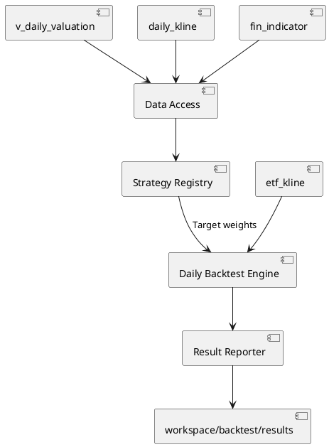

# 日频股票回测

## 1. 定位与范围

`backtest/` 是基于统一视图的 A 股日频、长仓、横截面选股回测模块。当前内置 `quality-value-recovery`、`price-momentum`、`multi-factor-quality-value-momentum` 与 `factor-composite-experiment` 四个策略，统一使用月度调仓和 ETF 基准比较；另提供候选实验的训练/验证/测试与 Walk-forward 评估器。它用于验证研究假设，不能直接替代实盘交易系统。

不支持分钟级交易、融资融券、整手委托、停复牌原因、涨跌停成交限制或税费；研究评估器只在配置文件显式列出的候选和有限参数网格内搜索，不进行无上限的自动超参数寻优。启用 `[training]` 时会在训练集内真实拟合候选因子集合的非负 Ridge 权重。

## 2. 架构与数据流



回测启动时通过 `db_manager.ensure_views(...)` 按策略数据需求显式加载 `v_daily_valuation`、`daily_kline`、`fin_indicator` 和 `etf_kline`。所有市场与财务查询均经统一视图完成，不直接读取 Parquet 文件。

| 模块 | 职责 |
|:---|:---|
| `backtest/config.py` | 读取 TOML、校验日期、资金、费用与基准参数 |
| `backtest/data_access.py` | 通过统一视图加载行情、按 TTM 公告日和指标数据可用日期对齐财务因子 |
| `backtest/strategy_base.py` | 定义策略契约和标准目标权重表校验 |
| `backtest/strategy_registry.py` | 显式注册可执行策略 |
| `backtest/strategies/` | 每个策略独立加载信号数据并生成目标权重 |
| `backtest/runner.py` | 统一执行已解析的内存回测，供正式回测和研究评估复用；研究评估器可按窗口缓存因子与市场输入 |
| `backtest/factor_trainer.py` | 使用点时月末因子和未来收益拟合非负 Ridge 因子权重 |
| `backtest/hyperparameter_search.py` | 展开因子组合、因子窗口、持仓数量、缩尾范围和 Ridge 强度的有限组合 |
| `backtest/research_evaluator.py` | 按固定切分和滚动 Walk-forward 训练、选择候选并锁定测试集 |
| `analysis/factors/` | 定义可复用点时因子、注册表、计算引擎和截面变换 |
| `backtest/engine.py` | 按 T+1 开盘调仓，逐日计算净值、现金和交易成本 |
| `backtest/metrics.py` | 计算收益、波动率、夏普和最大回撤 |
| `backtest/reporter.py` | 将输入参数、目标、交易、净值和摘要写入独立结果目录 |

## 3. 无未来函数规则

1. 信号在调仓日 T 收盘后生成。
2. T 日估值来自 `v_daily_valuation`：TTM 估值分母按 `fin_ttm.pub_date` ASOF 对齐，净资产按资产负债表的 `数据可用日期` ASOF 对齐，均不能使用各自生效日之前的数据。TTM 的 `pub_date` 是当前报告期四源统一后的公告日期；四源最大日期仍作为财务源全部可用性的派生边界。同步时若公告日期超过法定期限，还会通过对应交易所官方公告二次核验并覆盖该字段。
3. `fin_indicator` 的质量因子在回测查询中以 `数据可用日期` ASOF 对齐，不能以 `report_date` 直接对齐；同一股票同一生效日的多条记录按 `report_date` 降序确定性去重。
4. 调仓最早在下一个实际有行情的交易日 T+1 开盘执行，禁止 T 日收盘信号以 T 日价格成交。
5. 不复权价用于估值与原始成交价记录；后复权价用于持仓收益、净值和基准收益。
6. 持仓证券的行情在其最后交易日收盘后终结（退市/摘牌），当日收盘后按收盘价强制清算为现金并记录 `DELIST` 交易；清算后不再产生交易与定价，亦不再阻塞后续调仓。行情终结判定基于数据湖实际行情（该股最后一条日线），不依赖 `stocks` 快照的 `is_active` 状态。

持仓以连续价值而非整手股数表示。这样可以隔离策略本身与不同证券价格、最小交易单位导致的资金闲置；整手及涨跌停等实盘撮合约束留待独立模块实现。

## 4. 内置策略

所有内置策略在每月最后一个交易日筛选标的，并于下一交易日开盘等权调仓。可用策略通过以下命令查看：

```bash
uv run main.py list-backtest-strategies
```

### 4.1 quality-value-recovery

| 条件 | 默认阈值 |
|:---|:---|
| 上市交易日 | 至少 250 日 |
| 估值 | `pe_ttm` 与 `pb` 均处于合格股票横截面最低 40% |
| 质量 | 加权 ROE 大于 8%，经营现金流/营业收入大于 0 |
| 趋势 | `price_trend_above_ma_120d` 确认后复权收盘价高于 120 日均线 |
| 排名 | PE 与 PB 横截面百分位之和，分数由低到高 |
| 持仓 | 前 20 只等权，可通过 TOML 的 `holding_count` 修改 |

若目标证券 T+1 没有有效开盘价，则不建仓，其目标权重保留为现金。若既有持仓没有有效开盘价（停牌等临时缺失），则该次调仓整体跳过，避免将无法交易的证券以虚构价格卖出；行情终结（退市/摘牌）的持仓不在此列——其在最后交易日收盘后已按收盘价强制清算，不再阻塞后续调仓。

该策略使用 `valuation_pe_ttm`、`valuation_pb`、`quality_roe_weighted`、`quality_operating_cashflow_ratio` 和 `price_trend_above_ma_120d` 等独立因子；PE/PB 百分位排名和策略阈值仍在策略层完成。

### 4.2 price-momentum

| 条件 | 默认阈值 |
|:---|:---|
| 上市交易日 | 至少 250 日 |
| 动量 | 后复权 120 日收益率，由高到低排名 |
| 趋势 | `price_trend_above_ma_120d` 确认后复权收盘价高于 120 日均线 |
| 持仓 | 前 20 只等权 |

动量策略仅使用市场数据，不读取财务指标；动量和趋势信号由独立因子库计算，因此它也是验证策略注册表与策略特有数据需求的基准实现。

### 4.3 multi-factor-quality-value-momentum

该策略使用独立因子库计算价值、质量、动量、趋势和低波动特征。因子在同一信号日内先缩尾并按方向做百分位排名，再按配置权重合成综合分数。

| 因子 | 默认权重 |
|:---|---:|
| `price_momentum_120d` | 20% |
| `price_trend_gap_120d` | 15% |
| `price_volatility_60d` | 10% |
| `valuation_pe_ttm` | 15% |
| `valuation_pb` | 15% |
| `quality_roe_weighted` | 12.5% |
| `quality_operating_cashflow_ratio` | 12.5% |

默认要求上市交易日不少于 250 日，综合分数最高的前 20 只股票等权持有。因子接口、输入字段和未来函数约束见 [独立因子库](factor_library.md)。

### 4.4 factor-composite-experiment

该策略用于单因子和小组合研究，不改变三个正式策略的配置和行为。调用方通过 `factor_weights` 显式选择因子；策略根据因子元数据的 `higher_is_better` 统一方向，先按交易日缩尾并做百分位排名，再按权重合成分数，选择前 `holding_count` 只股票等权持有。

实验策略最多同时使用 6 个因子。`factor_parameters` 用于传递因子自身参数，例如反转因子的窗口；同一信号日只要任一选中因子缺失，该股票就从组合中剔除。权重会在参数解析时归一化，并把因子版本和参数写入 `parameters.json`。

单因子配置示例：

```bash
uv run main.py run-backtest \
  --backtest-config config/backtest/factor_experiment_reversal.toml
```

小组合配置示例：

```bash
uv run main.py run-backtest \
  --backtest-config config/backtest/factor_experiment_value_growth.toml
```

该策略是研究实验入口，不会自动修改 `multi-factor-quality-value-momentum` 的因子权重，也不代表某个因子已经通过投资有效性检验。

### 4.5 训练/验证/测试与 Walk-forward 评估

研究评估器读取一个研究 TOML，候选回测配置必须显式列出。启用 `[training]` 后，所有 `factor-composite-experiment` 候选在各自训练窗口内使用点时月末因子和未来收益拟合非负 Ridge 权重；如果同时启用 `[hyperparameter_search]`，还会在显式有限网格中展开因子组合、因子窗口、持仓数量、缩尾范围和 Ridge 强度，每组组合分别拟合权重。验证集选择完整参数组合，测试集只运行入选组合。训练失败的组合会记录原因并排除，不会退回默认权重；只有全部组合都失败时窗口才终止。启用 `[validity]` 后，训练默认至少需要 24 个有效信号日，验证和测试默认至少需要 11 个实际可执行信号及 100 个目标观测；低于门槛会阻断对应组合或窗口，而不是仅生成收益报告。开启 Walk-forward 后，每个完整滚动窗口都会重新展开、训练和选择，最终只汇总各窗口测试段。未启用训练时，才是仅比较候选原始配置的兼容模式。

为避免有限参数网格重复加载相同点时数据和行情结构，研究评估器在每个 split 内以有界 LRU 复用因子实验的原始信号数据、基础候选表以及与目标无关的市场日历/价格映射；默认最多保留 4 组因子输入和 2 个市场区间，超出后释放最久未使用项。缩尾边界、因子权重、排名、持仓数量和逐日持仓状态仍按每组试验重新计算。缓存不跨 split，也不改变普通 `run-backtest` 的默认路径。

```bash
uv run main.py evaluate-factor-experiments \
  --research-config config/backtest/factor_experiment_evaluation.toml
```

示例配置见 `config/backtest/factor_experiment_evaluation.toml`，设计与边界见 [`workspace/design_factor_experiment_evaluation.md`](../workspace/design_factor_experiment_evaluation.md) 和 [`workspace/design_factor_hyperparameter_training.md`](../workspace/design_factor_hyperparameter_training.md)。结果写入 `workspace/backtest/evaluations/<name>_<timestamp>/`，包括标准人读结果报告 `summary.md`、`training_models.csv`、`hyperparameter_trials.csv`（每组参数的训练状态、训练/验证指标、拟合权重和失败原因）、`evaluation_failures.csv`、`research_validity.csv`（训练 / 验证 / 测试的实际覆盖、阈值和门禁结果）、候选指标、入选记录和参数快照。`summary.md` 固定报告执行状态、点时样本覆盖、研究有效性门禁、失败组合、入选权重、训练/验证/测试表现、Walk-forward 稳定性和研究边界；CSV 是完整审计明细。评估器不把测试结果反写到候选配置，也不跨窗口传递持仓或净值。

## 5. 成交、成本和净值

单边交易成本为 `commission_bps + slippage_bps`。每次调仓先按开盘时持仓与目标持仓的绝对差额计算名义换手，再从组合净值中扣除成本，最后按扣成本后的净值配置目标权重。因此现金不会因成本而变为负数。

后复权收盘价涵盖分红与除权影响。引擎先将前一收盘持仓价值按当日后复权开盘价变动至开盘，再在收盘时按后复权收盘价变动，避免将公司行为误记为投资收益或损失。

## 6. 配置、命令与输出

回测输入为 TOML。配置由 `[run]`、`[strategy]` 与 `[strategy.parameters]` 组成；前两部分定义通用运行环境，最后一部分由已注册策略严格校验。示例配置位于 `config/backtest/`。

```toml
[run]
start_date = "2018-01-01"
end_date = "2026-08-07"
initial_capital = 1000000
commission_bps = 5
slippage_bps = 5
benchmark_symbol = "510300"

[strategy]
name = "price-momentum"

[strategy.parameters]
holding_count = 20
lookback_days = 120
trend_window = 120
min_listing_days = 250
```

```bash
uv run main.py run-backtest \
  --backtest-config config/backtest/price_momentum.toml
```

将 `benchmark_symbol` 设为空字符串可跳过 ETF 基准。每次运行写入 `workspace/backtest/results/<strategy>_<timestamp>/`：

| 文件 | 内容 |
|:---|:---|
| `parameters.json` | 解析并校验后的通用参数、策略参数和策略版本 |
| `daily_nav.csv` | 每日策略净值、现金、持仓市值和基准净值 |
| `rebalance_targets.csv` | 信号日、候选评分、排名和目标权重 |
| `trades.csv` | T+1 成交记录、原始及后复权开盘价、名义金额与成本 |
| `summary.md` | 普通回测的收益、风险、换手和交易记录摘要；因子实验评估另生成固定章节的训练结果报告 |

结果目录已被 Git 忽略。可复用的研究结论应在复核后写入 `investigation/`，不应把单次运行结果直接提交。

## 7. 新增策略

新增策略必须在 `backtest/strategies/` 中实现 `BacktestStrategy` 契约，并在 `backtest/strategy_registry.py` 显式注册。策略只能负责点时数据需求和标准目标权重表，不能修改引擎的 T+1 成交、复权收益与成本口径。

每个策略必须：

1. 声明名称、版本、说明和参数摘要。
2. 为 TOML 参数设置默认值、类型与范围校验，并拒绝未知参数。
3. 通过 `BacktestDataAccess` 读取统一视图，财务字段必须按公告日对齐。
4. 返回 `date`、`symbol`、`score`、`rank`、`target_weight` 五列目标权重表。
5. 提供策略筛选、未来函数边界和可手算样本测试。

## 8. 验证与扩展

单元测试覆盖 TOML 配置、策略注册、因子计算与截面变换、质量价值与动量策略排序、多因子策略权重、T+1 成交、交易成本、缺失目标开盘价处理和行情终结（退市）清算。两个旧策略迁移后还通过固定同一份点时输入的前后回测文件比较，验证目标、交易、净值和摘要保持一致。修改时间线、费用、复权口径、目标权重或清算逻辑时，必须先补充对应的可手算测试样例。

因子 IC、分位收益、覆盖率、换手、信号自相关和因子相关性诊断已由 `diagnose-factors` 提供；训练/验证/测试与 Walk-forward 评估由 `evaluate-factor-experiments` 提供。后续可独立扩展行业权重约束、卖出印花税、停牌与涨跌停规则、整手仿真、因子归因和参数敏感性分析。这些功能不得改变本模块现有的点时数据和 T+1 成交约束。
