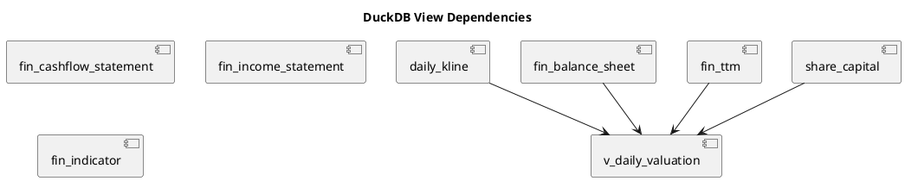

# QuantPyLab 数据资产目录 (Data Catalog)

本项目的数据资产说明书已按模块拆分，以提供更清晰的字段定义和维护体验。

## 1. 视图关系图 (View Relationships)
下图展示了系统内部视图之间的自动推导依赖关系：

## 2. 详细资产分类

### 基础与行情数据 (Market Data)
- **[股票基础信息 (stocks)](catalog/market/stocks.md)**: 包含股票代码、名称、行业、地域等基础索引。
- **[日线行情 (daily_kline)](catalog/market/daily_kline.md)**: 每日价格、成交量及复权因子。
- **[股本变动 (share_capital)](catalog/market/share_capital.md)**: 历史股本变更记录。

### 财务数据 (Financial Data)
- **[财务报表 (三大会计报表)](catalog/financial/financial_statements.md)**: 包含资产负债表、利润表、现金流量表的原始数据字段。
- **[财务指标 (高阶计算因子)](catalog/financial/financial_indicators.md)**: 包含由东财提供的 140+ 项专业财务指标。
- **[滚动财务 (TTM 估值分母)](catalog/financial/valuation_ttm.md)**: 包含自主计算的滚动十二个月 (TTM) 数据，专门用于估值还原。

### 分析视图 (Analytical Views)
- **[估值分析视图 (v_daily_valuation)](catalog/analysis/valuation_views.md)**: 整合了价格、复权因子、股本、TTM 财务数据，提供无穿越的实时估值指标。

## 3. 计算规范
- 所有金额单位如无特殊说明，均为 **元 (CNY)**。
- 比例指标单位通常为 **%**。
- 日期格式统一为 **YYYYMMDD**。
