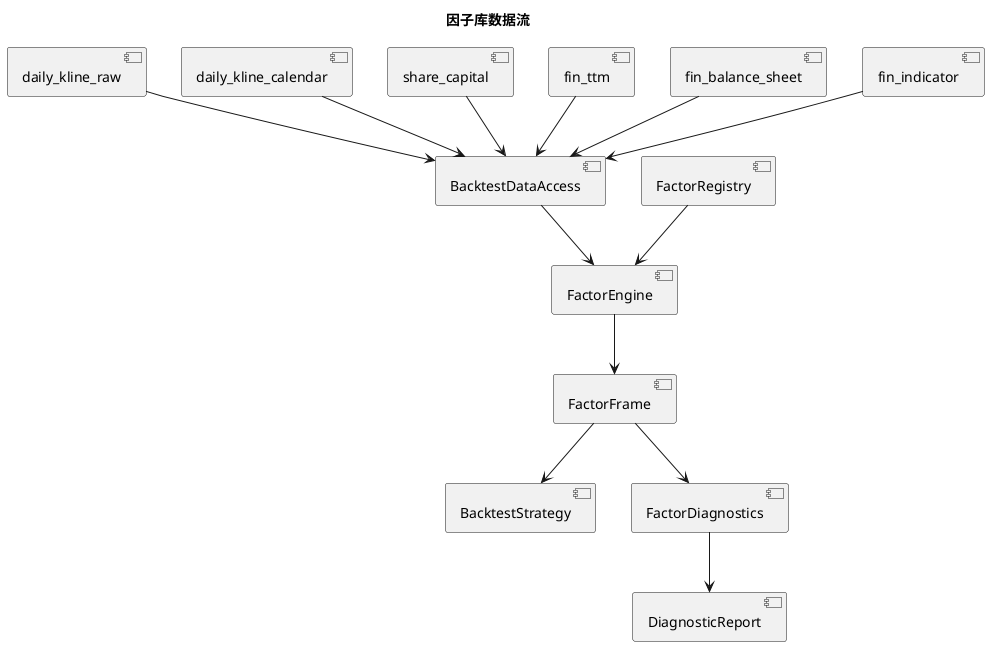

# 独立因子库

## 1. 定位

`analysis/factors/` 是 QuantPyLab 的可复用点时因子计算层。因子负责把统一视图加载的行情、估值和公告日对齐财务数据转换为股票截面特征；策略负责组合因子、筛选标的和生成目标权重。

当前因子按回测任务按需计算，不直接读取 Parquet，不写入独立因子数据表。数据访问由 `backtest/data_access.py` 统一完成：估值因子从 `share_capital`、`fin_ttm` 和 `fin_balance_sheet` 构造点时估值，质量因子从 `fin_indicator` 的 `数据可用日期` 回溯对齐。行情先通过轻量日历和原始行情视图按区间读取，重复键仅在检测到时按确定性规则去重；财务历史先在 Python 中确定性去重，再使用最近的 `effective_date <= signal_date` 行，不依赖 DuckDB ASOF 或大型区间连接的执行计划。



## 2. 核心模块

| 模块 | 职责 |
|:---|:---|
| `analysis/factors/base.py` | 定义因子输入、元数据、计算契约和结果校验 |
| `analysis/factors/registry.py` | 显式注册因子并提供版本元数据 |
| `analysis/factors/engine.py` | 汇总输入需求、计算因子并拼接宽表结果 |
| `analysis/factors/transforms.py` | 截面排名、缩尾、标准化和因子合成 |
| `analysis/factors/diagnostics.py` | 覆盖率、Rank IC、分位收益、换手、自相关和相关性诊断 |
| `analysis/factors/market.py` | 动量、趋势和波动率因子 |
| `analysis/factors/fundamental.py` | 估值和财务质量因子 |

因子定义必须实现 `FactorDefinition`，并声明名称、版本、输入字段、历史窗口和信号方向。计算结果统一为 `date`、`symbol`、`value` 三列；因子本身不能决定持仓数量、目标权重或成交时间。

## 3. 当前内置因子

| 因子 | 公式或口径 | 方向 |
|:---|:---|:---|
| `growth_deduct_profit_yoy` | `数据可用日期` ASOF 对齐的扣非净利润同比增长 | 越高越好 |
| `growth_revenue_yoy` | `数据可用日期` ASOF 对齐的营业总收入同比增长 | 越高越好 |
| `price_momentum_120d` | `close_hfq / close_hfq.shift(120) - 1` | 越高越好 |
| `price_reversal_20d` | 20 日后复权收益率的反向信号 | 越高越好 |
| `price_trend_gap_120d` | `close_hfq / MA(close_hfq, 120) - 1` | 越高越好 |
| `price_trend_above_ma_120d` | `close_hfq > MA(close_hfq, 120)`，成立为 1，否则为 0 | 越高越好 |
| `price_volatility_60d` | 后复权日收益率的 60 日滚动标准差 | 越低越好 |
| `quality_roic` | `数据可用日期` ASOF 对齐的投入资本回报率 | 越高越好 |
| `valuation_pe_ttm` | 点时 `pe_ttm`，非正值缺失 | 越低越好 |
| `valuation_pb` | 点时 `pb`，非正值缺失 | 越低越好 |
| `valuation_ps_ttm` | 点时 `ps_ttm`，非正值缺失 | 越低越好 |
| `valuation_pcf_ttm` | 点时 `pcf_ttm`，非正值缺失 | 越低越好 |
| `quality_roe_weighted` | `数据可用日期` ASOF 对齐的加权 ROE | 越高越好 |
| `quality_operating_cashflow_ratio` | `数据可用日期` ASOF 对齐的经营现金流/营业收入 | 越高越好 |

## 4. 截面变换

`transforms.py` 提供不依赖数据库的纯函数：

- `rank_factor_cross_sectionally`：按交易日做百分位排名，并支持高值或低值优先。
- `winsorize_factor_cross_sectionally`：按交易日分组缩尾，减少极端值影响。
- `standardize_factor_cross_sectionally`：按交易日计算标准分。
- `combine_factor_scores`：按显式权重合成因子分数。
- `filter_valid_factor_rows`：删除指定因子缺失的股票截面。

因子先提供原始值，方向翻转和截面标准化由策略明确决定，避免把某一套策略的评分规则固化在因子定义中。

## 5. 因子诊断

因子诊断命令使用真实点时输入，信号日在收盘后生成，收益从下一交易日开盘进入。`horizon=1` 表示下一交易日开盘到收盘的收益；更长持有期仍从下一交易日开盘进入，在对应交易日收盘退出。

```bash
uv run main.py diagnose-factors \
  --factor-names price_momentum_120d valuation_pe_ttm quality_roe_weighted \
  --start-date 2018-01-01 \
  --end-date 2025-12-31 \
  --horizons 1 5 20 \
  --quantile-count 5
```

命令会输出覆盖率、每日 Rank IC、方向调整后的 Rank IC、分位数组合收益、优选分位组合换手率、信号秩自相关和因子两两截面相关性。结果默认写入 `workspace/factor_diagnostics/run_<timestamp>/`，也可以通过 `--output` 指定目录。输出目录中的 `parameters.json` 固定数据窗口、因子名称、持有期和分位数组数，便于复现。

诊断中的“方向调整”使用因子元数据的 `higher_is_better`：低估值因子会将原始负相关转换为正向可比较指标。因子诊断只用于评估信号，不改变策略的筛选、权重和成交逻辑。

因子实验还可以使用 `diagnose-factor-exposures` 审计点时规模暴露。命令从 `v_daily_valuation.market_cap` 读取信号日市值，在每个信号日的可选股票池内重新分组，比较可选池与入选持仓的规模占比、选择提升和覆盖率。该审计不参与训练或回测，也不改变策略行为。当前 `stocks.industry` 是没有历史生效日期的元数据快照，不能用于历史行业暴露或行业中性结论。

历史行业分类已经通过独立数据集 `industry_classification_sw` 提供，使用申万 `effective_date` 做 ASOF 对齐，`stocks.industry` 仍只作为当前快照。行业数据资产本身不参与因子训练和回测；真实覆盖率审计已完成，行业中性化仍需单独明确缺失处理和约束规则。

行业覆盖率与选择暴露可通过 `diagnose-factor-industry-exposures` 生成独立报告。该命令只审计候选池和入选持仓，不改变训练、策略和回测；即使覆盖率较高，也不自动将行业中性化接入策略。研究对照命令 `diagnose-factor-neutralization` 进一步比较行业、规模和联合残差化评分，但残差化只改变排序，不保证组合严格满足行业/规模配额，因此当前仍不接入正式策略。

比例配额对照命令 `diagnose-factor-constrained-selection` 固定原始综合评分，按有效行业、规模或行业×规模候选数量分配 `holding_count`，使用 Hamilton 最大余数法并在组内保留原始评分排序。它用于区分“直接风险配额导致的目标变化”和“残差评分导致的目标变化”；配额误差、控制变量覆盖率和目标重合率均写入报告。该命令仍是研究工具，不改变因子定义、训练、正式策略和回测。

选股约束的收益影响由 `evaluate-factor-selection-variants` 在同一成本与成交口径下统一比较。它同时运行原始 baseline、三种残差化和三种比例配额目标，复用同一 `PreparedMarketData` 和 `DailyBacktestEngine`，输出逐日净值、逐笔成交、换手、成本、覆盖失败和目标重合审计。只有调用方显式传入预先锁定且未参与方案选择的评估区间时，报告才可作为样本外影响对照；该命令不会把任何约束接入正式策略。

多因子组合的边际贡献由 `evaluate-factor-marginal-contributions` 独立验证。它在同一公共候选池中运行正式七因子组合、七个单因子和七个 leave-one-out 组合，统一使用正式策略的因子方向、截面变换、持仓数量、成交和成本口径，并输出逐因子收益、风险、换手、成本、候选覆盖和目标重合。leave-one-out 只移除一个因子并按剩余正式权重重新归一化；结果用于识别单因子信号、因子互补性与组合依赖，不直接改写正式权重。显式传入预先锁定的评估区间后，报告才可作为样本外边际贡献证据。

交易容量与流动性由 `diagnose-factor-liquidity-capacity` 独立审计。该命令只对正式多因子策略运行，使用 `daily_kline.amount` 的信号日及此前配置窗口（默认 20 个交易日）滚动平均成交额，以及 `BacktestDataAccess` 构造的点时 `market_cap`，计算候选/入选覆盖率、成交额分组和逐笔订单参与率，并保留正式目标权重作为审计文件。容量按 `initial_capital × 参与率上限 / 实际订单参与率` 做单笔订单近似，默认检查 5%、10%、20% 上限；执行日成交额不进入分母，缺失流动性、无效名义金额、SKIP_REBALANCE 和 DELIST 单独记录。诊断只保留候选信号日快照和回测所需五列行情，回测引擎按交易日使用紧凑数值表，避免多份宽行情表和嵌套 Python 字典同时驻留。它是研究有效性审计，不把流动性直接注册为 alpha 因子，也不自动修改正式策略。

## 6. 回测使用方式

多因子策略 `multi-factor-quality-value-momentum` 使用全部七个内置因子：

- 动量：20%
- 趋势：15%
- 低波动：10%
- PE：15%
- PB：15%
- 加权 ROE：12.5%
- 经营现金流/营业收入：12.5%

策略在每月最后一个交易日收盘后计算截面分数，选择前 `holding_count` 只股票等权持有，并由现有回测引擎在下一交易日开盘成交。配置示例：

```bash
uv run main.py run-backtest \
  --backtest-config config/backtest/multi_factor_quality_value_momentum.toml
```

因子版本和解析后的权重会随策略参数写入回测结果的 `parameters.json`。

`factor-composite-experiment` 是面向研发的单因子/小组合实验入口。它通过 `factor_weights` 显式选择 1 至 6 个已注册因子，使用因子元数据统一低值优先与高值优先方向，按信号日截面缩尾、百分位排名和权重合成后月度等权调仓。因子专属参数放在 `factor_parameters`，例如：

```toml
[strategy]
name = "factor-composite-experiment"

[strategy.parameters.factor_weights]
price_reversal_20d = 1.0

[strategy.parameters.factor_parameters.price_reversal_20d]
lookback_days = 20
```

缺少任一选中因子的股票不会进入该信号日组合；实验策略最多使用六个因子，并将归一化权重、因子版本和专属参数写入回测结果。该入口用于单因子与小组合比较，不会改变现有正式策略。

候选实验和正式七因子策略的时间切分由 `evaluate-factor-experiments` 自动执行。启用 `[training]` 后，未来收益标签会在每个信号日转换为截面百分位排名并去均值，各信号日对目标函数贡献相同；权重通过确定性投影梯度法约束为非负且总和为 1，并由 `ridge_alpha` 向候选配置预先声明的完整权重收缩。`factor-composite-experiment` 仍按候选配置选择 1 至 6 个因子，`multi-factor-quality-value-momentum` 完整覆盖正式七因子，训练得到的零权重不会被默认权重恢复。

有限网格中的每组组合独立训练；模型有效因子数或最大权重不合格、验证选择分数低于阈值时标记为拒绝，不读取该窗口测试段。协议门禁还检查训练失败比例、组合/验证信号日、测试窗口不重叠和最少完成测试窗口。`research_validity.csv` 保存样本、模型和验证门禁，`research_protocol.csv` 保存流程级门禁，报告把协议状态和策略测试证据分开。正式七因子配置是 5 年训练、2 年验证、2 年测试、2 年步长和 4 组外层参数；由于历史测试期已经用于修复诊断，结果标记为回溯性方法开发而不是新盲测。完整配置协议见 [`workspace/design_factor_research_validity_remediation.md`](../workspace/design_factor_research_validity_remediation.md)。

有限参数搜索时，评估器在单个 split 内通过有界 LRU 缓存已经加载并计算完成的因子候选基础表；当前最多保留 2 组输入，每组参数仍独立执行缩尾、方向排名、权重合成和持仓选择。缓存只服务研究评估调用，不写入因子数据表，也不跨 Walk-forward 窗口复用。

`price-momentum` 与 `quality-value-recovery` 也已经使用独立因子库：前者使用动量因子和 `price_trend_above_ma_120d`，后者使用趋势确认因子、估值因子和质量因子。`price_trend_above_ma_120d` 保留旧策略严格的 `close_hfq > rolling_mean` 判断；比例型 `price_trend_gap_120d` 继续作为多因子策略的连续评分因子。两个旧策略的 PE/PB 排名、阈值过滤、排名方向和等权建仓逻辑仍由策略层负责。

动量与趋势因子支持调用方传入正整数窗口参数；因子名称中的 `120d` 表示默认口径，不限制策略使用自定义窗口。

研究评估报告的 `parameters.json` 和 `summary.md` 还记录评估进程峰值 RSS、2 GiB 进程资源预算、单次数据加载目标和训练缓存上限，便于核对长窗口训练的资源边界；若真实全量运行超过预算，报告会明确标记。滚动因子按股票批次计算，训练器只保留月末因子和标签样本；默认因子批次为 125 只股票。

## 7. 迁移验证

迁移验证脚本位于 `workspace/run_migration_behavior_validation.py`。它固定一份点时输入和基准价格，分别执行旧目标生成逻辑与迁移后策略，并逐项比较 `parameters.json`、`rebalance_targets.csv`、`trades.csv`、`daily_nav.csv` 和 `summary.md`。验证产物位于 `workspace/backtest/migration_validation/`。

## 8. 未来函数约束

1. 估值因子只能使用 `fin_ttm.pub_date` 当天及之后可见的 TTM；质量因子只能使用 `fin_indicator.数据可用日期` 当天及之后可见的指标。
2. `daily_kline_raw` 按区间读取，检测到 `(symbol, date)` 重复时按 `daily_kline` 的 tie-break 口径确定性去重；估值和指标先按股票、生效日去重，再由 Python 使用不晚于信号日的最近生效记录，避免重复记录和 DuckDB ASOF 物理排序造成研究结果变化。
3. 滚动窗口只能使用当前日期及之前的行情。
4. 截面排名、缩尾和标准化只能在同一交易日内计算。
5. 因子数据访问根据因子最大历史窗口和策略最小历史要求向回取数。
6. 因子计算不能使用回测结束日之后的数据填补历史缺失值。

TTM 的 `pub_date` 取当前报告期四源统一后的公告日期；上年年末和上年同期仅参与 TTM 数值计算，不把其历史日期传播到当前 TTM。历史比较数据若需要严格区分真实修订版本，应在未来版本化财务数据模型中实现，不在因子层自行推断。

因子测试包含未来行情变更隔离样例，确保修改未来日期的数据不会改变此前交易日的因子值。
