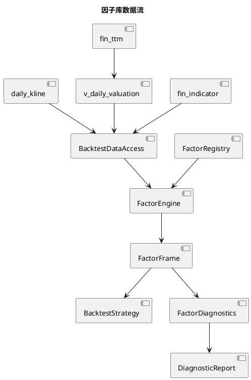

# 独立因子库

## 1. 定位

`analysis/factors/` 是 QuantPyLab 的可复用点时因子计算层。因子负责把统一视图加载的行情、估值和公告日对齐财务数据转换为股票截面特征；策略负责组合因子、筛选标的和生成目标权重。

当前因子按回测任务按需计算，不直接读取 Parquet，不写入独立因子数据表。数据访问由 `backtest/data_access.py` 统一完成：估值因子通过 `v_daily_valuation` 使用 `fin_ttm.pub_date` ASOF 对齐，质量因子通过 `fin_indicator.数据可用日期` ASOF 对齐。



## 2. 核心模块

| 模块 | 职责 |
|:---|:---|
| `analysis/factors/base.py` | 定义因子输入、元数据、计算契约和结果校验 |
| `analysis/factors/registry.py` | 显式注册因子并提供版本元数据 |
| `analysis/factors/engine.py` | 汇总输入需求、计算因子并拼接宽表结果 |
| `analysis/factors/transforms.py` | 截面排名、缩尾、标准化和因子合成 |
| `analysis/factors/diagnostics.py` | 覆盖率、Rank IC、分位收益、换手、自相关和相关性诊断 |
| `analysis/factors/market.py` | 动量、趋势和波动率因子 |
| `analysis/factors/fundamental.py` | 估值和财务质量因子 |

因子定义必须实现 `FactorDefinition`，并声明名称、版本、输入字段、历史窗口和信号方向。计算结果统一为 `date`、`symbol`、`value` 三列；因子本身不能决定持仓数量、目标权重或成交时间。

## 3. 当前内置因子

| 因子 | 公式或口径 | 方向 |
|:---|:---|:---|
| `growth_deduct_profit_yoy` | `数据可用日期` ASOF 对齐的扣非净利润同比增长 | 越高越好 |
| `growth_revenue_yoy` | `数据可用日期` ASOF 对齐的营业总收入同比增长 | 越高越好 |
| `price_momentum_120d` | `close_hfq / close_hfq.shift(120) - 1` | 越高越好 |
| `price_reversal_20d` | 20 日后复权收益率的反向信号 | 越高越好 |
| `price_trend_gap_120d` | `close_hfq / MA(close_hfq, 120) - 1` | 越高越好 |
| `price_trend_above_ma_120d` | `close_hfq > MA(close_hfq, 120)`，成立为 1，否则为 0 | 越高越好 |
| `price_volatility_60d` | 后复权日收益率的 60 日滚动标准差 | 越低越好 |
| `quality_roic` | `数据可用日期` ASOF 对齐的投入资本回报率 | 越高越好 |
| `valuation_pe_ttm` | 点时 `pe_ttm`，非正值缺失 | 越低越好 |
| `valuation_pb` | 点时 `pb`，非正值缺失 | 越低越好 |
| `valuation_ps_ttm` | 点时 `ps_ttm`，非正值缺失 | 越低越好 |
| `valuation_pcf_ttm` | 点时 `pcf_ttm`，非正值缺失 | 越低越好 |
| `quality_roe_weighted` | `数据可用日期` ASOF 对齐的加权 ROE | 越高越好 |
| `quality_operating_cashflow_ratio` | `数据可用日期` ASOF 对齐的经营现金流/营业收入 | 越高越好 |

## 4. 截面变换

`transforms.py` 提供不依赖数据库的纯函数：

- `rank_factor_cross_sectionally`：按交易日做百分位排名，并支持高值或低值优先。
- `winsorize_factor_cross_sectionally`：按交易日分组缩尾，减少极端值影响。
- `standardize_factor_cross_sectionally`：按交易日计算标准分。
- `combine_factor_scores`：按显式权重合成因子分数。
- `filter_valid_factor_rows`：删除指定因子缺失的股票截面。

因子先提供原始值，方向翻转和截面标准化由策略明确决定，避免把某一套策略的评分规则固化在因子定义中。

## 5. 因子诊断

因子诊断命令使用真实点时输入，信号日在收盘后生成，收益从下一交易日开盘进入。`horizon=1` 表示下一交易日开盘到收盘的收益；更长持有期仍从下一交易日开盘进入，在对应交易日收盘退出。

```bash
uv run main.py diagnose-factors \
  --factor-names price_momentum_120d valuation_pe_ttm quality_roe_weighted \
  --start-date 2018-01-01 \
  --end-date 2025-12-31 \
  --horizons 1 5 20 \
  --quantile-count 5
```

命令会输出覆盖率、每日 Rank IC、方向调整后的 Rank IC、分位数组合收益、优选分位组合换手率、信号秩自相关和因子两两截面相关性。结果默认写入 `workspace/factor_diagnostics/run_<timestamp>/`，也可以通过 `--output` 指定目录。输出目录中的 `parameters.json` 固定数据窗口、因子名称、持有期和分位数组数，便于复现。

诊断中的“方向调整”使用因子元数据的 `higher_is_better`：低估值因子会将原始负相关转换为正向可比较指标。因子诊断只用于评估信号，不改变策略的筛选、权重和成交逻辑。

## 6. 回测使用方式

多因子策略 `multi-factor-quality-value-momentum` 使用全部七个内置因子：

- 动量：20%
- 趋势：15%
- 低波动：10%
- PE：15%
- PB：15%
- 加权 ROE：12.5%
- 经营现金流/营业收入：12.5%

策略在每月最后一个交易日收盘后计算截面分数，选择前 `holding_count` 只股票等权持有，并由现有回测引擎在下一交易日开盘成交。配置示例：

```bash
uv run main.py run-backtest \
  --backtest-config config/backtest/multi_factor_quality_value_momentum.toml
```

因子版本和解析后的权重会随策略参数写入回测结果的 `parameters.json`。

`factor-composite-experiment` 是面向研发的单因子/小组合实验入口。它通过 `factor_weights` 显式选择 1 至 6 个已注册因子，使用因子元数据统一低值优先与高值优先方向，按信号日截面缩尾、百分位排名和权重合成后月度等权调仓。因子专属参数放在 `factor_parameters`，例如：

```toml
[strategy]
name = "factor-composite-experiment"

[strategy.parameters.factor_weights]
price_reversal_20d = 1.0

[strategy.parameters.factor_parameters.price_reversal_20d]
lookback_days = 20
```

缺少任一选中因子的股票不会进入该信号日组合；实验策略最多使用六个因子，并将归一化权重、因子版本和专属参数写入回测结果。该入口用于单因子与小组合比较，不会改变现有正式策略。

候选实验的时间切分由 `evaluate-factor-experiments` 自动执行。启用研究配置的 `[training]` 后，训练集会对每个显式候选的因子集合拟合非负 Ridge 权重（使用点时月末因子排名和未来收益）；进一步启用 `[hyperparameter_search]` 时，会在有限网格中搜索因子组合、因子窗口、持仓数量、缩尾范围和 Ridge 强度，每组组合重新拟合权重。验证集选择完整组合，测试集只运行入选方案；无法拟合或样本覆盖低于 `[validity]` 门槛的组合会记录原因并排除，不会回退到默认权重；Walk-forward 会在每个窗口重新展开和拟合。研究配置的默认门槛是训练至少 24 个信号日、验证和测试各至少 11 个实际可执行信号及 100 个目标观测，门槛不足时不能把结果解释为有效研究结论。该流程不进行无上限搜索，测试结果不会参与候选选择。每次运行的 `summary.md` 是标准人读结果报告，固定展示信号日数量、研究有效性门禁、验证集选择稳健性、训练状态、失败原因、入选权重、阶段表现和稳定性提示；CSV 文件保留完整审计明细，其中 `research_validity.csv` 保存逐阶段门禁明细，`selection_diagnostics.csv` 记录验证比较规模与多重比较风险。验证信号日偏少或比较组合数多于验证信号日时只产生风险提示，不改变选择规则。完整配置协议见 [`workspace/design_factor_experiment_evaluation.md`](../workspace/design_factor_experiment_evaluation.md) 和 [`workspace/design_factor_hyperparameter_training.md`](../workspace/design_factor_hyperparameter_training.md)。

有限参数搜索时，评估器在单个 split 内通过有界 LRU 缓存已经加载并计算完成的因子候选基础表；默认最多保留 4 组输入，每组参数仍独立执行缩尾、方向排名、权重合成和持仓选择。缓存只服务研究评估调用，不写入因子数据表，也不跨 Walk-forward 窗口复用。

`price-momentum` 与 `quality-value-recovery` 也已经使用独立因子库：前者使用动量因子和 `price_trend_above_ma_120d`，后者使用趋势确认因子、估值因子和质量因子。`price_trend_above_ma_120d` 保留旧策略严格的 `close_hfq > rolling_mean` 判断；比例型 `price_trend_gap_120d` 继续作为多因子策略的连续评分因子。两个旧策略的 PE/PB 排名、阈值过滤、排名方向和等权建仓逻辑仍由策略层负责。

动量与趋势因子支持调用方传入正整数窗口参数；因子名称中的 `120d` 表示默认口径，不限制策略使用自定义窗口。

## 7. 迁移验证

迁移验证脚本位于 `workspace/run_migration_behavior_validation.py`。它固定一份点时输入和基准价格，分别执行旧目标生成逻辑与迁移后策略，并逐项比较 `parameters.json`、`rebalance_targets.csv`、`trades.csv`、`daily_nav.csv` 和 `summary.md`。验证产物位于 `workspace/backtest/migration_validation/`。

## 8. 未来函数约束

1. 估值因子只能使用 `fin_ttm.pub_date` 当天及之后可见的 TTM；质量因子只能使用 `fin_indicator.数据可用日期` 当天及之后可见的指标。
2. 滚动窗口只能使用当前日期及之前的行情。
3. 截面排名、缩尾和标准化只能在同一交易日内计算。
4. 因子数据访问根据因子最大历史窗口和策略最小历史要求向回取数。
5. 因子计算不能使用回测结束日之后的数据填补历史缺失值。

TTM 的 `pub_date` 取当前报告期四源统一后的公告日期；上年年末和上年同期仅参与 TTM 数值计算，不把其历史日期传播到当前 TTM。历史比较数据若需要严格区分真实修订版本，应在未来版本化财务数据模型中实现，不在因子层自行推断。

因子测试包含未来行情变更隔离样例，确保修改未来日期的数据不会改变此前交易日的因子值。
