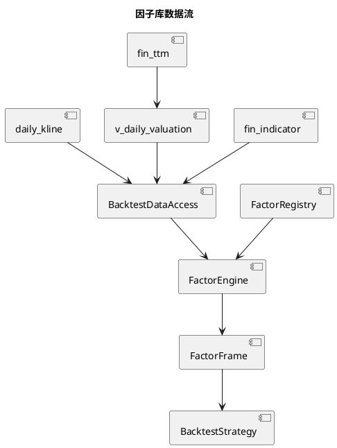

# 独立因子库

## 1. 定位

`analysis/factors/` 是 QuantPyLab 的可复用点时因子计算层。因子负责把统一视图加载的行情、估值和公告日对齐财务数据转换为股票截面特征；策略负责组合因子、筛选标的和生成目标权重。

当前因子按回测任务按需计算，不直接读取 Parquet，不写入独立因子数据表。数据访问由 `backtest/data_access.py` 统一完成：估值因子通过 `v_daily_valuation` 使用 `fin_ttm.pub_date` ASOF 对齐，质量因子通过 `fin_indicator.数据可用日期` ASOF 对齐。



## 2. 核心模块

| 模块 | 职责 |
|:---|:---|
| `analysis/factors/base.py` | 定义因子输入、元数据、计算契约和结果校验 |
| `analysis/factors/registry.py` | 显式注册因子并提供版本元数据 |
| `analysis/factors/engine.py` | 汇总输入需求、计算因子并拼接宽表结果 |
| `analysis/factors/transforms.py` | 截面排名、缩尾、标准化和因子合成 |
| `analysis/factors/market.py` | 动量、趋势和波动率因子 |
| `analysis/factors/fundamental.py` | 估值和财务质量因子 |

因子定义必须实现 `FactorDefinition`，并声明名称、版本、输入字段、历史窗口和信号方向。计算结果统一为 `date`、`symbol`、`value` 三列；因子本身不能决定持仓数量、目标权重或成交时间。

## 3. 当前内置因子

| 因子 | 公式或口径 | 方向 |
|:---|:---|:---|
| `price_momentum_120d` | `close_hfq / close_hfq.shift(120) - 1` | 越高越好 |
| `price_trend_gap_120d` | `close_hfq / MA(close_hfq, 120) - 1` | 越高越好 |
| `price_trend_above_ma_120d` | `close_hfq > MA(close_hfq, 120)`，成立为 1，否则为 0 | 越高越好 |
| `price_volatility_60d` | 后复权日收益率的 60 日滚动标准差 | 越低越好 |
| `valuation_pe_ttm` | 点时 `pe_ttm`，非正值缺失 | 越低越好 |
| `valuation_pb` | 点时 `pb`，非正值缺失 | 越低越好 |
| `quality_roe_weighted` | `数据可用日期` ASOF 对齐的加权 ROE | 越高越好 |
| `quality_operating_cashflow_ratio` | `数据可用日期` ASOF 对齐的经营现金流/营业收入 | 越高越好 |

## 4. 截面变换

`transforms.py` 提供不依赖数据库的纯函数：

- `rank_factor_cross_sectionally`：按交易日做百分位排名，并支持高值或低值优先。
- `winsorize_factor_cross_sectionally`：按交易日分组缩尾，减少极端值影响。
- `standardize_factor_cross_sectionally`：按交易日计算标准分。
- `combine_factor_scores`：按显式权重合成因子分数。
- `filter_valid_factor_rows`：删除指定因子缺失的股票截面。

因子先提供原始值，方向翻转和截面标准化由策略明确决定，避免把某一套策略的评分规则固化在因子定义中。

## 5. 回测使用方式

多因子策略 `multi-factor-quality-value-momentum` 使用全部七个内置因子：

- 动量：20%
- 趋势：15%
- 低波动：10%
- PE：15%
- PB：15%
- 加权 ROE：12.5%
- 经营现金流/营业收入：12.5%

策略在每月最后一个交易日收盘后计算截面分数，选择前 `holding_count` 只股票等权持有，并由现有回测引擎在下一交易日开盘成交。配置示例：

```bash
uv run main.py run-backtest \
  --backtest-config config/backtest/multi_factor_quality_value_momentum.toml
```

因子版本和解析后的权重会随策略参数写入回测结果的 `parameters.json`。

`price-momentum` 与 `quality-value-recovery` 也已经使用独立因子库：前者使用动量因子和 `price_trend_above_ma_120d`，后者使用趋势确认因子、估值因子和质量因子。`price_trend_above_ma_120d` 保留旧策略严格的 `close_hfq > rolling_mean` 判断；比例型 `price_trend_gap_120d` 继续作为多因子策略的连续评分因子。两个旧策略的 PE/PB 排名、阈值过滤、排名方向和等权建仓逻辑仍由策略层负责。

动量与趋势因子支持调用方传入正整数窗口参数；因子名称中的 `120d` 表示默认口径，不限制策略使用自定义窗口。

## 6. 迁移验证

迁移验证脚本位于 `workspace/run_migration_behavior_validation.py`。它固定一份点时输入和基准价格，分别执行旧目标生成逻辑与迁移后策略，并逐项比较 `parameters.json`、`rebalance_targets.csv`、`trades.csv`、`daily_nav.csv` 和 `summary.md`。验证产物位于 `workspace/backtest/migration_validation/`。

## 7. 未来函数约束

1. 估值因子只能使用 `fin_ttm.pub_date` 当天及之后可见的 TTM；质量因子只能使用 `fin_indicator.数据可用日期` 当天及之后可见的指标。
2. 滚动窗口只能使用当前日期及之前的行情。
3. 截面排名、缩尾和标准化只能在同一交易日内计算。
4. 因子数据访问根据因子最大历史窗口和策略最小历史要求向回取数。
5. 因子计算不能使用回测结束日之后的数据填补历史缺失值。

TTM 的 `pub_date` 取当前报告期四源统一后的公告日期；上年年末和上年同期仅参与 TTM 数值计算，不把其历史日期传播到当前 TTM。历史比较数据若需要严格区分真实修订版本，应在未来版本化财务数据模型中实现，不在因子层自行推断。

因子测试包含未来行情变更隔离样例，确保修改未来日期的数据不会改变此前交易日的因子值。
