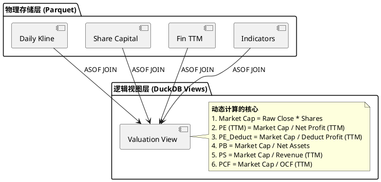

# RFC: 日线行情与动态估值体系架构 (K-Line & Valuation)

| 属性 | 内容 |
| :--- | :--- |
| **状态** | Draft (待评审) |
| **目标** | 构建支持**精准回测**与**历史估值分析**的行情数据库。 |
| **涉及模块** | `data_ingestion`, `storage`, `analysis` |

## 1. 背景与挑战

为了支持价值投资策略的回测（如“在 PE < 10 时买入”），我们需要解决以下核心痛点：

1.  **复权陷阱**：前复权导致历史数据被重写，破坏回测一致性；不复权导致价格断层。
2.  **市值失真**：仅有股价无法计算历史市值，必须结合当时的股本。
3.  **数据穿越**：计算历史 PE/PB 时，必须严格使用**当时已披露**的财务数据，而非后来发布的年报。

## 2. 核心设计原则

**“存原始，算复权，动态拼装”**

1.  **存储层 (The Truth)**：只存储**不复权价格**、**复权因子**、**股本变动记录**、**原始财报**。这些是客观存在的历史事实，永远不随时间改变。
2.  **逻辑层 (The Logic)**：利用 DuckDB 强大的计算能力，通过视图 (View) 动态生成后复权价格和历史估值。

## 3. 数据模型设计 (Schema)

### 3.1 日线行情表 (daily_kline)
存储路径：`data/warehouse/daily_kline/symbol=XXXXXX/*.parquet`
分区策略：按 `symbol` 分区，每个文件包含该股全量/年度历史。

| 字段 | 类型 | 说明 | 数据源 |
| :--- | :--- | :--- | :--- |
| `date` | DATE | 交易日期 | `ak.stock_zh_a_hist(adjust="")` |
| `open` | DOUBLE | **不复权**开盘价 | |
| `high` | DOUBLE | **不复权**最高价 | |
| `low` | DOUBLE | **不复权**最低价 | |
| `close` | DOUBLE | **不复权**收盘价 | |
| `volume` | DOUBLE | 成交量 (手) | |
| `amount` | DOUBLE | 成交额 (元) | |
| `adj_factor` | DOUBLE | **复权因子** | 核心字段。用于计算后复权价。 |

### 3.3 财务 TTM 数据 (fin_ttm)
存储路径：`data/warehouse/financial/ttm/symbol=XXXXXX/data.parquet`
由 `analysis/processors/ttm_calculator.py` 生成。

| 字段 | 类型 | 说明 |
| :--- | :--- | :--- |
| `report_date` | VARCHAR | 报告期 (YYYYMMDD) |
| `pub_date` | VARCHAR | **披露日期** (YYYYMMDD) - 用于 ASOF JOIN 防止穿越 |
| `net_profit_ttm` | DOUBLE | 归母净利润 (TTM) |
| `deduct_net_profit_ttm` | DOUBLE | 扣非归母净利润 (TTM) |
| `revenue_ttm` | DOUBLE | 营业总收入 (TTM) |
| `ocf_ttm` | DOUBLE | 经营活动现金流 (TTM) |

### 3.4 财务指标库 (indicators)
存储路径：`data/warehouse/indicators/symbol=XXXXXX/data.parquet`
由 `data_ingestion/collectors/financial_collector.py` 采集。主要用于获取非 TTM 类指标（如净资产）。

| 字段 | 类型 | 说明 |
| :--- | :--- | :--- |
| `公告日期` | VARCHAR | 披露日期 (YYYYMMDD) |
| `净资产` | DOUBLE | 归属于母公司股东权益合计 |

## 4. 动态估值逻辑 (The "Trinity" View)

这是本方案的核心。我们不直接存储每天的 PE/PB，而是通过 **DuckDB ASOF JOIN** 动态合成。

### 4.1 逻辑视图架构


### 4.2 关键 SQL 实现 (伪代码)
```sql
CREATE OR REPLACE VIEW v_daily_valuation AS
WITH 
-- 1. 准备基础行情
base_kline AS (
    SELECT symbol, date, close AS raw_close, adj_factor 
    FROM 'data/warehouse/daily_kline/*/*.parquet'
),
-- 2. 准备股本历史
capital_hist AS (
    SELECT symbol, CAST(变动日期 AS DATE) as change_date, 总股本 * 10000 AS total_shares 
    FROM 'data/warehouse/share_capital/*/*.parquet'
),
-- 3. 准备财务 TTM 历史
ttm_hist AS (
    SELECT symbol, CAST(pub_date AS DATE) as pub_date, net_profit_ttm, deduct_net_profit_ttm, revenue_ttm, ocf_ttm
    FROM 'data/warehouse/financial/ttm/*/*.parquet'
),
-- 4. 准备净资产历史
assets_hist AS (
    SELECT symbol, CAST(公告日期 AS DATE) as pub_date, 净资产 as net_assets
    FROM 'data/warehouse/indicators/*/*.parquet'
)

SELECT 
    k.date,
    k.symbol,
    -- A. 价格指标
    k.raw_close,
    (k.raw_close * k.adj_factor) AS close_hfq, -- 后复权价格 (用于回测)
    
    -- B. 股本指标
    s.total_shares,
    
    -- C. 核心估值 (计算当时的总市值)
    (k.raw_close * s.total_shares) AS market_cap,
    
    -- D. 估值比率 (ASOF JOIN 匹配当时已披露的数据)
    (k.raw_close * s.total_shares) / NULLIF(t.net_profit_ttm, 0) AS pe_ttm,
    (k.raw_close * s.total_shares) / NULLIF(t.deduct_net_profit_ttm, 0) AS pe_deduct_ttm,
    (k.raw_close * s.total_shares) / NULLIF(a.net_assets, 0) AS pb,
    (k.raw_close * s.total_shares) / NULLIF(t.revenue_ttm, 0) AS ps_ttm,
    (k.raw_close * s.total_shares) / NULLIF(t.ocf_ttm, 0) AS pcf_ttm

FROM base_kline k
ASOF JOIN capital_hist s 
    ON k.symbol = s.symbol AND k.date >= s.change_date
ASOF JOIN ttm_hist t 
    ON k.symbol = t.symbol AND k.date >= t.pub_date
ASOF JOIN assets_hist a
    ON k.symbol = a.symbol AND k.date >= a.pub_date;
```

## 5. 实施计划

### Phase 0: 财务 TTM 计算 (Completed)
- **任务**: 实现 `TTMCalculator`。
- **产出**: `data/warehouse/financial/ttm/`。

### Phase 1: 股本数据采集 (Share Capital)
- **任务**: 实现 `ShareCollector`。
- **接口**: `ak.stock_share_change_cninfo(symbol)`.
- **存储**: `data/warehouse/share_capital/symbol=XXXXXX/data.parquet`。

### Phase 2: K线数据同步 (K-Line Sync)
- **任务**: 实现 `DailyKlineCollector`。
- **数据源**: `ak.stock_zh_a_hist`。
- **逻辑**: 同时抓取 Raw 和 HFQ，计算并存储 `adj_factor`。
- **存储**: 使用 Parquet 写入，按 Symbol 分区。

### Phase 3: 估值视图构建 (Analysis Layer)
- **任务**: 在 `storage/database/manager.py` 中编写 SQL View 注册逻辑。
- **验证**: 验证 PE/PB/PS/PCF 是否随除权除息和财报披露平滑变动。

## 6. 问答 (Q&A)

**Q: 为什么要自己算 PE，不直接抓取东财的 PE 数据？**
A: 
1. **黑盒问题**：第三方平台的 PE 计算口径（扣非/不扣非、TTM/LYR）经常变动且不透明。
2. **回测需求**：我们需要构建因子库。自己计算能确保分子分母的定义完全可控。
3. **数据对齐**：第三方数据可能在财报修正后“偷偷”修改历史 PE，导致回测引入未来函数。自己算可以严格基于“披露日” (Pub Date) 锁定当时的数据。

**Q: 股本数据如果不全怎么办？**
A: 这是一个潜在风险。如果 `stock_share_change_cninfo` 缺失早期数据，我们将回退到使用“财务报表中的股本”进行填充（虽然财报是季频，不如公告频次高，但足以覆盖绝大多数场景）。
