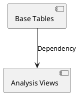

# 统一视图架构设计 (Unified View Architecture)

## 1. 背景与核心价值
在 DuckDB 分析层，我们彻底消除了“物理表”和“逻辑视图”的界限。所有可查询的数据对象统一呈现为 **视图 (View)**。这种架构带来了以下优势：
- **存算分离**：底层数据以 Parquet 分片存储，上层逻辑通过 SQL 动态解析。
- **一致性保障**：通过 `ASOF JOIN` 强制执行“公告日对齐”逻辑，从架构层面杜绝未来函数。
- **透明性**：目录结构即架构，开发者只需通过文件名和位置即可理解数据拓扑。

## 2. 设计模式：代码即定义 (Code-as-Definition)
传统的 `.sql` 文件难以管理复杂的依赖关系。我们采用了 Python 类来封装视图逻辑：

### 2.1 核心组件
- **`DuckDBView` (基类)**: 定义了视图的 `name`（表名）、`dependencies`（依赖列表）和 `get_sql()`（动态生成 SQL 的能力）。
- **`ViewLoader` (加载器)**: 
    - **自动发现**: 递归扫描目录并导入模块。
    - **DAG 调度**: 利用拓扑排序（Topological Sort）计算加载顺序。
    - **自愈加载**: 自动检测循环依赖并报错。
    - **可视化**: 自动提取依赖关系并生成 PlantUML 源码。

## 3. 视图拓扑规范
视图按业务域（Domain）组织在 `storage/database/views/` 下：

| 业务域 | 说明 | 示例 |
| :--- | :--- | :--- |
| **market/** | 基础行情映射，直接对应物理文件。 | `daily_kline`, `share_capital` |
| **financial/** | 财务报表映射，直接对应物理文件。 | `fin_balance_sheet`, `fin_ttm` |
| **analysis/** | **分析衍生层**。通过关联、计算生成的业务视图。 | `v_daily_valuation` |

## 4. 依赖管理与可视化
加载器会自动分析 `dependencies` 属性构建有向无环图 (DAG)。

### 4.1 自动可视化流程
系统运行时，可通过 `DBManager.get_view_relationships_puml()` 获取最新的关系图。这确保了文档中的架构图永远与代码逻辑保持 100% 同步。

## 5. 开发建议
1. **一视图一文件**：严禁在一个文件中定义多个视图。
2. **显式依赖**：如果视图 `A` 在 SQL 中使用了视图 `B`，必须在 `A.dependencies` 中添加 `B.name`。
3. **性能优化**：尽量在基础视图中完成初步的类型转换（如 `CAST(date AS DATE)`），减少衍生视图的计算负担。
