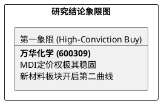

# 研报章节七：投资摘要与风险因素

**研究日期：2026年5月8日**

## 1. 投资摘要 (Investment Summary)

万华化学（600309.SH）正处于从“周期股”向“全球化新材料平台”转型的估值重塑期。

*   **核心逻辑**：
    1.  **MDI 基本盘稳固**：受全球装置大修及需求修复影响，MDI 供需紧平衡，万华通过挺价（5 月挂牌 2.2 万）对冲成本。
    2.  **新材料爆发**：2026 年 Q1 营收大增 25.5%，显示电池材料及 CMP 等新业务已贡献实质动能。
    3.  **地缘壁险力**：美国反倾销终裁税率 85.11%（大幅下调），虽仍有压力，但匈牙利基地（BC）的战略对冲作用在 120% 综合关税背景下更为凸显。
*   **估值结论**：2026 年预测 EPS 5.98 元，给予 17.5x PE，目标价 104.65 元。当前股价 83.60 元，盈亏比极佳。
*   **技术面**：90 元双头压制导致短期回撤，目前已回落至箱体下沿（80-83 元），具备左侧吸纳价值。

## 2. 风险因素 (Risk Factors)

1.  **产品价格波动风险（高）**：MDI 等价格受全球宏观波动影响，若下游需求释放不及预期，将制约盈利弹性。
2.  **成本压力风险（高）**：丙烷等原材料价格在 2026 年 Q2 异常冲高（750 美元/吨），若高价持续，将挤压毛利空间。
3.  **地缘政治与贸易壁垒（中）**：85.11% 的反倾销税虽好于预期，但长期高关税环境仍对全球供应链优化提出挑战。

## 3. 研究结论象限图 (Final Evaluation Matrix)

