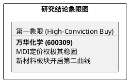

# 研报章节七：投资摘要与风险因素

**研究日期：2026年2月26日**

## 1. 投资摘要 (Investment Summary)

万华化学（600309.SH）正处于从“周期股”向“全球化新材料平台”转型的估值重塑期。

*   **核心逻辑**：
    1.  **MDI 基本盘稳固**：受全球装置老化及不可抗力影响，MDI 供需缺口持续，价格弹性支撑公司盈利底座。
    2.  **新材料爆发**：2026 年是电池材料（LFP）及 CMP 抛光垫的收获元年。凭借一体化成本优势及技术壁垒，新材料板块正成为公司第二增长曲线。
    3.  **地缘避险能力**：通过匈牙利基地（BC）实现对欧美市场的精准供应，有效化解了地缘政治引发的关税压力。
*   **估值结论**：预计 2026 年业绩大幅增长。给予 17.5x PE，目标价 104.65 元（较现价具备显著空间）。
*   **技术面**：正处于关键阻力位带量突破前夜，具备极高的参与价值。

## 2. 风险因素 (Risk Factors)

1.  **产品价格波动风险（高）**：MDI 等大宗化工品价格受全球宏观经济波动及原油价格剧震影响，若需求不及预期，将直接压缩利差。
2.  **折旧压力风险（中）**：近年来高强度的资本开支导致折旧费用处于高位，若新产线爬坡进度慢于预期，将对短期净利造成压制。
3.  **行业竞争风险（中）**：电池材料等新赛道竞争日趋激烈，需警惕产能过剩导致的毛利率下滑。

## 3. 研究结论象限图 (Final Evaluation Matrix)

