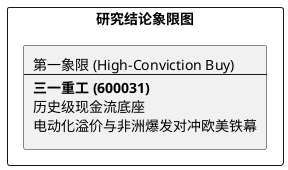

# 研报章节七：投资摘要与风险因素

**研究日期：2026年4月25日**

## 1. 投资摘要 (Investment Summary)

三一重工（600031.SH）在 2026 年 4 月展现了显著的逻辑改善信号。国内市场的强劲复苏与德国本地化生产的正式启动，有效对冲了海外地缘政策的短期噪音。

*   **核心逻辑**：
    1.  **国内需求超预期反弹**：3 月销量同比增长 **23.5%**，政策驱动下的“V型”底修复已确立，上修 2026 年国内营收增速预测。
    2.  **战略 de-risking 实质推进**：4 月 10 日签署德国本地化协议，通过普茨迈斯特渠道启动起重机本地生产，提前锁定欧盟准入权。
    3.  **业绩可见度提升**：2026E EPS 上修为 **1.18 元**，反映了成本控制与内需反弹的共振。
*   **估值结论**：现价 19.52 元处于破位后的极度超卖区，对应 2026E PE 仅 16.5x，显著低于历史中枢。修正后目标价区间 **24.5 - 29.2 元**。
*   **技术面**：正在测试 18.65 元波段支撑。

## 2. 风险因素 (Risk Factors)

1.  **一季报业绩波动风险**：4 月 30 日披露的 Q1 报表若毛利率因原材料波动不及预期，将触发技术面二次探底。
2.  **海外本土化进度风险**：德国工厂 5 月启动后的爬坡效率若不及预期，短期成本支出将高于产出。

## 3. 研究结论象限图 (Final Evaluation Matrix)

