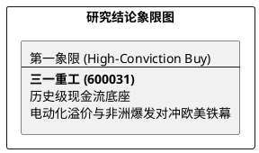

# 研报章节七：投资摘要与风险因素

**研究日期：2026年4月1日**

## 1. 投资摘要 (Investment Summary)

三一重工（600031.SH）正处于全球战略收缩与新兴市场爆发的错位期，2025 年报确认了极其稳健的底层财务质量，但 2026 年面临更严峻的外部环境挑战。

*   **核心逻辑**：
    1.  **历史性现金流底蕴**：2025 年报确认了创纪录的 **199.75 亿元** 经营性现金流（OCF），这种超常的收现比为公司在应对全球贸易壁垒时提供了深厚的“护城河”。
    2.  **区域增长错位**：非洲（+55.3%）与亚澳区（+16.2%）的强劲爆发，有效抵消了欧洲区（+1.5%）的低迷。全球化逻辑正在从“全面铺开”转向“深耕高增长极”。
    3.  **电动化红利兑现**：新能源产品销售额 86.4 亿元 (+115%)，在欧美巨头补课期间，三一已确立了实质性的商业闭环领先地位。
*   **估值结论**：2025 年 EPS（0.915元）低于预期。预计 2026 年 EPS 为 1.14 元，受外部地缘溢价折价影响，目标价区间下调至 **23.2 - 27.6 元**。
*   **技术面**：目前处于 250 日年线附近的“弱修复”阶段。

## 2. 风险因素 (Risk Factors)

1.  **地缘政治风险（极高）**：欧盟 30%-90% 的正式反倾销税已落地，这是 2026 年欧洲区营收的“天花板”。
2.  **中东订单不及预期风险（高）**：沙特 NEOM 等特大型项目缩减带来的“幻灭期”风险，可能拖累海外高毛利订单的增长斜率。
3.  **国内复苏迟滞风险（中）**：设备更新政策的拉动效应若持续弱于预期，内销的低增速将无法对冲海外市场的波动。

## 3. 研究结论象限图 (Final Evaluation Matrix)

