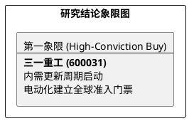

# 研报章节七：投资摘要与风险因素

**研究日期：2026年2月26日**

## 1. 投资摘要 (Investment Summary)

三一重工（600031.SH）正通过周期共振与电动化护城河实现全球份额的重构，业绩已进入主升复苏轨道。

*   **核心逻辑**：
    1.  **内销超预期复苏**：2026 年初内销预计大幅增长，存量更新周期正式从“L型”转向向上弹性轨道。
    2.  **电动化领先优势**：在挪威、沙特等高端/极端市场的批量交付，证明公司在电动化领域领先全球巨头 1-2 年，构建了垄断性准入壁垒。
    3.  **全球化质变**：核心逻辑已由“出海避险”进化为“技术领先驱动的份额重构”，海外收入占比及毛利水平持续提升。
*   **估值结论**：预计 2026 年 EPS 为 1.24 元。估值有望从当前历史低位向均值回归，目标价区间 26.3 - 31.0 元。
*   **技术面**：均线系统呈多头排列，正处于右侧主升浪中。

## 2. 风险因素 (Risk Factors)

1.  **贸易壁垒风险（高）**：需关注欧盟对历史出口货物可能实施的关税追溯征收带来的非经常性损失。
2.  **财务风险（中）**：国内百亿级应收账款在复苏初期的减值波动可能对季度利润产生扰动。
3.  **技术竞争风险（低）**：全球工程机械巨头在电动化领域的技术追赶速度若超预期，可能缩窄公司的先发时间窗。

## 3. 研究结论象限图 (Final Evaluation Matrix)

