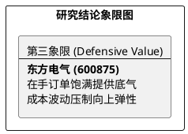

# 研报章节七：投资摘要与风险因素

**研究日期：2026年2月26日**

## 1. 投资摘要 (Investment Summary)

东方电气（600875.SH）处于订单繁荣与成本压力的平衡期，定位于具备分红底座的技术期权。

*   **核心逻辑**：
    1.  **订单高确定性**：456 亿合同负债及“十五五”电网投资锁定了营收规模，在手订单排期延伸至 2027 年。
    2.  **盈利挑战并存**：原材料（如铜）价格上行及信用减值扩大实质性压制利润弹性，2026 年净利率预期维持在 5.4% 审慎区间。
    3.  **技术期权逻辑**：26MW 海风机组确立技术制高点，作为深远海平价开发的战略筹码。
*   **估值结论**：预计 2026 年 EPS 为 1.48 元。给予 25x PE，目标价 37.00 元，分红承诺提供了估值安全垫。
*   **技术面**：股价处于 MA20 > MA60 黄金对齐，但在 35 元心理关口面临抛压。

## 2. 风险因素 (Risk Factors)

1.  **成本波动风险（高）**：铜、钢等原材料价格若持续暴涨，将显著侵蚀大中型机组的毛利率。
2.  **技术商业化风险（中）**：大兆瓦海风机组的商业化节奏若不及预期，将导致技术领先优势无法转化为财务收益。
3.  **财务减值风险（低）**：下游结算周期拉长可能导致信用减值损失超预期计提。

## 3. 研究结论象限图 (Final Evaluation Matrix)

