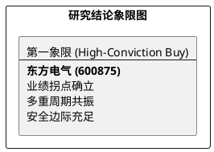

# 研报章节七：投资摘要与风险因素

**研究日期：2026年04月01日**

## 1. 投资摘要 (Investment Summary)

东方电气（600875.SH）已正式进入业绩兑现与估值修复的“双击”通道。2025 年报确认了公司作为能源安全压舱石的盈利弹性，而“十五五”规划则为其打开了长期增长天花板。

*   **核心逻辑**：
    1.  **业绩拐点确立**：2025 年归母净利增长 31.11%，告别低速增长。472 亿合同负债创历史新高，锁定了 2026 年交付大年的确定性。
    2.  **成本压力缓解**：铜价从高位回落叠加公司技术代差溢价，毛利率修复路径清晰。
    3.  **分红底座稳固**：5.3 元/10股的派息预案及 50% 的分红目标，为公司提供了坚实的防御属性。
*   **估值结论**：锚定 2026E EPS 1.48 元，给予 27x PE，**目标价上修至 40.00 元**。
*   **技术面**：放量突破 35.00 元关键平台，二浪上攻态势明确。

## 2. 风险因素 (Risk Factors)

1.  **成本二次冲高风险（中）**：若地缘政治导致铜、钢价格再次失控突破前高，将挤压毛利。
2.  **信用减值风险（中）**：随着交付规模放量，下游央企的结算周期波动可能导致减值损失超预期。
3.  **技术路径更迭风险（低）**：大兆瓦海风机组的竞争烈度若超预期，可能影响 ASP 稳定性。

## 3. 研究结论象限图 (Final Evaluation Matrix)

