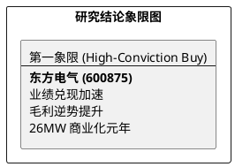

# 研报章节七：投资摘要与风险因素

**研究日期：2026年04月29日**

## 1. 投资摘要 (Investment Summary)

东方电气（600875.SH）2026Q1 业绩实现“开门红”，正式步入业绩爆发与技术兑现的共振期。公司不仅展现了极强的成本转嫁能力，更在深远海风电及自主燃机领域确立了代差领先地位。

*   **核心逻辑**：
    1.  **业绩兑现加速**：Q1 归母净利增长 37.4%，扣非增长 11.5%，毛利率逆势提升至 17.18%。463 亿合同负债确保了交付大年的持续性。
    2.  **技术护城河拓宽**：26MW 海风机组进入商业化，G50 自主燃机扬帆出海，抽水蓄能订单稳居 40%+ 份额。
    3.  **政策与红利双驱动**：“十五五”电网投资与设备更新细则落地，叠加 50% 分红承诺，构建了坚实的估值底座。
*   **估值结论**：上修 2026E EPS 至 1.68 元，给予 27x PE，**目标价上调至 45.00 元**。
*   **技术面**：放量突破 40 元关口后进行健康缩量回踩，多头趋势稳固。

## 2. 风险因素 (Risk Factors)

1.  **铜价结构性高位风险（高）**：若 LME 铜价长期维持在 $13,000 以上，可能在 Q2/Q3 重新压制制造端毛利。
2.  **交付节奏波动风险（中）**：特高压及核电项目建设周期长，收入确认受工程进度及政策审批影响。
3.  **非经常性损益占比波动（中）**：Q1 利润中非经营性贡献较大，后续核心业务利润释放强度需持续观察。

## 3. 研究结论象限图 (Final Evaluation Matrix)

