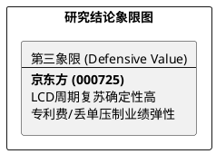

# 研报章节七：投资摘要与风险因素

**研究日期：2026年2月26日**

## 1. 投资摘要 (Investment Summary)

京东方（000725.SZ）正处于“财务阵痛”与“格局重塑”的交织期，投资属性已从弹性爆发向防御价值退守。

*   **核心逻辑**：
    1.  **LCD 周期复苏**：受益于 2026 世界杯等赛事驱动，LCD 业务量价齐升，叠加早期产线进入“折旧悬崖”，基础利润垫厚实。
    2.  **高端化挑战**：OLED 业务面临良率瓶颈，在 iPhone 17 系列中的份额大幅缩水，显示其在顶级柔性面板技术上与三星仍存代差。
    3.  **财务对冲压力**：折旧红利（约 80 亿）被巨额专利授权费（约 54 亿）及诉讼赔偿集中计提所抵消，实际利润增量受限。
*   **估值结论**：预计股价受 1.1x PB 强力支撑。目标价区间 4.80 - 5.30 元。
*   **技术面**：围绕年线（4.10 元）进行底部震荡，具备较强的防御属性，但缺乏向上的弹性催化。

## 2. 风险因素 (Risk Factors)

1.  **专利封锁风险（高）**：全球显示面板专利博弈加剧，若后续专利费计提超预期，将进一步侵蚀盈利空间。
2.  **资产减值风险（中）**：OLED 产线若稼动率持续不足，可能引发大规模的产线资产减值。
3.  **地缘政治风险（中）**：供应链关键材料或设备的出口限制可能扰动高端面板的生产节奏。

## 3. 研究结论象限图 (Final Evaluation Matrix)

