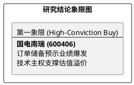

# 研报章节七：投资摘要与风险因素

**研究日期：2026年2月26日**

## 1. 投资摘要 (Investment Summary)

国电南瑞（600406.SH）作为电力设备国家队，正迎来“十五五”开局的确定性爆发。

*   **核心逻辑**：
    1.  **订单先行指标爆发**：2025Q3 合同负债同比增长 48.5%，预示 2026 年特高压与柔直项目将集中结转。
    2.  **技术主权确立**：控保系统（74.5%）与换流阀（57.6%）市占率统治级领先，4500V IGBT 实现完全自主化。
    3.  **财务质量跃迁**：净现比创历史高位（0.97），产业链议价权极强，高质量现金流支撑分红与研发。
*   **估值结论**：预计 2026 年 EPS 为 1.51 元。综合审计修正后，目标价 36.23 元（空间约 35%）。
*   **技术面**：股价创出新高，呈标准多头排列，关注 26.0 元附近的 MA20 支撑。

## 2. 风险因素 (Risk Factors)

1.  **审批进度风险（中）**：特高压线路核准及建设进度若不及预期，将直接影响订单结转节奏。
2.  **海外监管风险（中）**：欧盟对华 FSR 调查升级可能对欧洲电网市场的长期准入造成扰动。
3.  **成本传导风险（低）**：铜、铝等原材料剧烈波动对毛利率的边际挤压。

## 3. 研究结论象限图 (Final Evaluation Matrix)

