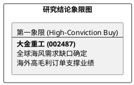

# 研报章节七：投资摘要与风险因素

**研究日期：2026年2月26日**

## 1. 投资摘要 (Investment Summary)

大金重工（002487.SZ）正从“规模驱动”向“全球系统服务商”跨越，在地缘博弈中重塑全球海风价值。

*   **核心逻辑**：
    1.  **全球领军地位**：2025 年欧洲单桩市场市占率达 29.1%，位居第一。曹妃甸 50 万吨超级产能释放及高附加值过渡段（TP）交付锁定了 2026 年业绩。
    2.  **护城河构建**：通过 XXL 单桩量产能力、自建特种船队的 DAP（目的地交付）模式及欧洲本土化建厂，构建了极强的准入与成本壁垒。
    3.  **估值重估**：业绩正经历“U型”反转，毛利率显著提升。虽然地缘政治存在压力贴现，但技术密度提升足以对冲。
*   **估值结论**：预计 2026 年 EPS 为 3.21 元。综合审计后给予 22.4x PE，目标价 72.00 元。
*   **技术面**：底部中枢放量突破，上升通道确立，支撑位 61.5 元。

## 2. 风险因素 (Risk Factors)

1.  **地缘政策风险（高）**：欧盟 FSR 深入调查及 NZIA 政策的强制执行可能对中国供应商份额设定隐形天花板。
2.  **行业竞争风险（中）**：欧洲本土厂商（如 Sif Group）若扩产超预期，将削弱公司的议价优势。
3.  **汇率波动风险（低）**：海外收入占比高，欧元对人民币的大幅贬值将直接侵蚀报表利润。

## 3. 研究结论象限图 (Final Evaluation Matrix)

