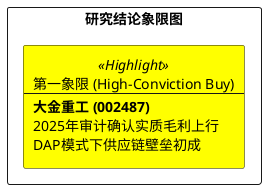

# 研报章节七：投资摘要与风险因素

**研究日期：2026年3月5日**

## 1. 投资摘要 (Investment Summary)

大金重工（002487.SZ）已正式跨越“制造出海”阶段，进入“全球供应链霸权”构建期。2025 年年报验证了公司在复杂贸易环境下的盈利爆发力与会计稳定性。

*   **核心逻辑升级**：
    1.  **业绩确定性兑现**：2025 年归母净利 **11.03 亿元**（+133%），出口收入占比达 **74.46%**。穿透 DAP 模式的会计稀释后，制造端毛利率实质上行，验证了全球溢价能力。
    2.  **供应链掌控力**：2025 年成功完成交付模式切换，通过长期租约锁定海运资源。目前正在进行的 Hornsea 3 规模化交付，证明了其在物流波动环境下的保供能力。
    3.  **产能周期共振**：曹妃甸 50 万吨基地全面达产，在手 **100 亿元**海外订单为 2026 年业绩高增提供了极高的物理能见度。
*   **估值定价**：维持 2026 年 EPS 3.21 元的预期。基于 24x PE，目标价上调至 **77.00 元**。

## 2. 风险因素排序 (Risk Ranking)

1.  **地缘政策传导风险（极高）**：欧盟 FSR 深入调查虽未直接触及单桩，但板块性估值压制依然显著。
2.  **2026 年运费波动风险（高）**：进入 2026 年，中东局势导致的绕行好望角显著增加了航行周期。DAP 模式下，若公司无法将新增成本向下游传导，将面临短期利润承压。
3.  **欧洲扩产超预期风险（中）**：Sif 等本土厂商在政策保护下的扩产进度可能挤压远期市场份额。

## 3. 研究结论象限图 (Final Evaluation Matrix)

