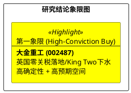

# 研报章节七：投资摘要与风险因素

**研究日期：2026年4月23日**

## 1. 投资摘要 (Investment Summary)

大金重工（002487.SZ）已从“预期驱动”正式跨入“实证兑现”阶段，全球海风装备霸权逻辑得到深度确认。

*   **核心逻辑进阶 (2026.04 审计)**：
    *   **红利变现与资产跨越**：**2026 年 4 月 1 日英国零关税正式执行**，为 2026 年贡献确定的单吨利润增量；**4 月 20 日 “King Two” 成功下水**，标志着公司全球交付壁垒进一步加高，DAP 模式利润回收能力提升。
    *   **成本利差走阔**：中欧钢价“剪刀差”优势在 4 月份因欧洲 CBAM 预期而进一步扩大，公司利润垫极厚。
*   **估值定价**：上修 2026 年 EPS 预测至 **3.53 元**。基于 24x 基准 PE 及全变量对冲审计（+10% 修正），目标价上修为 **93.10 元**。股价已突破前期 88 元关口，目前处于加速上涨后的强势整固期。

## 2. 风险因素排序 (Risk Ranking)

1.  **地缘政策合规风险（中）**：欧盟对中国风电企业的 FSR 调查仍是长期不确定性来源，需关注其向零部件环节的渗透。
2.  **高位波动风险（中）**：股价短期涨幅巨大（4月初至今涨幅超 20%），PE(TTM) 接近 50x，存在由于一季报预期落差导致的剧烈波动。
3.  **德国需求节奏扰动（低）**：德国竞配推迟的影响已在市场预期中被英国的强劲增长对冲。

## 3. 研究结论象限图 (Final Evaluation Matrix)

