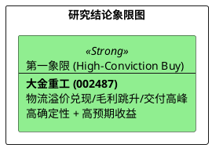

# 研报章节七：投资摘要与风险因素

**研究日期：2026年4月27日**
**版本：V3.0 (高置信度增持版)**

## 1. 投资摘要 (Investment Summary)

大金重工（002487.SZ）在 2026 年第一季度展现了“物流赋能制造”的极高商业壁垒。公司通过自有运输船队成功对冲了红海冲突引发的全球海运成本压力，实现单季毛利率逆势跳升至 39.1%。
*   **核心逻辑**：全球海风单桩供需缺口支撑销量，自有物流链条锁定超额利润。
*   **业绩预测**：上修 2026E 归母净利润至 **19.20 亿元**，对应 EPS **3.01 元**。
*   **估值定价**：基于 35x 估值中枢与物流溢价调节，给予目标价 **105.33 元**。

## 2. 风险因素 (Risk Factors)

1.  **地缘贸易制裁 (中)**：欧盟针对中国风电产业链的反补贴调查可能外溢至海工基础件。
2.  **全球海风装机滞后 (中)**：若欧洲项目 FID 进程受阻，可能导致订单确收节点推迟。
3.  **自有船队入役延期 (低)**：King Two/Three 的交付节奏直接影响下半年的物流成本覆盖。

## 3. 研究结论象限图 (Final Evaluation Matrix)

**终极定调：大金重工正从“出海制造”进化为“全球供应链定价者”。2026 年 Q1 的业绩爆发仅是主升浪的起点，物流阿尔法已成为其最核心的利润收割机。**

