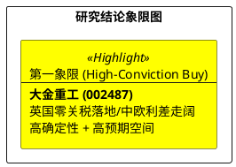

# 研报章节七：投资摘要与风险因素

**研究日期：2026年3月31日**

## 1. 投资摘要 (Investment Summary)

大金重工（002487.SZ）正步入“全球供应链霸权”与“政策红利”共振的利润爆发期。

*   **核心逻辑进阶 (2026.03 审计)**：
    *   **盈利底座进一步夯实**：2025 年年报已确认出口占比达 74% 的高质量增长。3 月底中欧钢价利差持续扩大，为公司构筑了深厚的制造毛利护城河。
    *   **英国红利正式开启**：**2026 年 4 月 1 日英国零关税政策正式执行**，标志着公司核心出口市场的利润空间将获得实质性提升，足以抵消红海绕行带来的成本扰动。
    *   **防御矩阵构建**：面对欧盟 FSR 深入调查，公司通过波兰 Wulkan 造船厂的本土产能协作，已提前建立了完善的政策风险对冲矩阵。
*   **估值定价**：上修 2026 年 EPS 至 **3.32 元**。基于 24x 基准 PE 及全变量审计下的 +10% 溢价调节，目标价由 85.00 元上修为 **88.00 元**。

## 2. 风险因素排序 (Risk Ranking)

1.  **地缘政策传导风险（中）**：欧盟对中国风电企业的合规调查可能常态化，需关注是否会从整机向零部件传导。
2.  **德国需求节奏扰动（中）**：德国 2026 竞配推迟至 2027 可能导致短期订单增速低于极度乐观的预期。
3.  **自有船队下水进度（低）**：King Two 若下水延期，将影响 DAP 模式在高运费环境下的利润回收率。

## 3. 研究结论象限图 (Final Evaluation Matrix)

