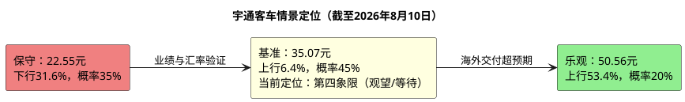

# 研报章节八：投资摘要与风险因素

**研究日期：2026年08月10日**

---

## 一、投资摘要

### 1.1 核心投资逻辑

宇通客车是全球销量规模最大的客车制造商（2025年销量4.95万辆），正处于从"中国龙头"向"全球龙头"跃迁的关键阶段。公司2025年海外营收首次超越国内（211亿 vs 154亿），且海外毛利率29.6%远超国内19.1%；2026H1营收167.19亿元、扣非净利润17.96亿元、经营现金流59.49亿元，但销量20,100辆同比下降5.73%，行业大中客销量却增长5.73%。当前结论是盈利质量改善、量端份额承压，不能再把出口驱动视为无条件的高增长。

### 1.2 当前价格与目标价

| 价格类型 | 数值 | 备注 |
|:---|:---|:---|
| 当前股价（不复权） | **32.97元** | 2026年8月10日收盘价 |
| 当前PE(TTM) | **13.37x** | 接近2021年以来P5 |
| 保守目标价 | **22.55元** | 下行风险-31.6% |
| 综合基准目标价 | **35.07元** | 上行空间+6.4% |
| 乐观目标价 | **50.56元** | 上行空间+53.4% |
| 概率加权审计目标价 | **33.79元** | 35%/45%/20%加权，中性档使用审计后35.07元 |
| 盈亏比 | **0.08 : 1** | 按概率加权审计目标价计算 |

### 1.3 投资逻辑的三层架构

**第一层：价值底——极致便宜**
当前PE 13.37x，约处于2021年以来P5附近。若仅将TTM扣非盈利作为稳定性参考，当前并非无风险低估；半年报后综合基准目标价仅35.07元，原有“极致便宜”的建仓逻辑不再成立，保留长期估值修复判断但等待分部盈利、竞品数据和更好的风险收益比。

**第二层：成长驱动——出口是星辰大海**
全球客车电动化仍是长期方向，宇通的海外服务生态（400+网点、40+配件库、120km服务半径、LINK+网联系统）构成竞品短期难以复制的壁垒。2026H1后估值输入为EPS2.05/2.71/3.16元，PE场景目标22.55/37.93/50.56元，综合基准目标价暂取35.07元（隐含PE约12.94x）；但出口分部利润和区域收入未披露，全球化定价仍需订单与毛利率验证。

**第三层：估值重估空间——市场尚未对其"全球化定价"**
当前统一视图实测PE为13.37x、接近2021年以来P5；市场一致预期和券商目标价尚未取得足够可追溯的双源证据，因此不把“市场给予10-12x PE”作为事实。2025年分部模拟曾估算海外利润贡献约70%（剔除非经营损益约78%），但这不是2026H1正式披露数据；若未来出口利润和区域毛利率得到验证，全球客车龙头的估值重估空间才成立，不能直接承诺30-50%的提升。

### 1.4 关键2026年催化剂

1. **下半年利润验证**：Q2倒算营收同比约+11.30%，但H1归母净利润-3.52%；若H2实现基准利润约41.33亿元且同比增长约14.2%，才支持EPS2.71元。
2. **海外大单落地**：宇通2025年末在手订单52.9亿，若2026年H2获得新一轮大单（如沙特、欧洲等），将极大提振信心。
3. **现金分红已实施**：2025年度10派20元方案已于2026年5月完成；后续观察股息再投资效果和下一年度分红意愿，不再把已发生除权作为新增催化剂。
4. **PE修复**：当前PE约13.37x接近历史低分位，若基本面兑现14x PE，PE法基准目标约37.93元；历史中位数受低利润基数污染，不作为必然回归目标。

---

## 二、风险因素

按对股价影响的烈度由高到低排序：

### 风险1：人民币持续大幅升值 ★★★★★

**本质**：宇通2025年海外营收约211亿元（约58%），2026H1披露外币金融资产约42.21亿元、外币金融负债约0.52亿元及多币种远期合约。人民币升值会通过未套保外币资产、应收账款和结算环节侵蚀利润，但具体币种占比不能从现有披露外推。

**量化影响**：半年报披露外币金融资产约42.21亿元、外币金融负债约0.52亿元，并披露远期外汇合约；人民币对外币金融资产负债升值10%时，净利润敏感性约减少4.17亿元，5%压力约为2.08亿元。2026H1财务费用0.63亿元、上年同期为净收益0.07亿元，但不能把财务费用全部归因于汇率；若人民币从当前7.0升至6.5，仍属于压力情景而非基准假设。

**监控指标**：美元/人民币汇率、公司财务费用科目（汇兑损益）

**对冲**：KD本地化合作若按计划投产可自然对冲部分风险，但卡塔尔项目实际投产尚待确认；公司已披露远期外汇合约，仍需观察未套保敞口和套保有效性。

### 风险2：地缘政治与贸易壁垒 ★★★★★

**本质**：中东冲突已实质冲击2026年4月大型客车出口（-28.93%），但宇通半年报披露H1行业大中客出口仍增长18.45%、新能源出口增长29.77%；欧洲反补贴调查风险悬而未决。宇通海外业务利润占比仍是估算值，不能将约70%/78%写成已披露事实。

**核心关切**：若欧盟启动反补贴调查并征收惩罚性关税，欧洲市场（高毛利核心区）将遭受重创。

**监控指标**：月度行业出口数据（中客网）、欧盟贸易政策公告、中东局势进展。

### 风险3：国内需求持续萎缩 ★★★★

**本质**：国内营收2025年同比下滑12.4%（2024:175.8亿→2025:154亿）；2026H1公司销量下降5.73%，公司称国内公路市场受购置税政策调整及客户经营不及预期影响，地方财政紧张和旅游需求波动仍在压制量端。

**量化影响**：2026E结构模拟中，国内业务利润约12.1亿元、占基准归母利润约20%（60亿元口径），但半年报未披露分部利润，不能将该比例视为已验证事实。国内营收每下滑10%（约16亿），按板块净利率7.5%估算对净利润的影响约1.2亿，相对可控；若国内下滑趋势加速，仍会拖累整体增速预期和市场信心。

**边界**：静态客车主营分部模拟显示海外业务利润约42.5亿元，但该结果假设固定费用、总部成本、营运资本和海外毛利率不变，且未由H1分部披露验证；不能把国内营收归零时的42.5亿元称为真实安全垫。

### 风险4：行业竞争加剧 ★★★

**本质**：2026H1行业增长而宇通销量下降5.73%，相对份额承压；中通、海格、比亚迪及金龙的正式半年报尚未全部取得，现有竞品增速只能作为待验证线索。竞品若在国内或出口端持续放量，可能侵蚀宇通份额和定价权。

**差异化的风险程度**：宇通的核心护城河在海外高端市场（T/U系列+新能源+LINK+服务），但竞品的业务结构和利润质量尚未通过同口径H1报告验证。短期内宇通绝对龙头地位未被推翻，竞品追赶是否局限于低毛利市场仍是待验证假设。

### 风险5：原材料价格波动 ★★★

**本质**：原材料占成本71.78%（电池、钢材等），电池价格波动直接影响毛利率。

**2025-2026趋势**：碳酸锂价格从高位回落趋于稳定，电池成本压力减轻。钢材价格在低位震荡。整体原材料环境对毛利率偏正面。

### 风险6：新能源补贴退坡 ★★

**本质**：公交"以旧换新"补贴维持8万/辆（2026年延续），但地方政府配套资金到位存在不确定性。新能源国补/地补的应收账款（约4.4亿未达标）存在减值风险。

### 风险7：产品质量保证、回购责任与未决仲裁 ★★★★★

**本质**：H1期末产品质量保证预计负债52.07亿元，购车融资回购责任54.91亿元，其中郑州安驰按揭42.09亿元；香港宇通还面临2.69亿欧元仲裁请求，案件已受理但尚未开庭。另有对外第三方担保0.49亿元、员工住房担保0.20亿元。公司披露郑州宇通集团对部分实际损失承担承诺，但上述事项仍应纳入现金流和安全边际监控。

**监控指标**：预计负债变动、实际质量赔付、回购损失、仲裁进展、应收账款账龄及坏账核销。

### 风险8：股东减持与质押状态不透明 ★★★

**本质**：H1报告显示郑州宇通集团持股37.70%，全国社保基金一零一组合报告期内减少941.38万股；前十名股东的质押、标记或冻结状态统一列示为“未知”，限售股份无变动。已确认的机构减持不直接改变经营价值，但未知的质押/冻结状态限制了资本市场风险判断。

**监控指标**：控股股东及5%以上股东增减持、质押/冻结公告、限售股变动和解禁安排。

---

## 三、研究结论象限图

基于"确定性"与"预期收益空间"的双维度评价：

### 最终定位：第四象限 — Observe/Wait（观望/等待）

**理由**：
1. **确定性中等**（3.5/5）：全球客车电动化趋势和宇通服务壁垒明确，但H1销量份额背离、竞品正式数据缺口仍在
2. **长期价值仍在但预期收益收窄**（综合基准+6.4%，审计后概率加权+2.5%）：PE接近低分位、分红率约6.1%、扣非及现金流改善
3. **下行风险显著高于上行空间**（-31.6%至保守价，框架盈亏比0.08）：预计负债、回购责任、应收账龄和分部数据缺口削弱安全边际

**前提与风险提示**：上述观望/等待判断以两大前提成立为基础——①下半年归母净利润达到约41.33亿元、出口及费用率不恶化；②人民币汇率和地缘冲突不出现压力情景。若H2利润低于简单年化水平、财务费用继续上升、预计负债/回购责任恶化、股东风险升级或行业增长持续与公司份额背离，本评级应进一步下调，届时按跟踪手册T1-T10证伪警报执行。

**仓位建议**：已持有者重点观察30.25—31.65元均线带、36.06元历史高点及下半年财务费用；新资金不宜在32—35元区间追高，等待更具风险收益比的位置或新增订单/分部盈利证据。竞品比较仍需等正式半年报，不应以二手排名替代。

---

*此研究基于公开信息、2026H1半年报及系统数据，截至2026年8月10日；部分竞品H1数据和出口分部盈利尚未取得权威原始来源。投资有风险，入市需谨慎。*
