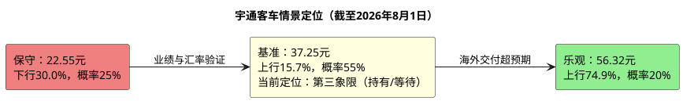

# 研报章节八：投资摘要与风险因素

**研究日期：2026年08月01日**

---

## 一、投资摘要

### 1.1 核心投资逻辑

宇通客车是全球销量规模最大的客车制造商（2025年销量4.95万辆），正处于从"中国龙头"向"全球龙头"跃迁的关键阶段。公司2025年海外营收首次超越国内（211亿 vs 154亿），且海外毛利率29.6%远超国内19.1%——这是盈利模式从"薄利多销"到"高附加值出口驱动"的根本性质变。2025年ROE达38%、ROIC达37.5%、净利率13.6%（含少数股东口径13.58%），均为历史最佳，且零有息负债、现金充裕、年分红率高达7.5%。

### 1.2 当前价格与目标价

| 价格类型 | 数值 | 备注 |
|:---|:---|:---|
| 当前股价（不复权） | **32.20元** | 2026年7月31日收盘价 |
| 当前PE(TTM) | **13.06x** | 近五年P5附近 |
| 保守目标价 | **22.55元** | 下行风险-30.0% |
| 基准目标价 | **37.25元** | 上行空间+15.7% |
| 乐观目标价 | **56.32元** | 上行空间+110.1% |
| 概率加权目标价 | **37.39元** | 25%/55%/20%加权（按修正目标价口径） |
| 盈亏比 | **0.52 : 1** | |

### 1.3 投资逻辑的三层架构

**第一层：价值底——极致便宜**
当前PE 13.06x，约处于近五年P5附近。即使假设2026年零增长（EPS维持2.51元），以12x PE（典型的成熟制造业定价）估值为30.12元，已低于当前32.20元；因此原有“极致便宜”的建仓逻辑不再成立，保留长期估值修复判断但等待半年报或更好的价格提供安全边际。

**第二层：成长驱动——出口是星辰大海**
全球客车电动化渗透率仅18%，中国客车出口2025年增长27%、2026年虽面临中东扰动但仍有望+30%。宇通的海外服务生态（400+网点、40+配件库、120km服务半径、LINK+网联系统）构成了竞品短期无法逾越的壁垒。2026E基准EPS 2.77元（+10.5%），PE法基准目标38.78元（14x），按PE/PB-ROE/DCF 50%/30%/20%权重交叉验证（859亿/848亿/584亿）并施加+3%审计调节后，修正基准目标价37.25元（隐含PE 13.45x）。

**第三层：估值重估空间——市场尚未对其"全球化定价"**
当前市场按照"中国制造业周期股"给予宇通10-12x PE，但如果其出口持续高增长、海外利润占比约70%（剔除政府补助等非经营损益口径约78%），全球投资者将逐步按照"全球客车龙头"重新定价。对标全球商用车龙头15-18x PE，存在30-50%的估值提升空间。

### 1.4 关键2026年催化剂

1. **Q2业绩拐点**：2026Q1营收-7.9%为周期低点，若Q2恢复正增长→确认V型反弹。
2. **海外大单落地**：宇通2025年末在手订单52.9亿，若2026年H2获得新一轮大单（如沙特、欧洲等），将极大提振信心。
3. **分红填权行情**：10派20元（股息率7.5%），每年Q2的除权-填权行情。
4. **PE修复**：历史上宇通PE中心约26x（虽被高利润低基数污染），从11x回到14-16x即是30-47%的涨幅。

---

## 二、风险因素

按对股价影响的烈度由高到低排序：

### 风险1：人民币持续大幅升值 ★★★★★

**本质**：宇通海外营收211亿（约58%），其中约60%以美元结算。人民币升值直接侵蚀海外营收的折算价值和利润。

**量化影响**：人民币每升值1%，海外营收折算损失约1.3亿，净利润影响约0.8-1亿。若人民币从当前7.0升至6.5（升值7.7%），额外吞噬利润约6-8亿（占基准净利润的10-13%）。

**监控指标**：美元/人民币汇率、公司财务费用科目（汇兑损益）

**对冲**：KD工厂本地化生产可自然对冲部分风险；公司可通过外汇远期套保（当前覆盖不足，需观察是否加强）。

### 风险2：地缘政治与贸易壁垒 ★★★★★

**本质**：中东冲突已实质冲击2026年Q2大型客车出口（4月-28.93%），欧洲反补贴调查风险悬而未决。宇通海外业务贡献约70%的利润（剔除政府补助等非经营损益口径约78%）。

**核心关切**：若欧盟启动反补贴调查并征收惩罚性关税，欧洲市场（高毛利核心区）将遭受重创。

**监控指标**：月度行业出口数据（中客网）、欧盟贸易政策公告、中东局势进展。

### 风险3：国内需求持续萎缩 ★★★★

**本质**：国内营收2025年同比下滑12.4%（2024:175.8亿→2025:154亿），地方财政紧张和旅游透支效应仍在压制需求。

**量化影响**：国内营收占42%但利润占比约20%（SOTP口径12.1/61.4亿）。国内营收每下滑10%（约16亿），按板块净利率7.5%估算对净利润的影响约1.2亿（占基准净利2.0%），相对可控。但若国内下滑趋势加速，将拖累整体增速预期和市场信心。

**底线**：即使国内营收归零（极端假设），海外业务仍可支撑约42.5亿利润——这是宇通的核心"安全垫"。

### 风险4：行业竞争加剧 ★★★

**本质**：中通、海格在国内份额快速提升（2026Q1中通+26.6%、海格+74.7%），金龙出口增速64.9%。竞品的激进扩张可能侵蚀宇通的份额和定价权。

**差异化的风险程度**：宇通的核心护城河在海外高端市场（T/U系列+新能源+LINK+服务），竞品的竞争主要集中在低毛利的国内和传统燃油车出口市场。短期内竞品追赶不会动摇宇通的基本盘。

### 风险5：原材料价格波动 ★★★

**本质**：原材料占成本71.78%（电池、钢材等），电池价格波动直接影响毛利率。

**2025-2026趋势**：碳酸锂价格从高位回落趋于稳定，电池成本压力减轻。钢材价格在低位震荡。整体原材料环境对毛利率偏正面。

### 风险6：新能源补贴退坡 ★★

**本质**：公交"以旧换新"补贴维持8万/辆（2026年延续），但地方政府配套资金到位存在不确定性。新能源国补/地补的应收账款（约4.4亿未达标）存在减值风险。

---

## 三、研究结论象限图

基于"确定性"与"预期收益空间"的双维度评价：

### 最终定位：第三象限 — Defensive Value（持有/等待）

**理由**：
1. **确定性高**（3.5/5）：全球客车电动化趋势确定、宇通龙头地位稳固、海外服务壁垒深厚
2. **长期价值仍在但预期收益收窄**（基准+15.7%）：PE仍处低位、分红率7.5%、盈利质量优异
3. **下行风险显著放大**（-30.0%至保守价）：资产质量极好（零负债、净现金）、清算底线5.78元，但现价已削弱安全边际

**前提与风险提示**：上述高确定性判断以两大前提成立为基础——①2026Q2起出口恢复正增长（Q1营收-7.9%为周期低点）；②人民币汇率企稳（若升值至6.7-6.8，汇兑损失或达5-10亿，对应基准净利下修8-16%）。若Q2-Q3营收持续负增长或汇兑损失超10亿，本评级应下调至观望，届时按跟踪手册T1-T7证伪警报执行。

**仓位建议**：已持有者可在半年报前持有并严格核验出口毛利率、汇兑损益和经营现金流；新资金不宜追高，等待8月11日半年报或回落至更具风险收益比的位置再评估。若追求更高弹性，可关注客车行业其他标的（中通出口加速、比亚迪新能源出口等），但其风险亦更高。

---

*此研究基于公开信息和系统数据，截至2026年8月1日。投资有风险，入市需谨慎。*
