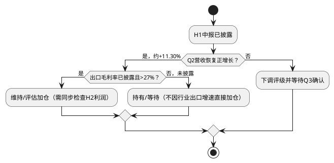

# 宇通客车 跟踪手册

**建立日期：2026年06月30日**
**最近更新：2026年09月10日**
**更新频率**：每季度财务报告披露后更新，重大事项即时更新

---

## 一、核心逻辑验证点 (Thesis Validators)

每季度需验证的关键定量指标：

| 序号 | 验证指标 | 基准预期 | 警戒阈值 | 当前状态 | 监控频率 |
|:---|:---|:---|:---|:---|:---|
| V1 | 季度营收增速 | Q2起恢复正增长(+5~15%) | 连续两季同比下滑>10% | Q2倒算营收同比约+11.30%，已验证；8月单月销量3746辆-12.07%、1-8月26771辆-7.05%显示量端压力延续 | 月报/季报 |
| V2 | 出口营收占比 | 维持55-62% | 跌破50%（意味国内被动萎缩或出口失速） | H1未披露出口分部收入，无法验证；1-7月大中型出口宇通7808辆+15.76%市场份额22.53%保持第一，出口韧性仍在 | 半年报/年报 |
| V3 | 出口毛利率 | 维持28-30% | 连续两季下滑>2pp（汇率或竞争侵蚀利润） | H1未披露出口毛利率，无法验证；人民币8月累计升值66bp至6.7828，升值压力边际缓和但仍需跟踪 | 半年报/年报 |
| V4 | 综合净利率 | 2026全年14%+ | Q2-Q3持续低于12% | H1归母净利率约11.17%，Q2约11.18%，暂未触发连续警报 | 季报 |
| V5 | 经营现金流/净利润 | 2026全年>80% | 连续两季<50%（应收恶化信号） | H1经营现金流/归母净利约319%，但采购付款减少贡献较大 | 季报 |
| V6 | 合同负债(预收款) | 维持15-25亿 | 连续两季<10亿（在手订单枯竭预警） | H1为20.97亿元，处于区间内 | 季报 |
| V7 | 应收账款/营收(TTM)及质量 | <15%，坏账率稳定 | 超过20%或账龄/核销恶化 | 期末净应收30.15亿元/TTM营收420.15亿元约7.2%；H1毛额46.68亿元、坏账准备16.53亿元、5年以上账龄13.48亿元 | 季报 |
| V8 | ROE(TTM) | 维持30%+ | 跌破20% | H1报告列示ROE11.85%，半年度指标不能直接年化 | 季报 |
| V9 | 每股分红 | 2025年度10派20元 | 分红骤降（管理层信心恶化信号） | 方案未变，静态股息率约6.1% | 年报 |
| V10 | 研发费用率 | 维持4-5% | 跌破3%（可能削减长期投入换短期利润） | H1研发费用率4.96%，已验证 | 年报 |
| V11 | 产品质量保证预计负债/回购责任 | 预计负债和实际赔付与收入规模匹配 | 预计负债连续增加且实际赔付显著超预算，或回购责任转化为现金损失 | H1预计负债52.07亿元、回购责任54.91亿元，首次纳入前台跟踪 | 季报/半年报 |

---

## 二、关键外部变量 (Exogenous Watchlist)

| 序号 | 外部变量 | 当前状态 | 需要关注的变化 | 监控来源 |
|:---|:---|:---|:---|:---|
| X1 | 美元/人民币汇率 | 7月14日中间价6.7990 | 若升值突破6.8并持续→利润侵蚀 | 央行中间价 |
| X2 | 中国客车月度出口量 | 公司半年报披露H1行业大中客出口+18.45%、新能源出口+29.77%；宇通销量-5.73% | 若行业增长持续而宇通份额继续下降→相对竞争力预警 | 公司半年报/中客网 |
| X3 | 中东地缘局势 | 冲突持续 | 若冲突扩大至沙特/阿联酋→大型客车出口再受冲击 | 国际新闻 |
| X4 | 欧盟对华电动车贸易政策 | 暂时平稳 | 若发起反补贴调查→对欧洲出口面临风险 | 欧盟官方公报 |
| X5 | 国内旅游人次增速 | 2025年+16.2% | 若增速低于5%→旅游客车需求将显著萎缩 | 文旅部 |
| X6 | 碳酸锂价格 | ~10-12万/吨 | 若再次暴涨（>20万）→电池成本压力 | 上海有色 |
| X7 | 宇通主要竞品出口量 | 金龙H1正式报告已披露：营收110.85亿+7.34%/归母2.76亿+137.58%/扣非1.9亿+1472%／出口1.78万辆+26.76%、新能源2777辆+35.2%、海外收入73.4亿占比66.2%；中通正式报告已披露：营收40.14亿+1.85%/归母2.83亿+48.5%/毛利率17.2%+1.8pp/出口4390辆+23.4%占比58%（7月大中型出口中通5043辆+23.24%跃居第二、海格4721辆+64.09%第三，比亚迪600辆跃居第三） | 若竞品同口径出口持续跑赢宇通→份额流失预警：1-7月宇通7808辆+15.76%仍居第一，但中通/海格增速22-64%高于宇通，追赶显著 | 公司公告/中客网 |
| X8 | 中国无风险利率(10Y) | ~2.5% | 若快速上行→高分红股相对吸引力下降 | 中国债券信息网 |
| X9 | 股东减持/质押/限售 | 宇通集团持股37.70%；社保基金减持941.38万股；前十股东质押状态披露为未知 | 若控股股东或核心机构持续减持，或出现重大质押/冻结→增加估值折价 | 半年报/交易所公告 |

---

### 2.1 竞品联动监控

| 竞品 | 预计披露日状态 | 必须取得的原始信源 | 核验指标与双向解读 |
|:---|:---|:---|:---|
| 中通客车 | H1正式报告已取得（2026-08-27/30双源）：营收40.14亿+1.85%/归母2.83亿+48.5%/扣非2.03亿+15.88%/毛利率17.2%+1.8pp/OCF15.48亿+1800%/出口4390辆+23.4%（含7月大中型725辆+20.83%） | 中通2026H1正式报告已归档，后续跟踪三季报 | 大中客销量、出口量/收入、毛利率、OCF、应收、合同负债；中通毛利/现金流同步改善，上调宇通份额压力——需求侧：中通/海格高增验证行业出口景气持续（对宇通为行业性利好）；竞争侧：中通出口增速23.4%高于宇通15.76%，且OCF暴增1800%，追赶显著，需上调竞争强度判断 |
| 金龙汽车/海格 | 金龙H1正式报告已取得（2026-08-24/25双源）：营收110.85亿+7.34%/归母2.76亿+137.58%/扣非1.9亿+1472%/毛利率13.1%+1.5pp/出口1.78万辆+26.76%、新能源2777辆+35.2%；海格需单独核验 | 金龙汽车正式半年报已归档，海格销量以苏州金龙口径跟踪 | 金龙海外收入73.4亿占比66.2%超预期，境内毛利率4.8%（去年1.9%）改善，但净利率仅2.9%远低于宇通13.4%；高增部分兑现但利润质量仍有差距，维持“差距显著但追赶加速”判断 |
| 比亚迪商用车 | 7月大中型出口600辆+7.72%跃居第三（环比+92.31%），但商用车分部毛利未单列，无法判定盈利威胁 | 比亚迪定期报告、公司公告 | 7月比亚迪跃居大中型出口第三，爆发力强，需跟踪其新能源客车ASP（约18.9万美元）与宇通持平度，仅当分部盈利持续高于宇通才升级为直接威胁 |

---

## 三、逻辑证伪警报 (Invalidation Triggers)

**当以下任一信号出现时，必须承认当前投资逻辑已死或严重受损，应触发止损或下调评级：**

| 触发编号 | 证伪信号 | 严重程度 | 行动建议 |
|:---|:---|:---|:---|
| **T1** | **宇通出口销量连续两季度同比下滑>15%** | ★★★★★ | 立即卖出——"出口驱动"的核心逻辑被证伪 |
| **T2** | **出口毛利率跌破22%（2025年29.6%，2026H1未披露）** | ★★★★★ | 立即卖出——高端化和品牌溢价假设崩溃；可能是价格战或汇率崩溃的先兆 |
| **T3** | **欧盟对宇通发起实质性反补贴调查** | ★★★★☆ | 减半仓——欧洲市场前景不明，等待调查结果 |
| **T4** | **公司ROE跌破15%（2025年38%，H1报告列示11.85%）** | ★★★★☆ | 需用全年ROE确认后再判定；半年度指标不直接触发 |
| **T5** | **核心管理层（李盼盼）非正常离职** | ★★★★☆ | 减仓观察——国企高管变动可能预示内部问题 |
| **T6** | **应收账款质量恶化（新增坏账损失/实际核销显著上升，或5年以上账龄继续增加）** | ★★★☆☆ | 减仓20%——海外客户信用风险暴露；H1坏账准备率35.42%为存量口径，不单独触发 |
| **T7** | **分红骤降（每股<0.5元）** | ★★★☆☆ | 重新评估——管理层对未来现金流的信心骤降 |
| **T8** | **产品质量保证预计负债连续增加且实际赔付明显超预算** | ★★★★★ | 下调评级并重做现金流与估值压力测试 |
| **T9** | **2.69亿欧元仲裁出现重大不利裁决，或回购责任形成重大现金损失** | ★★★★☆ | 减仓观察，按实际损失金额重算净资产与现金流 |
| **T10** | **控股股东/5%以上股东持续减持，或出现重大质押、冻结** | ★★★☆☆ | 增加估值折价并重新评估资本市场风险；“未知”状态不直接触发 |

---

## 四、关键时间节点 (Calendar)

### 2026年

| 时间 | 事件 | 关注重点 |
|:---|:---|:---|
| 7月中旬 | 中国客车出口6月数据 | 已核验：6月行业大中型出口6077辆+5.56%环比+45.14%；宇通2116辆+0.62%环比+88.76%市场份额34.82%断崖式领先 |
| 8月10-11日 | **宇通2026年中报已核验** | H1营收+3.65%、Q2倒算营收+11.30%、扣非净利+15.83%、经营现金流+246.96%；出口毛利率和地区收入未披露，财务费用0.63亿元需继续拆分 |
| 8月中旬 | 7月出口数据已核验 | 7月大中型出口4573辆-6.48%环比-24.75%（6月集中爆发后回落）；宇通1166辆+33.87%市场份额25.50%仍居第一，中通725辆+20.83%保持第二、海格/比亚迪追赶显著；1-7月累计宇通7808辆+15.76%市场份额22.53%稳居榜首，中通5043辆+23.24%跃居第二、海格4721辆+64.09%第三 |
| 9月2日 | **8月产销快报已核验（临2026-043）** | 8月单月销量3746辆-12.07%（大型1822辆-10.77%、中型1467辆-？、轻客4695累计中轻客5712辆+9.61%唯一正增长）、1-8月累计26771辆-7.05%（大型13596辆-7.82%、中型7463辆-15.57%），量端压力较H1 -5.73%扩大，国内公交及团体采购阶段性收缩是主因 |
| 9-10月 | 欧洲反补贴调查动向 | 是否有新政策信号 |
| 10月下旬 | **宇通2026年三季报** | 全年业绩趋势基本明朗 |
| 11-12月 | 2027年"以旧换新"政策是否延续 | 政策连续性对2027年内需至关重要 |
| 12月 | 年度客车出口数据汇总 | 全年出口是否达标 |

### 2027年

| 时间 | 事件 | 关注重点 |
|:---|:---|:---|
| 3月 | **宇通2026年年报** | 全年EPS验证、分红方案、2027年展望 |
| 3-4月 | 卡塔尔KD工厂产能爬坡情况 | 海外本地化战略落地进展 |

---

## 五、持仓决策流程图

---

## 六、估值区间与调仓参考

| 股价区间(不复权) | PE(TTM) | 操作建议 |
|:---|:---|:---|
| >50元 | >16x | 乐观情景基本兑现，分批减仓 |
| 35.07-50元 | 14-16x | 持有不追高，等待盈利继续兑现 |
| 32-35.07元 | 13-14x | 观望/等待，当前区间不追高 |
| 22.55-32元 | 11-13x | 分批评估；须同时确认H2利润和证伪条件未触发 |
| <22.55元 | <11x | 仅在基本面未触发T1/T2且现金流正常时重新评估 |

---

## 七、2026年09月10日动态审计结论

1. 2026H1半年报已取得并完成原始文本、系统数据及外部信源交叉审计；报告财务报表由董事会于2026年8月10日批准，统一视图公告日期为2026年8月11日，历史估值按公告日使用；2026-09-02 8月产销快报（临2026-043）已双源核验。
2. H1营收167.185亿元（+3.65%）、归母净利润18.674亿元（-3.52%）、扣非净利润17.956亿元（+15.83%）、经营现金流59.487亿元（+246.96%）；Q2倒算营收108.091亿元（约+11.30%）、归母净利润12.082亿元。V1已验证，V5暂时改善但受采购付款节奏影响；1-8月累计26771辆-7.05%显示量端压力较H1扩大，轻客5712辆+9.61%是唯一正增长亮点。
3. 公司H1销量20,100辆（-5.73%），行业大中客销量53,686辆（+5.73%）；行业出口上半年+18.45%、新能源出口+29.77%，1-7月大中型出口34654辆+14.42%仍增长但7月单月-6.48%回落，宇通1-7月出口7808辆+15.76%市场份额22.53%稳居第一但中通/海格增速22-64%追赶显著；公司未披露出口收入占比和出口毛利率，因此V2/V3不能验证，行业增长不能直接外推为宇通收入增长——双向解读：需求侧行业高增验证全球化景气（对宇通为行业性利好），竞争侧竞品增速更高构成份额压力。
4. 合同负债20.97亿元处于V6区间，应收账款30.15亿元、研发费用率4.96%；H1 ROE11.85%为半年度指标，不直接触发T4。T1/T2因H1未披露出口销量和出口毛利率暂无法判定，T3/T4/T5/T6/T7/T8/T9/T10当前未触发；需监控财务费用0.63亿元、预计负债52.07亿、回购责任54.91亿、股东变动、下半年利润及竞品相对份额；新增核验：金龙/中通H1正式报告已取得（见2.1），欧盟反补贴拟扩围至插混尚未落地（无公告不计入）、碳酸锂8月约15.0-15.4万/吨较假设10-12万高位需跟踪、人民币8月升值66bp至6.7828边际缓和。
5. 2026年08月10日不复权收盘价32.97元（PE 13.37x），对应综合基准目标价35.07元、审计后概率加权目标价33.79元；保守价22.55元，按框架计算盈亏比约0.08，行动重点为观望/等待。**2026年09月09日不复权收盘价27.87元（视图实测PE 11.25x、PB 4.76x、MA20 29.38/MA60 29.64/MA250 30.10已全部跌破、RSI 37.5），对应同一目标体系（35.07/33.79/22.55元）上行至综合基准+25.8%、至概率加权+21.3%（33.79-27.87=5.92）、下行至保守价-19.1%（27.87-22.55=5.32）、盈亏比约1.11（5.92/5.32），赔率由0.08修复至1.11进入可分批评估区但尚未形成右侧；技术支撑看26.04元（6月低点、MA250附近），阻力看29.4-30.1元均线簇，放量收复MA20/MA250且三季报验证财务费用/出口毛利率不恶化为加仓前置。** 境内小额中标（郴州628.8万/延安1532.8万/绍兴1311.8万等、希腊50辆交付）均远小于重大合同阈值（41亿），不计入估值。
6. 非公告渠道扫描：上证e互动/互动易未检索到近期新增在手订单问答增量；官网及官方渠道新增希腊塞萨洛尼基50辆铰接纯电交付（OASTH约160辆累计）、南岳批量纯电交付、贵州30辆客货邮投运、样样巴士62辆跨省交付等均为运营层面增量，不计入财务预测；招标平台8月小额公示累计未达重大阈值，按“招标平台公示、未经公司公告确认”口径不入E。

*跟踪手册将随每季度财报更新。重大事项发生时，将即时评估是否触发证伪警报。*
