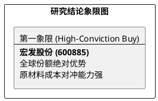

# 研报章节七：投资摘要与风险因素

**研究日期：2026年2月26日**

## 1. 投资摘要 (Investment Summary)

宏发股份（600885.SH）作为全球继电器霸主，正通过全球化 2.0 与 AI+新能源双驱动，在原材料波动中展现强韧的“存活者红利”。

*   **核心逻辑**：
    1.  **全球霸权稳固**：核心继电器业务全球市占率领先，HVDC（高压直流）产品在 800V 电动车平台市占率超 40%，具备极强的规模效应与成本控制力。
    2.  **AI 数据中心增量**：AI 算力爆发驱动 800V 电源模块及液冷继电器需求，成为 2026 年核心利润边际增量。
    3.  **全球化 2.0 避险**：通过越南、墨西哥等多地工厂布局，构建了规避全球关税波动的实质性盾牌。
*   **估值结论**：预计 2026 年 EPS 为 1.46 元。给予 26x PE，目标价 37.96 元（较现价具备充足安全边际）。
*   **财务韧性**：在银、铜等原材料高位波动的背景下，凭借 80% 核心零部件自给率，毛利率维持在 33.5% 以上。

## 2. 风险因素 (Risk Factors)

1.  **原材料价格风险（高）**：白银、铜等核心原材料价格若持续极端高位，将对毛利率产生边际挤压。
2.  **贸易保护风险（中）**：美、欧等市场的产地追溯审查可能对公司的全球供应链调度提出更高挑战。
3.  **AI 建设节奏风险（低）**：全球 AI 数据中心建设进度若不及预期，将延缓数通业务板块的放量。

## 3. 研究结论象限图 (Final Evaluation Matrix)

