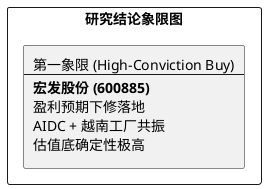

# 研报章节七：投资摘要与风险因素

**研究日期：2026年04月13日**

## 1. 投资摘要 (Investment Summary)

宏发股份（600885.SH）作为全球继电器霸主，正处于“业绩预期整固”与“业务结构跨越”的交汇点。2025 年报虽在利润端受原材料冲击略逊预期，但其营收的高增长与全球化 2.0 的纵深布局（越南工厂、印尼二期）确立了更宽的长期护城河。

*   **核心逻辑**：
    1.  **全球化 2.0 溢价**：2026 年 1 月越南工厂正式运营，标志着公司成功构建了对冲 USMCA 溯源风险与 301 关税的全球化盾牌。
    2.  **AIDC 利润引擎**：AI 服务器 800V 供电架构转型进入放量元年，液冷专用继电器的高溢价将驱动 2026 年毛利率实现结构性回升。
    3.  **估值底探明**：当前 23 倍 PE 已处于历史约 30% 分位，充分消化了年报利空，赔率处于极佳位置。
*   **估值结论**：修正 2026 年 EPS 预期至 1.35 元。给予 25x PE，目标价 **33.75 元**。
*   **财务韧性**：2025 年经营现金流近 30 亿（NP 的 1.7 倍），极高的盈利含金量为公司在行业低谷期的全球扩张提供了最强保障。

## 2. 风险因素 (Risk Factors)

1.  **原材料价格风险（高）**：LME 铜价若持续突破 1.3 万美元/吨，将严重延缓毛利率的修复进度。
2.  **供应链溯源风险（中）**：USMCA 2026 联合审议可能带来的更严苛 RVC 审计，对公司越南工厂的产值增量提出了更高要求。
3.  **行业竞争加剧（低）**：虽然宏发优势稳固，但需警惕欧姆龙等日系对手在高端 AIDC 领域的低价反扑。

## 3. 研究结论象限图 (Final Evaluation Matrix)

