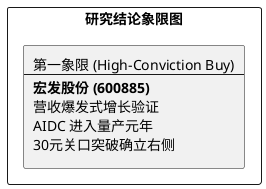

# 研报章节七：投资摘要与风险因素

**研究日期：2026年04月30日**

## 1. 投资摘要 (Investment Summary)

宏发股份（600885.SH）正从“业绩整固”快速切换至“高β增长”阶段。2026Q1 的财报验证了一个核心逻辑：**营收端的高爆发（+28%）足以抵消成本端的极端压力。** 尽管原材料成本处于历史地狱模式，但公司通过在 AIDC（英伟达供应链）和 800V 车载市场的份额掠夺，确立了极强的经营杠杆。

*   **核心逻辑更新**：
    1.  **营收超预期爆发**：Q1 营收增长 28.2%，远超此前 18% 的预测，显示了全球 Tier 1 客户订单的强力回流及高端化转型的成功。
    2.  **AIDC 估值重塑**：800V 液冷继电器已从概念验证进入大批量产阶，AIDC 将成为公司 2026-2027 年毛利率修复的最强引擎。
    3.  **技术面趋势确认**：股价放量站稳 30.0 元，完成了从“磨底”到“反攻”的趋势反转。
*   **估值结论**：上修 2026 年 EPS 预测至 **1.42 元**。维持 25x PE，上修目标价至 **35.50 元**。
*   **配置建议**：公司具备极高的防御性与成长弹性，是应对全球地缘动荡与 AI 算力革命的优质底座资产。

## 2. 风险因素 (Risk Factors)

1.  **极端原材料风险（极高）**：LME 铜价若持续站在 **1.3 万美元/吨** 以上，或白银突破 **$90/oz**，将导致公司顺价策略滞后，毛利率修复不及预期。
2.  **地缘政策不确定性（高）**：**USMCA 2026 联合审议**将于 7 月 1 日开启，若 RVC 计算规则向北美以外产业链发起极端限制，将影响越南工厂的长远增量。
3.  **现金流回款压力（中）**：Q1 应收账款随营收高增而同步扩大，需关注下游车企价格战带来的回款周期延长风险。

## 3. 研究结论象限图 (Final Evaluation Matrix)

