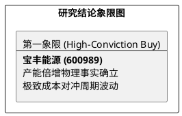

# 研报章节七：投资摘要与风险因素

**研究日期：2026年2月26日**

## 1. 投资摘要 (Investment Summary)

宝丰能源（600989.SH）作为全球现代煤化工行业的极致成本领先者，正处于产能倍增与估值重构的“双击”时刻。

*   **核心逻辑**：
    1.  **产能跨越式增长**：内蒙古 300 万吨烯烃项目全面达产，2026 年将成为首个全产能贡献年度，预计归母净利润达 126 亿元，正式确立百亿利润量级。
    2.  **极致成本壁垒**：单吨成本较油制路径低 1100-1500 元，确保了行业底部的高 ROE 运行。
    3.  **政策溢价重塑**：2026 年“碳排放双控”政策实施，绿氢耦合模式从合规风险转变为特有溢价。
*   **估值结论**：预计 2026 年 EPS 为 1.72 元。给予 2026 年目标价 36.64 元，较现价具备约 39% 的上涨空间。
*   **技术面**：股价已突破历史新高（Blue Sky 区域），上方无套牢压力，均线系统呈发散多头排列。

## 2. 风险因素 (Risk Factors)

1.  **能源价格波动风险（高）**：若原油价格长期低于 $40/桶，煤制路径的超额利润优势将显著收窄甚至消失。
2.  **新产能投产风险（中）**：宁东四期等后续建设进度若受设备交付或审批影响，将影响业绩释放节奏。
3.  **下游需求风险（低）**：房地产下行超预期可能导致管材等终端需求大幅萎缩，压制产品售价。

## 3. 研究结论象限图 (Final Evaluation Matrix)

