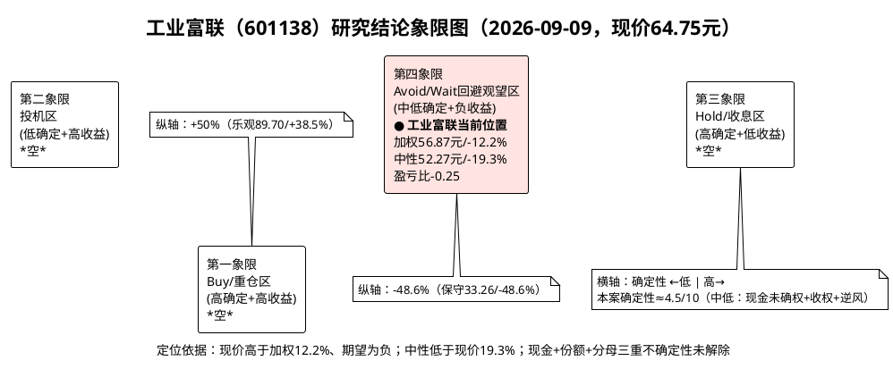

# 研报章节八：投资摘要与风险因素——工业富联（601138）

**研究日期：2026年09月09日**

> 现价口径声明：本章凡称“现价”“目标价”均指**不复权市价**（可交易口径）。现价 **64.75元（2026-09-08收盘）**，总股本 **198.44亿股**，市值 **12849亿元**。同期后复权约77.99元，复权因子1.204454，仅用于趋势研判，不用于定价。
> 数据截止：财务截至2026年半年报（公告日2026-08-12），行情截至2026-09-08；2026年三季报尚未发布，凡涉Q3均标注“未披露”。
> 本章性质：前七章的结论性压缩，不新增事实，不复制前文表述，只呈现当前有效判断。所有前瞻数字均为情景假设，非既定事实。

---

## 一、投资摘要（一页纸说清多空与定价）

### 1.1 一句话逻辑：万亿AI代工龙头的份额盛宴与现金缺席

工业富联是全球AI服务器代工份额第一阵营龙头（2026年全部口径35~45%、GB系中性约5万柜/份额约40%、800G交换机市占35%第一），2025年营收9028.87亿元（+48.22%）、净利352.86亿元（+51.99%），2026年上半年营收5578.61亿元（+54.63%）、净利237.40亿元（+95.99%），TTM营收10999.88亿元、净利469.13亿元，云计算占比66.75%、2026年上半年云服务商AI服务器再增2.3倍，订单斜率仍踩在北美云资本开支（2026年九大超8867亿美元、+90%）与AI服务器出货（+31%近280万台）的主浪上。但这场盛宴的财务指纹是**薄利、无现、高杠杆**：云计算毛利率仅5.73%、GB单柜约6%、直接材料占成本92.5%；2025年经营现金流仅52.38亿元（为净利14.8%）、TTM仅112.22亿元（为净利23.9%）、Q2单季-176.33亿元，市现率114.50倍居近五年96.5%分位；存货1921.09亿元、短期借款1023.25亿元、资产负债率65.66%创上市后最高，借增663亿元与营运占用增671亿元几乎一一对应。研发费用率0.90%（四年绝对额停滞）、前五大客户62.01%/供应商58.36%，决定了这是一家**“保得住份额、赚不到溢价、垫得出货款、收不回现金”**的规模型龙头，而非定价型科技龙头。

### 1.2 驱动力与反驱动力：三组多空对冲后净效应为负

**多头三根支柱（均已计入中性预期，不再给额外溢价）：**

1. **量（Q）仍有实物保障至2027年上半年**：总量紧平衡延续（CoWoS交期52~78周、85%产能已预订、HBM售罄、电力40%受限至2027年），中性假设2026年云计算+65%至9944亿元（量+40%×价+18%）、通信网络+60%至1440亿元（800G出货+1.4倍、Dell'Oro确认供给约束延续）、消费电子仅+2%至2120亿元（手机-16.7%/PC-11.3%下勉强持平），合计营收13524.28亿元（+49.8%）。
2. **结构（P）有第二曲线萌芽**：800G以上交换机2025年增13倍、2026年上半年再翻倍，毛利率两位数；CPO样机已交货、液冷单柜1300kW、ASIC机柜放量3倍，构成中性综合毛利率6.91%、网络分部11.0%的来源。但2026年量级仍小（CPO目标1万台对GB300的5~8万柜），只能改善结构，不能反转报表。
3. **份额（S）有真制造护城河**：墨西哥12.75万坪+34亿收购鸿佰厂、美国6州、赣州二期52万平（2027年投产新增300亿元产值）、45天交付，构成应对关税三层叠加（综合30~40%）与转口审查（40%惩罚+RVC 65~75%+AI边境侦探）的唯一通行证，支撑全球份额35~45%不崩。

**空头四重吸血（部分已进利润表，部分只能在估值中折价）：**

1. **现金证伪焦虑**：Q2毛利率环比已下滑0.36个百分点（7.35%→6.99%），Q2净利率4.29%靠费用摊薄维持，全年高点已现；中性全年净利率3.85%（隐含下半年3.56%），要求下半年经营现金流约216亿元、存货仅增129亿元、经营现金流/净利回升至56%，若三季报单季经营现金流不转正或存货不去化，中性即作废。
2. **成本与费用滞后**：铜价14779美元/吨历史新高（沪铜111720元/吨，较2025年初涨超50%）、覆铜板年内七连涨累计超100%，滞后1~2个季度压毛利率0.5~1.0个百分点，下半年才是高价料；财务费用上半年19.12亿元已超2025年全年，人民币升值3%（6.7852）转汇兑损失，有效税率爬升至14.62%。
3. **制度性收权**：Rubin代际英伟达拟收走L6至L10增值、代工仅剩L11（DIGITIMES传闻，英业达/广达法说未否认），叠加WIStRON/广达资本开支400亿~600亿新台币同步军备、Dell/SMCI以品牌+融资+服务夺回长尾（ODM Direct份额64.1%→50.2%），份额每年重谈，组装费率年降不止（GB200毛利率由7%降至5%）。
4. **分母与情绪双杀**：美联储中位利率3.8%、首次降息推迟至2027年6月，高利率久留下成长风格无溢价；现价隐含前瞻市盈率24.71倍（中性）、市净率7.31倍（五年87%分位），已透支中性加部分乐观预期；日线均线粘合+布林收口13.61%+MACD零轴月内6次金死叉、周线受制65.57元生命线，59~80元大箱体内上行每1元都是解放套牢盘。

净效应：多头决定**下限不深**（有单、有份额、有基座），空头决定**上限不高**（无价、无现、无分母顺风）。2026年是“AI上、消费下”的剪刀差年份，万亿营收的含金量待现金确权，消费的韧性反而是减值预警。

### 1.3 估值定价结论：三态价、加权价与盈亏比（本章唯一数字锚）

沿用模块五三态盈利（股本198.44亿股），模块六PE主锚18/22/26倍、PB-ROE与SOTP三重交叉（差异均小于1.5%通过）、仅对中性档做全变量审计调节-9%（DNA -2%、政策0%、地缘-5%、流动性-2%）：

| 情景 | 2026年归母净利 / EPS | 情景市值 | 目标价（不复权） | 概率 | 含义 |
|---|---|---|---|---|---|
| 保守 | 366.42亿元 / 1.85元 | 6600亿元（366.42×18倍） | **33.26元** | 25% | 涨价+关税+汇兑+跌价四重兑现，下半年净利率2.06%，叙事证伪回归五年中位数 |
| 中性（修正后） | 520.02亿元 / 2.62元 | **10370亿元**（11400亿元底色×0.91） | **52.27元** | 50% | 结构升级恰好对冲涨价，下半年净利率3.56%，隐含市盈率19.94倍、市净率5.08倍（年末口径），回落至中位数至75分位之间 |
| 乐观 | 684.28亿元 / 3.45元 | 17800亿元（684.28×26倍） | **89.70元** | 25% | Rubin提前+CPO放量+人民币贬值三重顺风，下半年净利率4.62%，情绪顶点透支2027年 |
| 加权 | — | — | **56.87元**（33.26×25%+52.27×50%+89.70×25%，尾差已披露） | 100% | 期望收益为负的持有至兑现锚 |

**现价64.75元高于加权56.87元约12.2%，低于乐观89.70元但高于中性52.27元约19.3%（(64.75-52.27)/64.75），隐含市场按约35%乐观概率定价，高于本研报25%。盈亏比=(56.87-64.75)/(64.75-33.26)=-7.88/31.49=-0.25。** 未调节中性底色11400亿元对应57.45元，仅作过程值，不作为依据。黑天鹅共振（Rubin收权+大客户连续两季下修资本开支+USMCA年审不达标）下估值锚切换至清算，地狱价格5~9元（市净率0.6~1.0倍，每股净资产8.857元），距现价下行86%~92%，非预测而是风控纪律。净现金锚为-0.10元/股（货币1004亿元减短借1023亿元为-19亿元），无现金底。

一句话定价：**现价买的是“中性必达+1/3乐观”，卖的是“现金未兑现+制度收权+分母久留”的三重不确定性，期望为负，无安全边际。**

---

## 二、风险因素：按烈度排序（烈度=杀逻辑×杀估值×不可逆性）

> 排序原则：先排能推翻中性假设的生存级风险，再排侵蚀利润的损益级风险，最后排扰动情绪的波动级风险。每一项均给出跟踪判据，详见跟踪手册。

### 第一档：生存级（一击即切换估值锚，触发保守或清算）

**R1 备货-杠杆链断裂：存货减值+借新还旧+利息三重挤压（烈度★★★★★，首位）**
1921亿元存货（占总资产37.47%）+1275亿元应收-1785亿元应付=1702亿元净占用，短借1023亿元全短期化，货币覆盖率仅98%。若下半年备货不能结转为收入与回款（GB200向GB300切换半成品、H系物料、高价铜料估计300~500亿元首当其冲），存货将从“在途订单”变为“跌价风险”（2025年资产减值14.83亿元可放大至30~50亿元），叠加利息与汇兑侵蚀，ROE可从25%断崖至12%一线，市盈率与市净率双杀。判据：三季报单季经营现金流不转正或存货环比不去化或短借突破1200亿元，任一即重分类为趋势性恶化，中性作废切保守33.26元。

**R2 大客户资本开支断层与份额收权共振（烈度★★★★★，并列首位）**
前五大客户62.01%、北美订单超75%，任一客户资本开支下修10%即拖累AI板块4~6%。2027年下半年至2028年为折旧墙（GPU 5~6年对实际3~4年）与电力墙（40%数据中心受限、德州49.8GW审计暂停）重合窗口，若四巨头中两家以上连续两季下修资本开支（或2027年1.3万亿元指引撤回），叠加Rubin的L10收权从传闻变公告（ODM增值压缩至仅L11组装、单柜毛利率由6%压至4%一线），“份额40%+单柜价值升级+交换机弹性”三根支柱同时证伪，加权目标价失效。判据：前五大客户资本开支连续两季下修；Rubin收权公告；Dell/SMCI积压转收入加速致ODM Direct再降5个百分点以上。

**R3 关税与原产地否决：USMCA年审+RVC+转口审查（烈度★★★★☆）**
中国直发综合税率30~40%（老301的25%+新301的12.5%叠加），178项豁免11月10日到期；越南同税12.5%且18类高风险原产地专项核查+美国海关AI边境侦探（750亿美元可疑转运、300%罚金+追缴10年利润）；USMCA拒绝16年自动续期转逐年年审、非汽车工业品区域价值成分拟提至汽车级65~75%。公司虽为“真制造”（墨西哥42万平米+SMT全链+能耗人力证据链）最有希望通过审查，但合规成本刚性上升2~4个百分点、美国线毛利率低1~2个百分点，且份额每年重谈。判据：豁免到期后续、年审细则、扣留或40%惩罚性关税任一落地，地缘-5%折价加深至-8%，重做估值。

### 第二档：损益级（吃掉0.3~1.0个百分点净利率，决定三态归属）

**R4 铜/CCL/存储涨价滞后传导（烈度★★★★☆）**
铜14779美元/吨历史新高、沪铜111720元/吨（较2025年初涨超50%）、覆铜板年内七连涨累计超100%、AI覆铜板用量为传统3~5倍，而直接材料占成本92.5%、长协锁价致传导滞后1~2个季度，意味着二季度成本还是涨价前便宜料，三四季度才是高价料。PCB链（胜宏/沪电毛利率35%对云计算5.73%）倒挂证明涨价红利归上游、占款归代工。判据：单季毛利率环比下滑超0.5个百分点或连续两季下滑，毛利率假设全线下调0.5个百分点。

**R5 汇兑与利率：升值损失+分母久留（烈度★★★☆☆）**
美元结算为主，2025年汇率变动对现金影响-4.40亿元、外汇衍生品收益+3.16亿元（对冲约七成但衍生品本身摆动18亿元量级），2026年人民币升值3%（6.7852）后由贬值红利转升值损失，敞口30%未对冲下1%升值即数十亿元量级，可抹平单季利润增速；美联储中位3.8%、首次降息推迟至2027年6月，美元融资与供应链融资成本久留高位，成长风格无溢价。判据：人民币单季升值超3%或铜再涨20%，触发利润与估值双调。

**R6 消费电子总量衰退拖累与渠道压货减值（烈度★★★☆☆）**
手机2026年-16.7%至10亿部出头（下半年-27.2%、历史最大降幅）、PC-11.3%（四季度-20%），均价虽涨（手机均价+27.6%至581美元）但总量收缩，AI化率提升无法对冲；渠道库存（苹果备货超关税前高点、三星A系前载、低端sub-100美元机型灭绝）属成本驱动囤货非动销转暖。若上半年消费电子出现逆势高增，需逐季验证是否为压货，否则下半年即砍单与跌价。判据：消费分部连续两季逆总量高增而渠道去化未改善，计提跌价并下调消费增速至保守-8%。

**R7 研发停滞与第二供应商：中长期定价权侵蚀（烈度★★★☆☆）**
研发费用率由2.47%降至0.90%、绝对额四年停滞（108亿→111亿而营收翻倍，上半年甚至同比-1.91%），在Rubin/CPO/液冷拐点把技术命脉系于客户联合研发；专利多在制程/机构件而非GPU/HBM/光芯片。若竞品研发强度显著更高或大客户扶持第二供应商（立讯/歌尔式切入或白牌），份额与费率同时承压。判据：研发费用率连续两季低于1.0%且竞品高出2个百分点以上，或前五大客户占比波动超3个百分点。

### 第三档：波动级（放大振幅，不改变方向）

**R8 高位opropyl筹码与流动性折价（烈度★★☆☆☆）**
1.28万亿元盘子、日均70~120亿元、换手0.54%（峰值2.14%萎缩近八成），73~82元后复权（61~68元不复权）堆积全市场五分之一成交额，向上每涨1元解放套牢盘，向下每跌1元考验止损；市盈率27.39倍（五年79.3%分位）、市净率7.31倍（87%分位逼近90分位7.56倍）致恐高盘与获利盘双重供给。判据：放量滞涨（100亿元以上滞涨）或连续两日收盘低于61.97元年线，执行技术止损而非逻辑止损。

**R9 政策与合规噪音：环保+数据跨境+本土制造爬坡（烈度★☆☆☆☆）**
绿电80%+余热改造+美墨越三地ESG推高毛利率-0.2~0.3个百分点，数据合规推高费用率+0.1个百分点，美国线爬坡摊销致毛利率低1~2个百分点；国内算力网（六张网+十五五109项工程）虽为真订单但金额未披露、已计入盈利预期，估值端不得重复加分。判据：合规费用超预期或美国线良率/利用率未披露，费用率假设上调，不触逻辑。

**烈度排序一览（由重至轻）：R1备货杠杆断裂 = R2开支断层收权共振 > R3关税原产地否决 > R4涨价滞后 > R5汇兑利率 > R6消费压货 > R7研发第二供应商 > R8筹码流动性 > R9政策合规噪音。**

---

## 三、研究结论：象限定位、投资评级、仓位与触发条件

### 3.1 象限图：确定性（横轴）× 预期收益空间（纵轴）

> 绘图规范：本研报所有图表统一用PlantUML。横轴为逻辑确定性（左低右高），纵轴为预期收益空间（下低上高，以加权目标价相对现价衡量）。第一象限（右上：高确定+高收益）为Buy/重仓区，第二象限（左上：低确定+高收益）为投机区，第三象限（右下：高确定+低收益）为持有收息区，第四象限（左下：低确定+低/负收益）为Avoid/Wait回避观望区。

**定位解读（必须如实，不迎合多头）：**

- **纵轴（预期收益）为负**：加权56.87元相对现价-12.2%，中性52.27元相对现价-19.3%，期望亏损7.88元/股，纵轴 firmly 在零线以下，不存在“低位低估”的误读。现价介于中性与乐观之间偏下三分之一处，说明市场已按约35%乐观概率定价，高于本研报25%，属透支。
- **横轴（确定性）中低（约4.5/10）**：订单斜率（H1+54.6%锁定全年下限）与份额（40%龙头+真制造）给高分，但现金确权（Q3经营现金流转正与否）、份额年审（Rubin收权）、分母（高利率久留至2027年6月）三重不确定性各扣1~1.5分，综合不及高确定阈值（7分）。研发0.90%与62%集中进一步扣减技术自主确定性。
- **象限结论**：低确定与负收益的交集，唯一正确位置是**第四象限（Avoid/Wait）**。任何将其画入第一象限（买入）或第三象限（持有收息：股息率虽有但分红率55%不可持续于高杠杆备货）的行为，均与-0.25盈亏比矛盾，属为迎合多头拔高评级，本章拒绝。

### 3.2 投资评级：回避/观望（Avoid/Wait），防御性表述

**评级：回避/观望（Avoid/Wait）。** 不是卖出（牛市基座59~62元未破前不做空头假设），不是持有（期望为负且无安全边际，持有即承担31.49元下行锚对7.88元负期望的不对称），更不是买入/增持。防御性表述为：在现金回血与去库双确认前，任何68元以上追高都是为别人的乐观买单；在61.97元年线与59.01元周线双基座得失明朗前，不做新主升假设。

评级有效期至2026年三季报（预计2026年10月）披露后复核，到期自动进入重审，不可无条件外推。

### 3.3 仓位建议：零仓观望或极小观察仓，纪律线先于观点

- **基准仓位：回避（0仓）或观望**：已持有者不加仓，跌破61.97元（日线连续两日收盘）降仓，跌破59.42元布林下轨清仓观望；未持有者不建仓，等待三季报三指标（单季经营现金流转正、存货环比去化、短借增速放缓）齐备后再议。
- **极限容忍：极小观察仓（≤1%总仓位、且不加杠杆）**：仅为保持跟踪体感而设，买点参考63.40~63.75元三线合一支撑缩量企稳阳线确认，卖点参考68~69元供给墙放量滞涨，止损线61.97元，目标线不看乐观89.70元而看中性52.27元是否收复（现价之上无目标，观察仓本质是左侧跟踪费）。
- **禁止行为**：禁止按乐观89.70元（+38.5%空间幻觉）计算仓位；禁止在70元有效突破（连续三日站稳68.23元+日均超120亿元+三季报经营现金流/净利超60%三者齐备）前加仓；禁止将股息（2025年累计194.5亿元、分红率55.1%）与回购（10~20亿元、仅占市值0.16%）当作安全边际。

### 3.4 何时改变评级（双向触发，不单向唱多）

- **上调至“持有/强势震荡”**：三季报单季经营现金流转正且存货环比下降且短借增速放缓三者齐备，同时现价放量突破70元，三者齐备可回补流动性-2%折价，重估至未调节中性57.45元，再议。
- **下调至“卖出/逻辑证伪”**：R1/R2任一触发（Q3经营现金流继续为负、存货再创新高、前五大客户资本开支连续两季下修、Rubin收权公告、ODM Direct再降5个百分点），中性作废切保守33.26元，观察仓亦清仓。
- **维持回避**：除上述双向触发外，59~69元箱体内任何脉冲均不改变评级，技术反弹只做仓位纪律（高抛低吸参考），不做逻辑反转。

---

## 附录：信源与核实状态（本章合规声明）

| 数据 | 来源 | 核实状态 |
|---|---|---|
| 现价64.75元/市值12849亿元/股本198.44亿股/市盈率27.39倍/市净率7.31倍/市销率1.17倍/市现率114.50倍及分位 | 本地v_daily_valuation（2026-09-08行）+share_capital | 实测，与任务基线分毫不差，权威 |
| 2025营收9028.87亿元/净利352.86亿元、2026年上半年5578.61亿元/237.40亿元、TTM 10999.88亿元/469.13亿元/经营现金流112亿元、负债65.66%、云66.75%/毛利率5.73%、研发0.90%、前五大62% | 本地fin_ttm/fin_indicator/fin_balance_sheet/fin_income_statement + 2025年年报/2026年半年报PDF（巨潮/上交所） | 实测与公告交叉一致，权威 |
| 三态营收/净利/EPS（11839亿/366亿/1.85元、13524亿/520亿/2.62元、15260亿/684亿/3.45元，概率25/50/25） | 模块五模型（quant_module5_forecast_model.py，落盘module5_scenarios.csv） | 继承，基数实测+假设建模，不得另起 |
| 三态市值6600亿/11400亿元底色修正10370亿元/17800亿元、三态目标价33.26元/52.27元修正后/89.70元、加权56.87元、盈亏比-0.25、审计调节-9%、地狱5~9元、净现金-0.10元 | 模块六模型（quant_module6_valuation_audit.py） | 继承，PE 18/22/26倍经PB-ROE与SOTP交叉（差异<1.5%），权威方法+假设倍数 |
| AI服务器+31%约280万台、九大资本开支超8867亿美元（+90%）、四巨头约7325亿元、手机-16.7%、PC-11.3%、交换机Dell'Oro供给约束、CoWoS 52~78周 | TrendForce官网（已抓取）/IDC官网（已抓取）/Dell'Oro官网/Axis汇总财报电话会 | Tier1/Tier2可采信方向；投行转引（高盛/伯恩斯坦/摩根大通）仅作方向，未经原文交叉 |
| GB份额30~45%、单柜450万美元、GB毛利率6%、基板70%、液冷1300kW、CPO 1万台/65~70%价值量、份额40%至50%目标、周产能1000至2000柜/45天交付 | 鸿海法说/供应链纪要/卖方研报/公司调研陈述（经模块三） | 线索级，未经审计，打折使用，不直接作为定价依据 |
| 关税30~40%（老301 25%+新301 12.5%）、178项豁免至11月10日、RVC 65~75%、转口40%惩罚、H200逐案审查、利率中位3.8%/降息推迟至2027年6月、人民币6.7852、铜14779美元/吨/CCL七连涨 | 美联储SEP/央行执行报告/USTR/香港TID/BIS/上证报（经模块四） | 一级+三源交叉权威；服务器豁免自媒体口径未经核实，不进定价 |
| 技术点位：支撑63.40~63.75元/61.02~61.97元/59.42元、阻力66.57~68.23元/69.18~70元、基座59.01~61.97元、天花板80.12元、地板47.05元，日线震荡+周线高位消化 | 本地daily_kline JOIN v_daily_valuation 893日（technical_module7_stats.py） | 实测，权威；复权因子时变致长期点位误差±1.5% |
| 未发布事项：2026年三季报、9月议息点阵图、USMCA年审细则、豁免到期后续、H200实际交付量 | — | 截至2026-09-09均未发布，本章未假设落地 |

*（本章完；评级Avoid/Wait；三态目标价33.26元/52.27元/89.70元，加权56.87元，盈亏比-0.25，现价高于加权12.2%、高于中性19.3%，仓位回避或极小观察仓。）*
