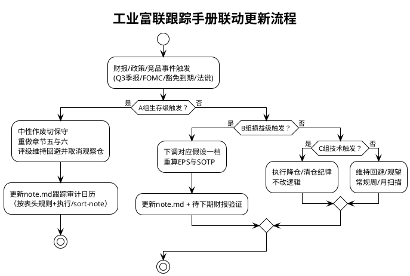

# 工业富联（601138）跟踪手册

**研究日期：2026年09月09日**
**适用研报：工业富联深度投资价值分析报告_2026年09月09日（含章节一至八）**
**现价锚：64.75元不复权（2026-09-08），市值12849亿元，股本198.44亿股**
**评级锚：回避/观望（Avoid/Wait，第四象限），加权56.87元，盈亏比-0.25，中性52.27元低于现价19.3%**
**手册性质：清单式执行文件，只列“看什么、阈值多少、何时看、触发后做什么”，不重复研报论证。未披露事项一律标注“未披露”，不外推。**

> 口径纪律：金额无特别注明均为人民币亿元；份额无注明均为全球AI服务器全部口径；毛利率无注明均为综合毛利率；经营现金流均指经营现金流净额（OCF）。本地视图以 `fin_indicator / fin_ttm / fin_balance_sheet / fin_income_statement / fin_cashflow_statement / v_daily_valuation / daily_kline` 为准，查询前显式 `ensure_views`，禁止全量扫描 `data/`。

---

## 一、核心逻辑验证点（定量财报指标，每期必查）

> 逻辑主线一句话：2026年中性假设=营收13524亿元（+49.8%）/净利520亿元（EPS 2.62元）/综合毛利率6.91%/期间费用率2.25%/税率14.5%/下半年净利率3.56%/全年经营现金流约290亿元（为净利56%）。以下每项都是该假设的“承重墙”，任一倒塌即重做盈利预测。

### 1.1 现金与营运占用（最高优先级，每季必查，Q3为生死判）

- [ ] **单季OCF是否转正**：2026年Q2单季-176.33亿元。要求2026年Q3单季OCF>0。若Q3继续为负，直接触发证伪A1（见第三章），中性作废切保守。来源：`fin_cashflow_statement` YTD差分，三季报披露后2个工作日内核算。
- [ ] **OCF/净利（TTM与单季）**：2025年14.8%、TTM 23.9%、2026年上半年31.1%。中性要求全年约56%（290亿/520亿）。若Q3单季OCF/单季净利<30%且存货不降，判定回血失败。来源：`fin_ttm` + 单季差分。
- [ ] **存货环比**：2026年6月末1921.09亿元（占总资产37.47%）。中性要求年末2050亿元（较6月末仅增129亿元）；保守2350亿元（+429亿元）；乐观1980亿元（+59亿元）。**Q3存货环比必须去化（较6月末下降）**，若再创新高即触发A1。同步查库龄与跌价：资产减值损失2025年14.83亿元为参照，若单季计提超10亿元即预警。来源：`fin_balance_sheet` + 年报/季报附注存货跌价。
- [ ] **应收账款与周转天数**：6月末1275.22亿元，周转天数38.44天为历史最优。中性要求年末1420亿元、天数维持38~40天。若单季激增超150亿元或天数恶化超45天，查保理是否缩量（见下）。来源：`fin_indicator` + `fin_balance_sheet`。
- [ ] **应付账款**：6月末1784.59亿元。中性要求年末2050亿元（随采购同增）。若应付增速显著低于存货+应收增速（缺口超100亿元），说明压款到极限，需查短借。来源：同上。
- [ ] **短期借款与负债率**：6月末短借1023.25亿元、负债率65.66%（上市后最高）。中性要求年末短借980亿元、负债率回落至63%一线。若Q3短借突破1100亿元或负债率超66.5%，或单季财务费用超12亿元（Q2为10.74亿元），判定加杠杆续命。来源：`fin_balance_sheet` + `fin_income_statement`财务费用。
- [ ] **销售收现/营收与购买付现/营收**：历史销售收现比98%~105%（失血不在应收端）、购买付现比2023年89.8%飙升至2025年95.0%。若Q3购买付现/营收再超95%且销售收现/营收跌破98%，判定备货吞噬加剧。来源：`fin_cashflow_statement`。
- [ ] **无追索保理出表**：2025年2903.86亿元（+277%）、成本10.44亿元计入投资损失。若保理规模环比骤降超500亿元而应收激增，说明贴现通道收紧，现金更紧。来源：年报“终止确认的应收账款”附注（仅年报/半年报披露，季报无则标注缺口）。

### 1.2 利润与毛利率（每季必查，连续两季规则）

- [ ] **单季毛利率环比**：Q1 7.35%→Q2 6.99%（-0.36个百分点）。若连续两季环比下滑或单季下滑超0.5个百分点，或跌破6.5%，全线下调毛利率假设0.5个百分点。铜/CCL滞后1~2个季度，下半年才是高价料，Q3毛利率是试金石。来源：`fin_income_statement`差分（营收-营业成本）/营收。
- [ ] **单季净利率**：Q2 4.29%判定为全年高点，中性要求下半年3.56%。若Q3单季守住4.1%以上，上调至乐观；若跌破3.5%，切换保守；若跌破2.5%，触发减值与关税共振核查。来源：同上。
- [ ] **分部毛利率（半年报/年报才披露，季报标注缺口）**：云计算中性6.0%（2025年5.73%）、通信网络11.0%、消费电子8.0%。若半年报云计算跌破5.5%或网络跌破10.5%，判定结构恶化。来源：半年报/年报分部附注。
- [ ] **期间费用率**：2026年上半年1.87%为季节性低点，全年三态2.48%/2.25%/2.05%。若Q3单季费用率超2.5%（研发回升+财务高企+合规），验证费用回升假设；若研发费用率连续两季低于1.0%（上半年0.90%），在Rubin/CPO拐点判为“压研发保利润”，毛利率改善不可信。来源：`fin_income_statement`。
- [ ] **财务费用单季**：Q2单季10.74亿元（2025年单季均值4.18亿元的2.6倍）。若单季超12亿元，拆分汇兑/利息/保理贴现，汇兑损失单独进敏感性表。来源：同上+附注汇兑损益。
- [ ] **有效税率**：2025年13.92%→上半年14.62%。三态假设15.0%/14.5%/14.0%。若超15.5%（境外高税率产能占比超预期），净利下调约2%。来源：所得税/利润总额。
- [ ] **非经常性损益占比**：2025年10.97亿元（占净利3.1%）、上半年7.56亿元（3.2%）。若单季超净利5%（政府补助/公允价值波动），扣非净利为准绳，不给估值加分。来源：附注。

### 1.3 增长斜率（每季验证是否按H1外推，严禁外推）

- [ ] **云计算增速**：上半年+75.7%（AI服务器+2.3倍）。中性要求全年+65%（下半年约+57%）。若Q3单季同比跌破+30%，全年滑向保守+45%；若超+80%且存货同步去化，才可谈乐观+85%。来源：季报MD&A定性+营收总量反推（分板块金额仅半年报/年报披露，季报标注缺口）。
- [ ] **通信网络增速**：上半年数据中心高速网络+1倍、800G出货+1.4倍。中性全年+60%。若Q3出货环比转负，查PCB/光模块供给（见4.2节）。来源：同上。
- [ ] **消费电子增速**：中性全年仅+2%（苹果-1.3%韧性对冲安卓-24.3%）。若Q3逆总量高增超+10%而渠道库存未去化，判为压货，不给估值加分，下半年计提跌价。来源：同上+IDC/Counterpoint渠道库存。
- [ ] **在建工程转固节奏**：6月末102.83亿元（2024年末31.73亿元→2025年末78.25亿元）。若单季转固超30亿元而营收不增，查产能利用率与折旧侵蚀。来源：`fin_balance_sheet`。

---

## 二、关键外部变量（决定Q与P的“天气”，每周/每月扫一遍）

| # | 变量 | 看什么数字 | 来源与频率 | 传导时滞 | 影响方向 |
|---|---|---|---|---|---|
| E1 | 北美云CAPEX | 四巨头合计约7325亿美元（2026）、九大超8867亿美元（+90%）、2027年约1.18~1.3万亿元；单家季报指引上/下修 | 公司财报电话会（季）+TrendForce（季）+Moody's/S&P（半年） | 2~4季度到EMS订单 | 高利率下增速递减为中性假设，任一头部下修10%+即预警 |
| E2 | AI服务器出货 | 2026年+31%近280万台、NVL72当量5.5万架、ASIC占比27.8%峰值 | TrendForce官网（季，已抓取8月3日）+高盛/伯恩斯坦转引（月，仅方向） | 1~2季度 | 出货下修即Q锚下调 |
| E3 | 手机/PC总量 | 手机-16.7%至10亿部出头（下半年-27.2%）、PC-11.3%（四季度-20%）、ASP+27.6%至581美元 | IDC官网（季，已抓取8月26日/6月2日）+Counterpoint（月） | 1季度到EMS砍单 | 总量再下修即消费保守-8%生效 |
| E4 | 交换机 | 以太网Q1+39.8%、数据中心+61%、800G 10.3倍、Q2后端超前端、2026~2030年累计近1万亿元供给约束 | Dell'Oro官网（季，7月上修/9月3日）+IDC转引（季） | 1季度 | 后端占比回落或1.6T推迟即网络增速下调 |
| E5 | CoWoS/HBM/电力交期 | CoWoS 52~78周、85%预订、HBM售罄、Gartner 40%数据中心2027年受限、德州49.8GW审计暂停 | 台积电法说（季）+英伟达CFO表态（季）+Gartner（年） | 即期到排产 | 交期拉长利好备货合理性，交期缩短+CapEx下修共振即过剩前兆 |
| E6 | 铜/CCL/存储 | LME铜14779美元/吨、沪铜111720元/吨、CCL年内七连涨累计超100%、DRAM现货+300% | 上期所/LME盘面（日）+建滔调价函（月）+21财经/财联社（周） | 1~2季度到毛利率 | 铜再涨20%或CCL再涨价即毛利率下调0.5个百分点 |
| E7 | 汇率 | 人民币6.7852（较上年末+3%）、区间6.9~7.3双向、掉期-174pips | 央行执行报告（季）+财联社/第一财经（日） | 当季到汇兑 | 单季升值超3%即触发利润与估值双调 |
| E8 | 利率/折现率 | 美中位3.8%、首次降息推迟至2027年6月、LPR 3.0%/3.5%十四连平 | 美联储SEP/声明（季）+央行报告（季） | 2~4季度到估值分母 | 点阵图再上调即地缘折价加深 |
| E9 | 关税/原产地 | 老301 25%+新301 12.5%=30~40%、178项豁免11月10日到期、RVC 65~75%、转口40%惩罚 | USTR/HTSUS/CBP+香港TID+律所梳理（月） | 即期 | 豁免到期恶化或扣留即重估 |
| E10 | GPU管制排产 | H200逐案审查（TPP<21000、50% cap、25%分成）、B200/Rubin推定拒绝、H20追加30万颗对暂停摆动 | BIS联邦公报+金杜解读（事件驱动） | 1季度到利用率 | 排产紊乱致利用率骤降即查存货跌价 |
| E11 | 国内算力网订单 | 六张网+十五五109项工程+绿电80%、运营商集采金额 | 发改委/数据局/运营商招标（月） | 2~3季度 | 金额落地才进Q，不落地不加分 |

---

## 三、逻辑证伪警报（判别性阈值，触发即重做研报，严禁拖延）

> 编号A为生存级（触发即中性作废），B为损益级（触发即下调一档），C为技术纪律（触发即降仓）。每条均写明“阈值+窗口+动作”。

### A组：生存级（任一触发，中性520亿元/52.27元作废，切保守366亿元/33.26元，并重做章节五与六）

- [ ] **A1 现金证伪**：2026年Q3单季OCF不转正（≤0）**或**存货环比不去化（较6月末1921亿元不降反升）**或**短借单季净增超100亿元，三者任一即触发。动作：R2暂时冲击重分类为趋势性恶化，加权目标价失效，评级维持回避并取消观察仓。
- [ ] **A2 开支断层**：前五大客户对应北美云巨头中两家以上连续两季下修CAPEX，或2027年1.3万亿元指引撤回/下修超10%。动作：GB300的5万柜/40%份额假设作废，重做P×Q。
- [ ] **A3 收权落地**：Rubin由ODM做到L10交英伟达、再由英伟达分派做L11从传闻变为公告，或公司GB/VR整机柜份额跌破30%（TrendForce口径）或全球AI服务器份额跌破35%下限。动作：护城河定性下调为“组装通道”，云分部PE由20倍下调至15倍，重做SOTP。
- [ ] **A4 分流失守**：ODM Direct份额再降5个百分点以上（由50.2%跌破45%），或Dell/SMCI单季AI收入环比超+30%而公司云增速环比转负。动作：ASP假设作废，查第二供应商切入。
- [ ] **A5 原产地否决**：USMCA年审RVC提至65~75%且公司墨西哥RVC未达标，或出现扣留/40%惩罚性关税实例，或178项豁免到期后无延续且公司中国直发占比未披露下降。动作：地缘折价由-5%加深至-8%，重做修正市值。

### B组：损益级（触发即下调对应假设一档，并在下期财报验证）

- [ ] **B1 毛利率**：综合毛利率连续两季环比下滑，或单季下滑超0.5个百分点，或跌破6.5%，或云计算分部（半年报）跌破5.5%。动作：三态毛利率全线下调0.5个百分点，重算EPS（约影响净利30~50亿元）。
- [ ] **B2 净利率**：Q3单季净利率跌破3.5%（中性下半年3.56%失守）或跌破3.0%。动作：切换保守情景；若守住4.1%以上，上调至乐观。
- [ ] **B3 汇兑与成本**：人民币单季升值超3%，或铜再涨20%，或CCL再发涨价函。动作：财务费用率上调0.1个百分点+毛利率下调0.3个百分点。
- [ ] **B4 消费压货**：消费分部连续两季逆总量（手机-16.7%/PC-11.3%）高增超+10%，而渠道周转未改善（苹果备货超阈值未降）。动作：消费增速下调至-8%，计提跌价10~20亿元。
- [ ] **B5 研发与集中**：研发费用率连续两季低于1.0%且竞品高出2个百分点以上，或前五大客户占比单期波动超3个百分点，或出现第二供应商定点公告。动作：DNA折价由-2%加深至-4%，云分部倍数下调。

### C组：技术纪律（不触逻辑，只触仓位，触发即执行不讨论）

- [ ] **C1 趋势止损**：日线连续两日收盘低于61.97元年线，降仓；跌破59.42元布林下轨，清仓观望。收盘价为准，盘中击穿不算。
- [ ] **C2 牛熊转换**：周线连续三周收盘低于59.01~61.97元双基座，或放量（超100亿元）跌破63.40元，判定箱体破坏，目标看53~56元双底进而47.05元年内低。
- [ ] **C3 假突破过滤**：70元突破需连续三日站稳68.23元+日均超120亿元+三季报OCF/净利超60%三者齐备，缺一即按假突破处理，不追高。
- [ ] **C4 地狱风控**：跌破33.26元保守价认错（逻辑已死）；跌破9元生存线为系统性风险，无需操作。最大回撤按-40.77%（近一年）至-89%（清算中点7元）做敞口管理。

---

## 四、关键时间节点（含财报日、政策日，精确到月/旬）

| 时间 | 事件 | 看什么 | 缺席如何处理 |
|---|---|---|---|
| 2026年9月15~16日 | 美联储FOMC+新SEP | 中位利率是否维持3.8%或再上调，点阵图加息票数 | 未发布不假设降息，中性维持久留假设 |
| 2026年10月（预计） | **工业富联2026年三季报**（生死判） | 单季OCF、存货环比、短借增量、单季毛利率/净利率 | 未披露前不外推Q3，评级自动延续回避 |
| 2026年10月27~28日 | 美联储FOMC | 同上，验证分母 | 同上 |
| 2026年11月10日 | 178项关税豁免到期 | 是否延续、有无新申请通道、服务器品类是否在列 | 到期前按叠加30~40%建模，不赌豁免 |
| 2026年11月（季报季） | 广达/纬创/纬颖/英业达Q3法说、Dell/SMCI季报、英伟达季报、浪潮Q3季报 | 见第五章双向解读 | 任一缺席标注缺口，不用旧数填充 |
| 2026年12月8~9日 | 美联储FOMC（年内最后） | 全年降息证伪或确认 | 全年0降息即分母维持高位 |
| 2026年Q4~2027年Q1 | USMCA六年审细则、RVC 65~75%落地 | 公司墨西哥RVC达成率、大陆出口美国比例 | 未披露标注为数据缺口，不假设达标 |
| 每月 | TrendForce AI服务器/IDC手机PC/Dell'Oro交换机月度追踪、建滔调价函、LME铜/人民币盘面 | 见第二章E1~E7 | 单月波动不调模型，连续两月同向才调 |
| 每周 | 技术双基座（61.97元年线/59.01元周线）与生命线65.57元得失（周五收盘价） | 见C组 | 盘中击穿不算，收盘连续确认才执行 |

> 跟踪审计日历维护纪律：任何读取或更新 `investigation/equities/note.md` 的跟踪审计日历，必须先完整读取从 `## 跟踪审计日历` 标题至表头结束的内容，再按公司名定位行；下次触发日仅可用 `YYYY-MM-DD`、`YYYY-MM-DD~YYYY-MM-DD`、以 `;` 分隔且按起始日升序的多个项目，或 `—`；更新后必须执行 `/sort-note` 校验排序，不得手工猜测位置。

---

## 五、竞争对手跟踪（广达/纬颖·纬创/浪潮信息/Dell/SMCI，另加英业达与PCB链为参照）

### 5.1 跟踪总表：指标、披露日历、判读阈值

| 对手 | 跟踪指标（每期必录） | 披露日历 | 利好/利空本公司的双向解读 | 联动更新要求 |
|---|---|---|---|---|
| **广达（2382，GB/VR第一争夺者）** | GB/VR整机柜份额（TrendForce口径，中性36%第一）、AI占服务器营收75~80%、GB300份额25~30%、资本开支2026年400亿元新台币（H1已投218亿元）、年底产能倍增、华亚厂2028年再倍增、GDR 22亿美元 | 台湾法说（约2/5/8/11月，8月法说为权威）+董事会公告（增资/购地）+月营收 | 对手份额升+公司份额稳=总量做大、分单非抢单（大和论），维持中性；对手份额升+公司份额跌破35%=丢失核心CSP，需触发A3；对手CapEx再上修+订单能见度至2028年=需求真实，强化Q锚；对手液冷更成熟实证=公司技术溢价下调 | 份额变动超3个百分点或CapEx上修超20%，48小时内更新研报第五章D3与估值SOTP云倍数 |
| **纬创（3231）+纬颖（6669，纯度最高）** | GB/VR约22%第三、AI占纬创营收约70%、纬颖2025年9507亿元新台币（+164%）、AI毛利率5.3~8.3%上沿、纬创2026年CapEx约600亿元新台币、加州33万平方英尺测试厂、增资美国子公司5亿美元 | 同上法说季+公告 | 纬颖纯度提升+公司ASIC同步3倍放量=双轨（GPU+ASIC）红利共振，维持中性；纬创GB300 8~9月交付超预期而公司Q2~Q3环比不及2~3倍=交付掉队，触发B1；两者GDR/增资补血=全行业杠杆扩张，过剩前兆记一笔 | AI毛利率区间上沿变动或ASIC占比超预期，更新第五章P逻辑与第六章云20倍是否上调 |
| **浪潮信息（000977，大陆镜像龙头）** | 中国AI服务器约32%第一、全球11.3%第二、服务器占主营93.88%、AI占比约35%、液冷年产能30万台、MW级3000W冷板 | A股季报（4/8/10月）+招标公告（工行30亿元海光/联通79.6亿元集采）+Gartner/IDC半年报 | 浪潮中标超预期+公司大陆投资加码=国内算力网对冲有效，但两者非同一擂台（中美体系分割），不直接加减份额；浪潮被中兴/超聚变侵蚀+公司份额稳=全球龙头地位稳固；浪潮液冷标准牵头+公司CPO样机=技术路线分化，需防标准错配 | 中国区CR5或浪潮份额变动超5个百分点，或国产替代招标超50亿元，更新第二章中国区判断与第五章D10 |
| **Dell（品牌龙头+客户/对手双重身份）** | 全球服务器收入16.5%（202.8亿美元）、AI份额17%（由5%跃升）、AI优化服务器161.3亿美元（+757%）、积压43亿→51亿→95亿美元、新签单季610亿美元、整体毛利率17.8~19.8%、自由现金流40亿美元/季、研发+22%至9.83亿美元、FY27 AI指引600亿美元 | 美股财报（约2/5/8/11月，电话会为权威）+IDC季度追踪 | 积压创新高+公司在手订单排至2027年=需求天花板保证，强化Q锚；Dell份额升+ODM Direct降=品牌夺回增量，公司ASP假设承压，触发A4；Dell毛利率19.8%对公司6%=品牌溢价不可比，估值端维持代工折价，不给公司品牌倍数 | 积压变动超100亿美元或ODM Direct变动超3个百分点，24小时内核查公司交付是否被分流 |
| **SMCI（超微，激进备货镜像）** | 全球份额7.6%（93.3亿美元）、FY2025营收219.7亿美元、Q3单季102.4亿美元（AI GPU超80%、毛利率9.9%）、毛利率由13.1%压缩至6.3~9.9%、库存129亿美元（由47亿元暴增）、现金转换149天、单季经营现金流-66亿美元、银行债88亿美元、大客户28%+9家十亿级占69%、DLC市占70~80% | 美股财报（约2/5/8/11月）+SEC预公告 | SMCI库存暴增+现金流-66亿美元+公司Q2单季-176亿元=行业性财务诅咒互证，非单家失误，但证明高备货模式脆弱，维持现金折价；SMCI毛利率压缩至6%一线=全行业费率底部，公司6%基准可信；SMCI backlog新高+公司份额稳=长尾需求真实；SMCI亏钱抢单+公司份额丢=价格战，需下调毛利率 | 库存/现金流恶化超20%或毛利率跌破6%，同步复核公司A1与B1是否触发 |
| **英业达（2356，参照）** | AI占服务器40~45%（2026年冲50%超笔电）、GB300约20%、ASIC超一半、CapEx由5亿美元倍增至超10亿美元、桃科88亿元+德州1.07亿美元+电力4860万美元单列 | 台湾法说+董事会公告 | ASIC占比超一半+公司ASIC 3倍=ASIC定制化主浪确认；电力单列4860万美元=机柜功耗瓶颈实锤，液冷价值量逻辑强化；GB300份额20%三源趋同=份额区间可信 | ASIC占比或CapEx变动超预期，更新第二章ASIC 27.8%与第五章结构假设 |
| **沪电/胜宏/生益（PCB链，定价权倒挂参照）** | 胜宏GPU加速卡全球45~52%、AI PCB全球第一13.8%、毛利率35.22%、研发4.03%；沪电毛利率35.48%、研发11.41亿元；AI/HPC PCB 15~20亿美元→2028年31.7亿美元（CAGR 25~35%） | A股季报+招商证券转引+Prismark | PCB毛利率35%对云6%=利润倒挂，证明代工不配顶端倍数，估值端维持云20倍对网络30倍的分化；Rubin四款Q2~Q3交付+存货39亿元=上游扩产决定ODM出货上限（有单无芯风险大于有芯无单） | PCB涨价函或毛利率变动超2个百分点，更新E6与B1 |

### 5.2 双向解读机制（四象限，避免单向唱多）

- **对手好+公司好=行业贝塔**：不给单家溢价，只强化总量Q锚（如Dell积压95亿美元+公司GPU机柜3.2倍=AI主浪确认，维持中性，不上调乐观概率）。
- **对手好+公司差=份额丢失**：必须回答是口径差（整机柜对NVL72单品）还是真丢失（连续两季份额跌破阈值），后者触发A3/A4。
- **对手差+公司好=份额提升待验证**：需用第三方（TrendForce/IDC）交叉，若仅公司陈述而无第三方印证，标注“公司陈述待验证”，不调模型。
- **对手差+公司差=行业拐点**：优先判为需求断层而非单家经营失误，切换保守并查存货跌价（如SMCI与公司同季现金流为负=备货模式系统性风险）。

### 5.3 联动更新要求（触发即执行，责任到研报章节）

1. 任一对手份额变动超3个百分点、CapEx上修超20%、积压变动超100亿美元、ODM Direct变动超3个百分点，48小时内复核研报章节三5.1节份额判断与章节五D1~D4，并决定是否重算三态EPS。
2. 任一对手毛利率变动超2个百分点或发布价格战/涨价信号，24小时内复核章节五毛利率三态（5.5%/6.0%/6.3%）与章节六SOTP分部倍数（云20倍/网络30倍/消费16倍）。
3. Rubin/CPO/液冷任一出现代际公告（英伟达GTC、对手法说、Dell'Oro上修），72小时内核查章节二2.2节定价锚是否推翻，旧结论仅作背景，一律采信最新可信信息。
4. 每次联动更新必须同步更新本手册第一章验证点状态（已验证/证伪/待验证）与 `investigation/equities/note.md` 投研汇总（按跟踪审计日历纪律+`/sort-note`），禁止只改研报不改汇总。

---

## 六、信源分级与缺口登记（诚实是最便宜的风控）

| 级别 | 定义 | 本手册用法 |
|---|---|---|
| Tier1 | 公司公告/交易所/巨潮/监管原文/财报电话会 | 财报数字、份额底座、分部增速、积压、税率、关税条款、利率SEP，直接进模型 |
| Tier2 | 市调机构官网/评级机构/权威媒体一线调研 | TrendForce/IDC/Dell'Oro/Moody's/上证报铜价，多源交叉后进Q锚，单源仅作方向 |
| Tier3 | 卖方研报/供应链纪要/垂直媒体转引 | 高盛/伯恩斯坦/摩根大通、GB单柜价值/6%毛利率、份额split，仅作方向或打折使用，不直接定价 |

**当前缺口（未发布或未披露，不得外推，移交下期补齐）：**

- [ ] 2026年三季报及之后财报（单季OCF、存货环比、短借增量、分部金额缺口待补）。
- [ ] 公司分地区营收（大陆/美/墨/越）与美元敞口比例、有息负债币种与期限结构、存货料号结构（铜/CCL/H系占比与跌价）。
- [ ] 墨西哥RVC实际达成率与美国线良率/利用率、大陆出口美国比例。
- [ ] Rubin 80~90%份额、Compute Tray独家、CPO 65~70%价值量、液冷1300kW/PUE实测、前五大客户明细（英伟达20~25%等估算）未经权威交叉，仅作线索。
- [ ] 9月议息点阵图、USMCA年审细则、178项豁免到期后续、H200实际对华交付量截至2026-09-09均未发布，不假设落地。

*（手册完；下次触发日按跟踪审计日历填写，格式仅允YYYY-MM-DD、YYYY-MM-DD~YYYY-MM-DD、以`;`分隔升序多个项目或`—`；更新后执行`/sort-note`。）*
