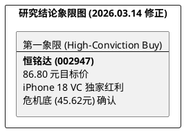

# 研报章节七：投资摘要与风险因素

**研究日期：2026年3月14日**

## 1. 投资摘要 (Investment Summary)

恒铭达（002947.SZ）目前正经历由 **“iPhone 18 不锈钢 VC 技术代差”** 与 **“治理信用修复”** 驱动的估值与业绩戴维斯双击。

*   **核心逻辑升级 (2026-03-14 修正)**：
    1.  **技术代差：iPhone 18 VC 转型红利**：2nm 芯片热密度倒逼 iPhone 18 Pro 系列放弃石墨片，全面导入**不锈钢 VC**。恒铭达作为该路径核心定点方，单机价值量（ASP）面临倍数级飞跃，这是公司从“精密件”向“热管理系统”转型的定性拐点。
    2.  **治理修复实证**：截至 2026 年 3 月底斥资 **3 亿元的大额回购**基本执行完毕，且董事会换届顺利。治理面已从“压制项”转变为“信用项”。
    3.  **算力主权卡位**：深度绑定华为昇腾 950 液冷链，是超节点（SuperNode）核心液冷冷板的主力供应商。
*   **估值结论**：预计 2026 年 EPS 为 **2.89 元**。给予合理溢价后的 30.0x PE。**目标价 86.80 元**（较现价 48.16 元有 80% 空间）。

## 2. 风险因素 (Risk Factors)

1.  **中东氦气供应链风险 (高)**：2026 年 3 月 4 日卡塔尔氦气出口中断，若持续超过一季度，将导致 VC 生产成本失控或交期延误。
2.  **技术路径更迭风险 (中)**：若不锈钢 VC 良率不及预期导致大客户方案回退。
3.  **地缘政治摩擦 (中)**：北美大客户供应链向印度/越南转移的物理节奏快于预期。

## 3. 研究结论象限图 (Final Evaluation Matrix)

