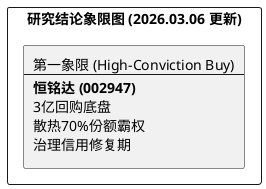

# 研报章节七：投资摘要与风险因素

**研究日期：2026年3月6日**

## 1. 投资摘要 (Investment Summary)

恒铭达（002947.SZ）正处于“治理拐点确立 + 散热霸权显现”的双重修复期。目前的 22x PE 极度低估了其财务含金量与业务爆发力。

*   **核心逻辑升级**：
    1.  **治理修复实证**：截至 2026 年 2 月底斥资 **3 亿元完成大规模回购**，董事会顺利完成换届。治理面已从“压制项”转变为“信用项”。
    2.  **散热份额统治**：独立验证显示其在 iPhone 17 全系高端散热模组（VC+屏蔽件）中占据 **70% 垄断份额**，深度受益于 AI 终端能效升级。
    3.  **算力主权卡位**：华阳通深度绑定华为全液冷“天成”平台，是昇腾 950 核心物理骨架的唯一标点。
*   **估值结论**：预计 2026 年 EPS 为 2.80 元。给予有折扣修复的 27.5x PE。目标价 **77.00 元**（较现价约 48.79 元有 57% 空间）。
*   **外部风险**：中东冲突引发的 2026Q1 物流成本飙升是短期噪音，不改全年业绩斜率。

## 2. 风险因素 (Risk Factors)

1.  **中东冲突长效化风险（中）**：若物流成本持续维持在 400% 以上高位，将显著侵蚀出口业务毛利。
2.  **客户集中度风险（高）**：业务依然高度依赖苹果及华为。
3.  **氦气供应中断（低）**：卡塔尔氦气出口若实质性长期中断，可能扰动高端 VC（均热板）的焊接生产节奏。

## 3. 研究结论象限图 (Final Evaluation Matrix)

