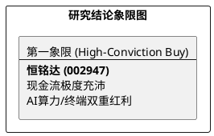

# 研报章节七：投资摘要与风险因素

**研究日期：2026年2月26日**

## 1. 投资摘要 (Investment Summary)

恒铭达（002947.SZ）目前正处于“业绩爆发期+现金流反转期”与“治理偏见折扣”的极度错配期。

*   **核心逻辑**：
    1.  **盈利质量极高**：2025Q3 经营性现金流高达 7.04 亿元，OCF/净利润比值达 1.72，彻底击碎市场关于“虚报利润”的质疑。
    2.  **AI 终端红利**：深度参与 iPhone 17 Air 等超薄化机型精密件研发，技术代差带来显著的 ASP 溢价。
    3.  **国产算力卡位**：通过子公司华阳通深度绑定 H 客户，在全液冷服务器机柜及冷板模组领域具备排他性定价权。
*   **估值结论**：预计 2026 年 EPS 为 2.80 元。给予有折扣的 27.5x PE（已对冲减持风险），目标价 77.00 元（较现价有约 57% 空间）。
*   **技术面**：右侧趋势确认，股价在 48.00 元平台换手充分，正走出底部主升浪。

## 2. 风险因素 (Risk Factors)

1.  **管理层治理风险（高）**：实控人及财务负责人同步披露的减持计划是当前压制估值中枢的核心因子。
2.  **客户集中度风险（中）**：公司业务高度依赖苹果及华为链，若终端销售严重不及预期，将直接冲击盈利模型。
3.  **汇率波动风险（低）**：海外收入占比高，虽然汇率影响正逐步中性化，但极端波动仍可能产生阶段性财务损耗。

## 3. 研究结论象限图 (Final Evaluation Matrix)

