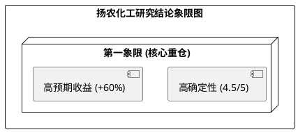

# 扬农化工 (600486) 投资价值分析报告：产能周期与政策红利共振，开启价值回归之旅

**日期**：2026-02-26
**评级**：核心重仓建议 (High-Conviction Buy)
**目标价**：121.5 元 (现价：76.05 元，空间 +60%)

---

## 【投资摘要】
扬农化工正处于历史性的**“基本面拐点 + 政策溢价期”**。
1.  **核心增长驱动**：辽宁优创一期已于 2025 年全面达产，2026 年将迎来首个满产年，产值增量确定。2025 年前三季度在行业底部已实现营收与利润双增长，验证了业绩韧性。
2.  **政策红利深厚**：“一证一品”强制执行与原药出口退税取消的组合拳，正加速行业 80% 的落后产能出清。扬农作为“原药-制剂一体化”龙头，具备非对称竞争优势。
3.  **业绩爆发预期**：我们预测 2026 年公司 EPS 将达到 **6.10 元**（中性场景），同比增长 70.9%。
4.  **估值催化剂**：先正达集团 2026 年赴港 IPO 将锚定全球估值体系，作为其核心资产的扬农化工有望获得显著的流动性与“压舱石”溢价。
5.  **技术面共振**：股价已完成长周期震荡箱体突破，均线呈多头排列，资金已开始抢跑业绩复苏。

---

## 模块一：企业微观与财务基石 (Micro & Financial Foundation)

扬农化工已成功跨越“投入高谷”，目前正处于“新老产能交棒”的初期。2025 年前三季度营收（91.56 亿）与净利（10.55 亿）逆势增长，验证了毛利率 22% 的扎实底部。北方基地 42 亿投资已全面转固，标志着 2026 年进入产出爆发期。公司财务费用常年为负，资产流动性极佳。

---

## 模块二：产业周期与竞争格局 (Time & Space Analysis)

全球农化行业正从“去库存”转向“去产能”。扬农凭借“原药中间体一体化”和先正达协同，在成本端构建了降维打击落后产能的护城河。2026 年行业进入常态化补库，巴西等核心市场的刚性需求将驱动价格稳中有升。

---

## 模块三：外部边界与宏观政策 (Boundary Analysis)

2026 年 4 月 1 日起取消原药出口退税是行业格局重塑的里程碑。由于制剂退税保留，扬农可利用退税差额获得更强的定价权。此外，先正达 IPO 预期的升温将显著抬升扬农的估值地板。

---

## 模块四：增长驱动与盈利预测 (Growth & Modeling)

基于 P*Q 动态模型，中性情景下 2026 年营收预计达 183.6 亿元，净利率回升至 13.5%，对应归母净利润 24.79 亿元。产能增量的确定性评分高达 **5分**，订单锁定度极高。

---

## 模块五：估值定价分析 (Valuation & Hedge)

通过对冲审计矩阵修正，我们给予 2026 年 20x 的目标 PE。经三态场景加权，得出目标价 **121.5 元**。当前股价对应的盈亏比高达 **15.41 倍**，下行空间受 PB（2.74x）深度锁定在 73 元附近。

---

## 模块六：技术面分析 (Technical Analysis)

完美的多头排列与突破 250 日新高，确认了资金对基本面拐点的认可。股价已进入右侧交易区间，回踩关键支撑位（约 73.0-75.0 元）均为极佳的买入时机。

---

## 【研究结论象限图】

## 【风险因素】
1.  **能源价格剧震**：布伦特原油持续突破 75 美元可能侵蚀短期毛利。
2.  **海外政策突变**：核心出口国出现超预期的贸易壁垒或地缘政治审查。
3.  **产能释放节奏**：辽宁优创二期进度若显著慢于预期。
