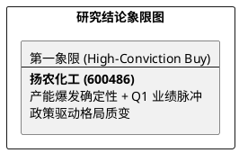

# 研报章节七：投资摘要与风险因素

**研究日期：2026年3月14日**

## 1. 投资摘要 (Investment Summary)

扬农化工（600486.SH）正处于“产能爆发+政策红利”的双重共振拐点。尽管 3 月宏观波动剧烈，但其作为全球农化龙头的竞争壁垒正在显著加强。

*   **核心逻辑 (REVISED)**：
    1.  **产能周期爆发**：辽宁优创一期已步入全面业绩兑现期。2026 年首个满产年预计贡献 45-50 亿产值增量，是业绩爆发的物理基石。
    2.  **政策红利脉冲**：4 月 1 日出口退税取消引发 3 月剧烈“抢出口”，预计 **2026Q1 业绩将出现超预期增长**。长期看，制剂退税保留将强化扬农的非对称竞争优势。
    3.  **估值催化剂 (CONFIRMED)**：先正达集团赴港 IPO 时间表（Q2 交表/Q4 挂牌）明确，作为核心供应链“压舱石”，扬农将直接受益于全球估值对标。
*   **估值结论**：修正 2026 年中性 EPS 至 **5.83 元**（反映高油价与退税成本挤压）。目标价 **116.0 元**。
*   **技术面**：股价站稳 80 元大关，MA20 强力支撑，处于主升浪初期的空中加油阶段。

## 2. 风险因素 (Risk Factors - UPDATED)

1.  **原材料波动风险 (高)**：布伦特原油突破 $100/桶，若持续维持高位，将显著侵蚀拟除虫菊酯等石油基产品的毛利。
2.  **成本传导风险 (中)**：4 月 1 日退税取消后，若全球原药需求疲软导致 9% 成本无法有效向下游传导，利润中枢将承压。
3.  **地缘政治风险 (中)**：供应链安全焦虑可能导致核心海外市场对中国农化产品采取非对称关税。

## 3. 研究结论象限图 (Final Evaluation Matrix)

## 章节结论
目前扬农化工处于**“逻辑证实期”**。3 月份的外部震荡不仅未证伪产能逻辑，反而通过退税政策加速了优胜劣汰。**14.4倍 的远期 PE 为极佳的战略配置窗口。**
