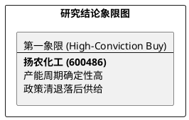

# 研报章节七：投资摘要与风险因素

**研究日期：2026年2月26日**

## 1. 投资摘要 (Investment Summary)

扬农化工（600486.SH）正处于“产能爆发+政策红利”的双重共振拐点，是农化板块价值回归的首选标的。

*   **核心逻辑**：
    1.  **产能周期爆发**：辽宁优创一期全面达产，2026 年迎来首个满产年，产值增量确定性极高。
    2.  **政策红利溢价**：原药出口退税取消（制剂保留）及“一证一品”政策加速行业落后产能出清，利好“原药-制剂一体化”龙头。
    3.  **估值催化剂**：先正达集团 IPO 预期升温，将显著抬升作为其核心资产的扬农化工的估值地板。
*   **估值结论**：预计 2026 年业绩大幅增长（中性 EPS 6.10 元）。目标价 121.5 元（空间约 60%）。
*   **技术面**：均线呈多头排列，突破 250 日新高，确认资金已抢跑基本面拐点。

## 2. 风险因素 (Risk Factors)

1.  **原材料波动风险（中）**：原油及基础化工原料价格剧震可能侵蚀短期毛利率。
2.  **产能释放风险（中）**：辽宁优创二期等后续产能建设进度若不及预期，将延缓业绩释放曲线。
3.  **海外政策风险（低）**：核心出口市场若出现突发性的贸易壁垒或地缘审查。

## 3. 研究结论象限图 (Final Evaluation Matrix)

