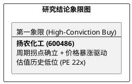

# 研报章节七：投资摘要与风险因素

**研究日期：2026年4月27日**

## 1. 投资摘要 (Investment Summary)

扬农化工（600486.SH）目前处于“利空出尽、价格先行”的复苏确认期。Q1 业绩虽受季节性及成本压制未达极度乐观预期，但 4 月份原药价格的爆发已提前锁定了 Q2 的业绩高弹性。

*   **核心逻辑 (REVISED)**：
    1.  **Q1 底部确认**：归母净利 **4.07 亿元** (环比 +76%) 确认了 2025Q4 即为本轮周期底部。营收 34.67 亿展现了较强的市场修复能力。
    2.  **4 月价格脉冲**：拟除虫菊酯原药价格在 4 月暴涨 30%+，主因地缘冲突导致的供应链收紧与成本推升。由于结算滞后性，Q2 将进入利润爆发期。
    3.  **双底支撑确立**：股价回撤至 **70 元** 关键支撑位，与 3 月底底部形成坚固的“双底”结构，提供了极佳的风险收益比。
*   **估值结论**：微调 2026 年中性 EPS 至 **5.54 元**。目标价 **110.3 元**。
*   **技术面**：目前在 71 元附近筑底磨底，建议关注缩量企稳信号。

## 2. 风险因素 (Risk Factors - UPDATED)

1.  **极端地缘与原材料黑天鹅风险 (极高)**：霍尔木兹海峡封锁导致现货油价飙升至 $140+。若该封锁长期化，虽然推升了农药价格，但若下游需求因成本过高而萎缩，将形成“滞胀”压力。
2.  **海运费侵蚀利润 (高)**：发往南美航线运费涨幅超 80%，需警惕出口毛利率在短期内受物流费用非理性上涨的挤压。
3.  **先正达 IPO 节奏风险 (中)**：若母公司 IPO 进度因全球市场波动推迟，可能影响短期估值溢价的兑现。

## 3. 研究结论象限图 (Final Evaluation Matrix)

## 章节结论
目前扬农化工处于**“价格领先于利润”**的典型复苏阶段。Q1 的业绩“微降”掩盖了环比爆发的实质，而 4 月的报价暴涨则预示了未来的惊喜。**在 70 元支撑位附近，任何恐慌性下跌都是战略性买入的机会。**
