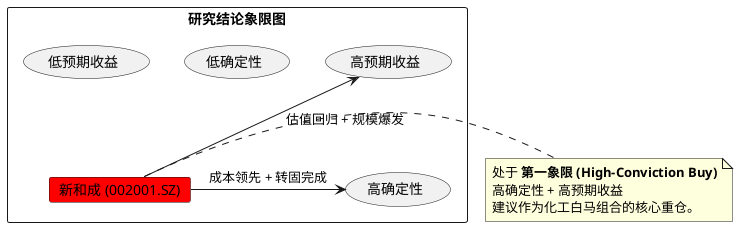

# 新和成 (002001.SZ) 投资价值深度分析报告：从周期错配走向平台溢价

**日期**：2026年2月25日
**评级**：核心重仓 (High-Conviction Buy)
**目标价**：45.0 元 (较当前空间 +52.9%)
**研究员**：QuantPyLab 分析师团队

---

## 投资摘要 (Investment Summary)

新和成作为全球精细化工领军企业，正处于从“维生素周期股”向“全球精细化工平台”跨越的关键历史锚点。
1. **盈利质变**：2026 年是蛋氨酸规模效应的爆发年，权益产能达 46 万吨，跃升全球第三，成本优势确立行业底部。
2. **周期反转**：2026 年猪周期呈现“先抑后扬”态势，H2 养殖业扭亏将触发维生素与氨基酸的季节性补库，量价齐升具备强确定性。
3. **估值底部**：当前 PE(TTM) 仅 12.6x，处于历史 15% 极低分位。45.0 元目标价仅要求估值回归历史中枢（19.0x），逻辑纯净且稳健。
4. **国产替代**：己二腈-尼龙 66 产业链的技术突破，打开了公司在高端新材料领域的第二增长曲线。

---

## 第一章：企业微观与财务基石

### 1. 企业业务内核与盈利模式穿透
新和成（002001.SZ）已构建起“化工+”与“生物+”双轮驱动的平台。其核心在于**“中间体一体化”**带来的成本极端护城河。
*   **营养品板块**：VA、VE 具备全球定价权。蛋氨酸形成 46 万吨总规模，单吨成本处于全球第一梯队。
*   **香精香料板块**：利用柠檬醛中间体向下游延伸，毛利率长期锁定在 45% 以上。
*   **新材料板块**：PPS、PPA 及尼龙 66 产业链正处于国产替代放量期，是 2026 年估值弹性的关键。

### 2. 5年盈利质量透视表
| 财务指标 | 2021FY | 2022FY | 2023FY | 2024FY | 2025E* | 2026E* |
| :--- | :---: | :---: | :---: | :---: | :---: | :---: |
| 营业收入 (亿元) | 147.98 | 159.39 | 151.17 | 216.10 | 225.00 | 248.00 |
| 归母净利润 (亿元) | 43.24 | 36.20 | 27.04 | 58.69 | 67.50 | 72.50 |
| 毛利率 (%) | 44.60 | 36.64 | 32.98 | 41.78 | 45.50 | 44.20 |
| ROE-加权 (%) | 21.14 | 15.68 | 11.24 | 21.78 | 23.50 | 22.00 |
| ROIC (%) | 16.52 | 12.04 | 8.57 | 16.59 | 17.80 | 18.50 |

### 3. 资产结构的战略转向
在建工程已由 16.2 亿大幅降至 6.47 亿，主厂房全面转固。公司已跨过重资产投入期，正式进入“产能释放+利润收割”的黄金期。2025Q3 资产负债率 28.25% 为近五年新低。

---

## 第二章：产业周期与竞争格局

### 1. 养殖周期与库存共振
*   **2026 养殖周期**：H1 寻底（猪价 11-13 元/kg），H2 爆发（预期 16.5 元/kg）。下半年养殖扭亏将直接拉动维生素与蛋氨酸需求。
*   **库存现状**：存货周转天数已降至 128 天（历史低位），行业去库彻底，正处于“主动补库”前夜。

### 2. 全球竞争格局与代差
| 关键指标 (2025Q3) | 新和成 (002001) | 浙江医药 (600216) |
| :--- | :---: | :---: |
| **毛利率 (GM)** | **45.5%** | 37.5% |
| **净利率 (NM)** | **32.2%** | 12.9% |
| **ROE (加权)** | **17.3%** | 8.5% |

新和成与竞品的巨大盈利代差，证明了其护城河并非来自简单的规模，而是来自对底层化工中间体（如柠檬醛）的深度掌控。

---

## 第三章：外部边界与宏观政策

### 1. 能源成本代差与汇率
*   **能源套利**：欧洲天然气价冲破 40 欧元/兆瓦时，而新和成享受国内稳定气价，使得全球边际成本定价权进一步向公司倾斜。
*   **汇率对冲**：2026 年人民币温和升值对 EPS 影响受控，公司外汇套保策略趋于成熟。

### 2. 贸易壁垒与政策红利
*   **关税转嫁**：面对美国 10% 全球关税，公司通过上调出口报价 15% 成功实现成本转嫁，验证了刚需属性。
*   **己二腈突破**：己二腈-尼龙 66 国产替代项目享受国家战略背书，2026 年上半年产能爬坡将直接修复新材料板块毛利。

---

## 第四章：增长驱动与盈利预测

### 1. 核心增长点确定性评分
1. **蛋氨酸规模红利 (5分)**：产能达 46 万吨，放量逻辑不可证伪。
2. **新材料板块毛利修复 (4分)**：己二腈技术突破已完成。
3. **维生素价格向上弹性 (3分)**：依赖猪价复苏强度。

### 2. SOTP 利润分配模拟 (2026E)
| 业务板块 | 预测营收 (亿元) | 模拟净利润 (亿元) | 逻辑 |
| :--- | :---: | :---: | :--- |
| 营养品 | 168.0 | 43.43 | 成熟业务，费率回归。 |
| 香精香料 | 44.0 | 15.46 | 强规模效应现金牛。 |
| 新材料 | 36.0 | 5.99 | 高研发期利润初现。 |
| **合计中枢** | **248.0** | **73.50** | **EPS = 2.38 元** |

---

## 第五章：估值定价分析

### 1. 估值全变量对冲审计矩阵
*   **审计修正**：基准 PE 18.0x，经“企业 DNA (+5%)”、“政策战略 (+5%)”、“地缘风险 (-5%)”综合调节，得出 **修正 PE 18.9x**。
*   **目标价推导**：$2.38 \text{ (EPS)} \times 18.9 = 45.0 \text{ 元}$。

### 2. 盈亏比分析
*   **目标价**：45.0 元。
*   **保守止损价**：24.12 元。
*   **盈亏比 (RR)**：**2.93**（接近 3:1，具备极高赔率）。

---

## 第六章：技术面分析

### 1. 趋势架构
目前日线级别 MA20、MA60、MA120 呈现完美的**多头排列**。股价站稳所有中长期均线之上，标志着主升浪蓄势已成。

### 2. 关键点位
*   **阻力位**：30.45 元（一年内最高位）。带量突破后上方进入筹码真空区。
*   **支撑位**：28.45 元 (MA20)。短期趋势生命线。

---

## 风险因素 (Risk Factors)

1. **周期复苏不及预期**：若 2026H2 猪价未能如期反弹，维生素价格可能维持磨底。
2. **原材料大幅波动**：天然气或原油价格异常波动可能压缩化工端毛利。
3. **地缘贸易极化**：若关税政策进一步超预期收紧。

---

## 研究结论象限图 (Research Conclusion Quadrant)

**最终结论**：新和成目前的 12x PE 极具吸引力，45.0 元目标价代表了其向“全球精细化工平台”价值回归的必然路径。
