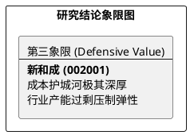

# 研报章节七：投资摘要与风险因素

**研究日期：2026年2月26日**

## 1. 投资摘要 (Investment Summary)

新和成（002001.SZ）作为全球精细化工平台，正处于存量博弈与结构性扩张的平衡期。

*   **核心逻辑**：
    1.  **一体化成本优势**：核心中间体（如柠檬醛）自主可控，成本较同行低 15%-20%，保障了在行业低迷期的存活能力。
    2.  **新材料拓展**：虽然尼龙 66 行业面临过剩，但公司正通过差异化竞争及工艺优化寻求毛利修复。
    3.  **财务极其稳健**：资产负债率低，现金流充沛，在降息周期及行业洗牌中具备极强的抗风险韧性。
*   **估值结论**：2026 年面临维生素筑底、尼龙 66 过剩及蛋氨酸强敌入场的三重挑战。目标价下修为 32.0 元，建议等待回调机会。
*   **研究评级**：下调至**防御型价值 (Defensive Value)**，处于研究象限第三象限。

## 2. 风险因素 (Risk Factors)

1.  **产能过剩风险（高）**：尼龙 66 等新材料细分领域若长期处于恶性价格战，将严重拖累相关板块的盈利预测。
2.  **竞争格局风险（中）**：万华化学等强力对手在蛋氨酸等领域的扩产速度若超预期，将导致行业定价权易主。
3.  **地缘关税风险（低）**：海外业务占比高，需持续关注关税波动及出口提价的转嫁能力。

## 3. 研究结论象限图 (Final Evaluation Matrix)

