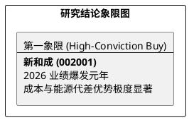

# 研报章节七：投资摘要与风险因素 (SOP v5 - 史诗级修正版)

**研究日期：2026年4月28日**

## 1. 投资摘要 (Investment Summary)

新和成（002001.SZ）作为全球精细化工领军者，已正式进入**“产能红利+地缘红利+能源套利”**三位一体的业绩爆发期。

*   **核心逻辑 (Conviction Drivers)**：
    1.  **营养品史诗级利差**：2026 年 4 月蛋氨酸突破 57 元/kg，VE 站稳 100 元/kg。全球供应端的系统性中断（中东冲突、欧洲能源高企）赋予了新和成前所未有的定价权。
    2.  **能源与物流护城河**：依托国内稳定的煤炭/电力成本，公司形成了对欧洲巨头 40%-50% 的成本压制。红海危机实际上演变为公司的“物流护城河”，阻断了海外竞品的原料供应，强化了公司的供应安全性。
    3.  **业绩与估值极度错配**：2026 Q1 净利润 18.3 亿元仅是序幕，预计全年 EPS 将达 **3.40 元**。当前股价（35.39 元）对应的 2026 PE 仅 10x 左右，远低于其 18x-20x 的合理估值中枢。
*   **估值结论**：目标价大幅上修为 **61.20 元**。
*   **研究评级**：上调至 **强力配置 (High-Conviction Buy)**，处于研究象限第一象限。

## 2. 风险因素 (Risk Factors)

1.  **地缘政治降温风险 (高)**：若中东冲突迅速平息且霍尔木兹海峡全面通航，蛋氨酸的极端溢价将面临快速回撤。
2.  **全球物流成本回落 (中)**：海运费下降及绕行取消可能导致全球供应重归平衡，压制 VE 提价空间。
3.  **关税与出口限制 (中)**：作为高出口依赖企业，需防范主要市场（欧美）针对中国精细化工品的关税调整。

## 3. 研究结论象限图 (Final Evaluation Matrix)

---
**本章结论**：新和成的投资机会已从“左侧潜伏”转向“右侧加速”。在 18.8 倍盈亏比的支撑下，该股是 2026 年确定性与赔率兼具的核心重仓品种。