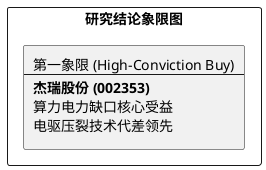

# 研报章节七：投资摘要与风险因素

**研究日期：2026年4月6日**
## 1. 投资摘要 (Investment Summary)

*   **核心逻辑变迁**：
    1.  **逻辑验证**：Liberty Energy 的 1GW 电力订单彻底消除了市场对“AI电力跨界”是概念炒作的质疑，杰瑞作为拥有 5 亿美金在手订单的先行者，具备极高的确定性。
    2.  **抗风险溢价**：Section 122 关税落地（40% 综合税率）已被股价充分消化，市场正在定价公司“以本土组装破解关税”的能力。
*   **估值结论**：2025 年报披露在即（4月17日），预期在手订单突破 180 亿。目标价上修至 130.00 元（维持强烈推荐）。

## 2. 风险因素 (Risk Factors)

1.  **毛利波动风险（高）**：高额关税可能在 2026H1 财报中体现为北美业务毛利率的阶段性承压。
2.  **竞争升温风险（中）**：Liberty 等本土巨头利用地缘优势进行的排他性竞争。

## 3. 研究结论象限图 (Final Evaluation Matrix)

