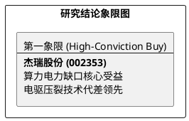

# 研报章节七：投资摘要与风险因素

**研究日期：2026年2月26日**

## 1. 投资摘要 (Investment Summary)

杰瑞股份（002353.SZ）正处于从传统油服装备向全球高端能源+AI 电力基础设施提供商转型的质变期。

*   **核心逻辑**：
    1.  **AI 电力跨界奇点**：北美 AI 数据中心电力缺口驱动移动电源蓝海，公司燃气轮机动力方案斩获巨额订单，打开估值天花板。
    2.  **存量替代红利**：北美电驱压裂（e-frac）渗透率跨越 50% 门槛，杰瑞凭借 7000 HP 泵的技术代差占据增量订单高位。
    3.  **区域增长共振**：沙特等中东国家开启非常规气投资新周期，公司从单机销售跃升为井场集成供应商。
*   **估值结论**：预计 2026 年业绩进入爆发期。综合考虑能源与算力双重属性，目标价 136.00 元（空间巨大）。
*   **技术面**：处于后复权历史新高，均线系统呈完美多头排列，趋势惯性极强。

## 2. 风险因素 (Risk Factors)

1.  **关税风险（高）**：北美市场综合关税压力仍存，需关注公司本土化运营及关键零部件豁免的持续性。
2.  **地缘波动风险（中）**：中东气田大基建进度可能受区域局势扰动。
3.  **能源价格风险（低）**：若油价长期剧烈波动，可能影响页岩油商对电驱压裂设备的资本开支节奏。

## 3. 研究结论象限图 (Final Evaluation Matrix)

