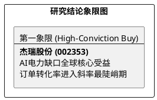

# 研报章节七：投资摘要与风险因素

**研究日期：2026年4月25日**
## 1. 投资摘要 (Investment Summary)

*   **核心逻辑变迁**：
    1.  **从“油服”到“算力基建”的范式转移**：北美累计签署超过 **14.4 亿美元** 的移动燃气轮机组订单，标志着杰瑞已成为美国 AI 算力短缺的“离网电力”核心供应商。
    2.  **关税风险的实质性出清**：Section 122 关税豁免叠加本土组装产能释放，公司北美盈利能力将呈现超预期回升。
    3.  **业绩非线性爆发**：2026 年预计净利润增速突破 40%，业绩驱动由“周期回暖”转向“跨界爆发”。
*   **估值结论**：考虑到业务属性切换及极高的业绩确定性，给予 2026E 40x PE。上修目标价至 **150.00 元**（维持强烈推荐）。

## 2. 风险因素 (Risk Factors)

1.  **Section 232 成分计税风险（中）**：若本土组装比例提升不及预期，可能面临一定的组件追溯税负。
2.  **地缘政治竞争（中）**：需关注美国对“能源基建”中资背景的限制政策演变。
3.  **汇率风险（低）**：美元结算为主，需警惕人民币剧烈升值。

## 3. 研究结论象限图 (Final Evaluation Matrix)

