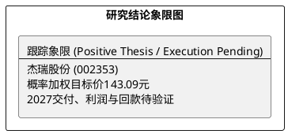

# 研报章节七：投资摘要与风险因素

**研究日期：2026年7月27日**
## 1. 投资摘要 (Investment Summary)

*   **核心逻辑变迁**：
    1.  **需求端重大验证**：公司 7 月 22 日确认已接受 **14.65 亿美元**燃机发电机组采购订单；自 2025 年 11 月以来，与同一客户及其子公司的累计合同金额为 **17.20 亿美元**。这提升了北美数据中心供电需求的可信度。
    2.  **2026 与 2027 严格分层**：该订单拟于 **2027 年分批交付，对 2026 年经营业绩无影响**。订单不是当期收入、利润或现金流，必须经过生产、交付、性能验收与回款。
    3.  **从乐观定价切换为兑现审计**：公司北美本地装配与扩产能力是积极信号；全球燃机供应链的长交期、关键部件和成本压力则是核心约束。贸易税负未有产品级验证，不再视作风险出清。
*   **投资结论**：**积极跟踪，概率加权目标价 143.09 元。** 对 2026E 不上调，但将 2027 年订单兑现纳入估值：悲观/基准/乐观总 EPS 为 3.47/4.11/4.76 元，对应 103.99/143.80/199.94 元，按 30%/50%/20% 加权。相对 7 月 24 日 137.29 元收盘价，上行约 4.2%，安全边际有限。旧 2026E 40x PE、150 元目标价和“强烈推荐”均已撤销。

## 2. 风险因素 (Risk Factors)

1.  **履约与供应链风险（高）**：关键部件外采、全球燃机供给紧张、延期赔偿和现场性能价格调整，可能侵蚀收入、毛利或现金回收。
2.  **客户与需求风险（中高）**：单一云客户及其数据中心项目的建设、融资和接电进度会影响订单落地节奏。
3.  **贸易与合规风险（中）**：美国 301 调查及后续措施存在不确定性，产品级税则/原产地与实际成本尚未核验。
4.  **汇率与营运资本风险（中）**：美元结算、应收账龄、合同负债和经营现金流均需随定期报告追踪。

## 3. 研究结论象限图 (Final Evaluation Matrix)

