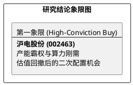

# 研报章节七：投资摘要与风险因素

**研究日期：2026年4月1日**

## 1. 投资摘要 (Investment Summary)

沪电股份（002463.SZ）正通过 **“技术先发+资本霸权”** 双重战略，从 AI 硬件生态的参与者向规则制定者进化。

*   **核心逻辑增量**：
    1.  **产能霸权确立**：启动 68 亿元高端 PCB 扩产项目，通过锁定高阶设备交付，在 1.6T 交换机及 Rubin 平台配套领域构筑极高的资本壁垒。
    2.  **1.6T 渗透超预期**：Rubin 平台规格确认推升 PCB 层数至 30-70 层，沪电作为核心供应商将享受更长周期的 ASP 溢价。
    3.  **地缘避险溢价**：泰国工厂利用率突破 90% 且认证超预期，已成为北美 CSP 客户的刚性供应链选择。
*   **估值结论**：上修 2026E 归母净利润至 **56.2 亿元**，对应目标价 **92.5 元**。当前股价回撤后提供了约 16% 的安全垫。
*   **研究评级**：上调至 **买入 (Buy)**。

## 2. 风险因素 (Risk Factors)

1.  **成本传导时滞（高）**：2026 年 3 月 CCL 涨价 30%，若下游定价调整滞后，将对 Q2 毛利率产生阶段性挤压。
2.  **资本开支与折旧风险（中）**：68 亿投资规模巨大，若 2027 年需求不及预期，将面临沉重的折旧摊销压力。
3.  **技术代差风险（低/中）**：CPO 技术长期仍有威胁，但 Rubin 平台采用 CoWoP 架构暂时延缓了该风险的爆发。

## 3. 研究结论象限图 (Final Evaluation Matrix修订)

