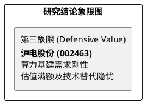

# 研报章节七：投资摘要与风险因素

**研究日期：2026年2月26日**

## 1. 投资摘要 (Investment Summary)

沪电股份（002463.SZ）已从 PCB 加工厂进化为 AI 硬件生态的核心工艺合伙人，正处于算力霸权与技术隐忧的博弈期。

*   **核心逻辑**：
    1.  **算力核心地位**：深度绑定英伟达、思科，在 800G/1.6T 交换机及 Blackwell/Rubin 平台演进中占据高层板（28-70层）技术高地。
    2.  **全球化对冲**：泰国工厂有效对冲了地缘风险，正成为承接北美大客户核心订单的关键安全岛。
    3.  **量价齐升**：层数增加带动 ASP 提升，2026 年净利润预期将突破 50 亿元大关。
*   **估值结论**：当前估值已接近合理偏满状态（2026E PE 约 27.6x），目标价 85.4 元。由于向上弹性弱于向下风险，盈亏比不对称。
*   **研究评级**：下调至**观望/持有 (Hold)**。

## 2. 风险因素 (Risk Factors)

1.  **技术代差风险（致命）**：2026 年后 CPO（共封装光学）技术的成熟可能导致主交换机对超高层数 PCB 需求拐点向下，动摇长线增长逻辑。
2.  **财务与治理风险（高）**：高管高位减持及过往财务更正瑕疵对买方持股信心构成压制。
3.  **产能爬坡阵痛（中）**：2026H1 面临新旧产能衔接真空期，泰国厂初期折旧与爬坡可能吞噬短期利润。

## 3. 研究结论象限图 (Final Evaluation Matrix)

