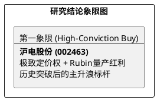

# 研报章节七：投资摘要与风险因素

**研究日期：2026年4月23日**

## 1. 投资摘要 (Investment Summary)

沪电股份（002463.SZ）在 2026Q1 正式开启了其 **“盈利爆发与估值重构”** 的共振时刻。

*   **核心逻辑增量**：
    1.  **业绩极限突破**：2026Q1 营收增长 53.9%，净利增长 62.9%，即便在 1.48 亿汇兑损失与 30% CCL 成本上涨的双重压力下，毛利率依然逆势扩张至 35.6%，实证了其无与伦比的定价权。
    2.  **Rubin 平台全面驱动**：NVIDIA Rubin 进入量产，高层数（30-70层）PCB 的技术壁垒与常州 CoWoP 先进封装配套的布局，使公司从 PCB 厂商向算力硬件系统供应商进阶。
    3.  **1.6T 规模化元年**：Arista 与 Cisco 的部署指引上修，驱动公司 1.6T 交换机板占比快速冲向 35% 以上，带来 ASP 与毛利的双升。
*   **估值结论**：大幅上修 2026E 归母净利润至 **62.5 亿元**（YoY +63%），给予修正目标价 **129.9 元**。
*   **研究评级**：维持 **买入 (Buy)**，并将其作为算力硬件板块的 **核心高确定性标的**。

## 2. 风险因素 (Risk Factors)

1.  **汇率大幅波动（中）**：Q1 的 1.48 亿损失提醒投资者，美元的大幅走弱仍是侵蚀利润的最大非经营性风险。
2.  **常州项目爬坡风险（中）**：新进入的 CoWoP 封装配套领域存在良率爬坡与客户验证节奏不确定的风险。
3.  **技术路径切换（低）**：虽然玻璃基板短期无威胁，但需监控 Rubin Ultra 等更远期平台对有机基材的替代深度。

## 3. 研究结论象限图 (Final Evaluation Matrix修订)

